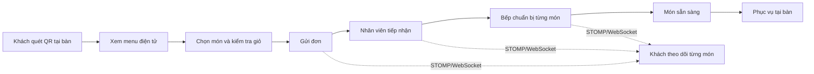
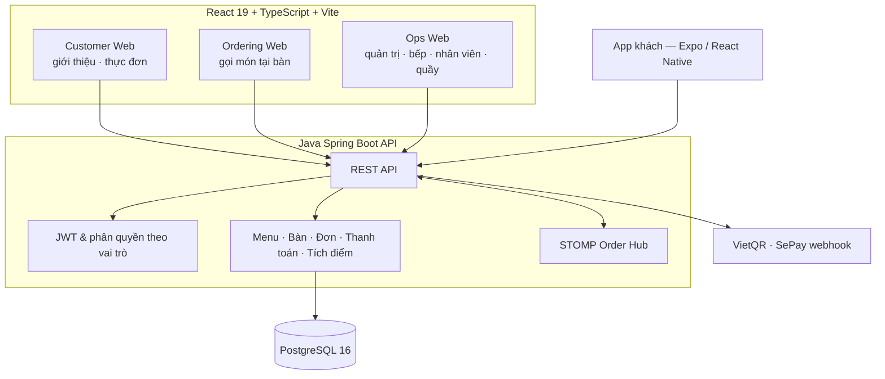

<div align="center">
  
  <h1>CMC Restaurant — QR Ordering</h1>
  <p><strong>Quét QR, gọi món và phối hợp vận hành nhà hàng trên một nền tảng thống nhất.</strong></p>
  <p>
    <a href="https://cmcrestaurant.app">Trải nghiệm khách hàng</a> ·
    <a href="https://admin.cmcrestaurant.app">Cổng vận hành</a> ·
    <a href="docs/backend/ARCHITECTURE.md">Kiến trúc</a> ·
    <a href="docs/backend/API_CONTRACT.md">API</a> ·
    <a href="#bắt-đầu-phát-triển">Bắt đầu phát triển</a>
  </p>
  <p>
    <a href="https://github.com/Anpham120/restaurant-qr-ordering-mobile/actions/workflows/ci.yml"></a>
    <a href="https://github.com/Anpham120/restaurant-qr-ordering-mobile/actions/workflows/security.yml"></a>
    <a href="https://github.com/Anpham120/restaurant-qr-ordering-mobile/actions/workflows/cd.yml"></a>
    <a href="LICENSE"></a>
  </p>
</div>

---

## Sản phẩm giải quyết điều gì?

CMC Restaurant số hoá hành trình phục vụ tại bàn: khách mở menu bằng QR mà không cần cài ứng
dụng, tự chọn món và theo dõi từng món; nhân viên và bếp nhìn cùng một trạng thái vận hành; quản
trị viên kiểm soát menu, bàn và đơn hàng từ một hệ thống duy nhất.

Dự án làm sâu đúng hai mảng, thay vì trải mỏng ra nhiều tính năng:

1. **Hạ tầng triển khai** — CI/CD, hai môi trường tách biệt, kiểm sức khoẻ sau khi triển khai,
   đường quay lui.
2. **Nghiệp vụ đặt món** — trạng thái từng món chứ không chỉ từng đơn, ước lượng thời gian lên
   món theo tải của từng bếp, tích điểm, thanh toán QR đối soát tự động.

| Khả năng | Giá trị nhận được |
| --- | --- |
| **Gọi món bằng QR tại bàn** | Không phải cài app, không nhầm bàn, không phải chờ gọi nhân viên |
| **Trạng thái theo TỪNG MÓN** | Bàn 4 món mà xong 1 thì khách thấy đúng món nào đã lên, không phải đoán |
| **Ước lượng thời gian lên món** | Tính theo tải của từng bếp — bếp nấu, quầy pha chế, hàng lấy sẵn — thay vì một hàng đợi chung |
| **Điều phối thời gian thực** | Khách, nhân viên và bếp nhận cùng một sự kiện qua STOMP/WebSocket |
| **Vận hành kiểm chứng được** | CI, quét bảo mật, kiểm sức khoẻ, staging, production và quay lui đều chạy bằng workflow |

## Trải nghiệm theo vai trò

| Vai trò | Trải nghiệm chính |
| --- | --- |
| **Khách hàng** | Xem giới thiệu nhà hàng, thực đơn và bắt đầu hành trình gọi món |
| **Khách tại bàn** | Quét QR, chọn món, gửi đơn và theo dõi trạng thái từng món |
| **Nhân viên** | Theo dõi bàn, tiếp nhận đơn, xử lý yêu cầu hỗ trợ và thu ngân |
| **Bếp** | Xem hàng đợi món, cập nhật tiến độ chuẩn bị, báo trễ |
| **Quản trị viên** | Quản lý menu, bàn, mã QR, đơn hàng, ưu đãi và số liệu vận hành |



## Giao diện sản phẩm

Ảnh chụp trực tiếp từ ứng dụng đang chạy, ngày **17/07/2026**.

<table>
  <tr>
    <td width="50%" align="center">
      
      <br /><strong>Website nhà hàng</strong>
    </td>
    <td width="50%" align="center">
      
      <br /><strong>Thực đơn</strong>
    </td>
  </tr>
  <tr>
    <td width="50%" align="center">
      
      <br /><strong>Điểm vào gọi món bằng QR</strong>
    </td>
    <td width="50%" align="center">
      
      <br /><strong>Cổng vận hành</strong>
    </td>
  </tr>
</table>

## Kiến trúc



Backend là một **modular monolith**: các module dùng chung một cơ sở dữ liệu và một giao dịch, nên
không có trạng thái nửa vời giữa đơn hàng, thanh toán và tích điểm. Mười hai module nghiệp vụ:
`auth`, `cart`, `counter`, `loyalty`, `menu`, `orders`, `payments`, `promotions`, `realtime`,
`reports`, `tables`, `shared`.

### Công nghệ chính

| Lớp | Công nghệ |
| --- | --- |
| Frontend | React 19, TypeScript, Vite — 3 ứng dụng triển khai thật, 7 gói dùng chung |
| App di động | Expo SDK 57, React Native |
| Backend | Java 21, Spring Boot 3.3.4, Spring Data JPA, Flyway (28 migration), STOMP/WebSocket, JWT |
| Dữ liệu | PostgreSQL 16 |
| Kiểm thử | Vitest, JUnit 5 + ArchUnit + Testcontainers, Jest |
| Triển khai | GitHub Actions, Docker Compose, Nginx, HTTPS, staging/production |

### Bảo mật và độ tin cậy

- **Phiên tại bàn:** mã QR và phiên bàn do backend cấp, xoay vòng và xác thực; không tin dữ liệu
  từ phía client.
- **Phân quyền:** JWT tách quyền khách, nhân viên, bếp và quản trị.
- **Bí mật:** khoá ký JWT, khoá webhook thanh toán và thông tin cơ sở dữ liệu chỉ nằm trong biến
  môi trường phía máy chủ — không có giá trị thật nào nằm trong kho mã.
- **Mặc định an toàn:** cấu hình để trống thì cổng liên quan TỪ CHỐI mọi lời gọi, không phải nhận
  tất cả. Áp cho Google, Firebase và webhook SePay.
- **Kiểm chứng:** CI dựng và kiểm frontend, backend, app di động, dữ liệu thực đơn, cấu hình
  Docker Compose, và chạy một phép kiểm realtime đầu-cuối với backend thật.

Tài liệu chuyên sâu: [kiến trúc backend](docs/backend/ARCHITECTURE.md),
[chính sách bảo mật](SECURITY.md), [CI/CD và vận hành](docs/devops/PIPELINE_AND_DEPLOY.md).

## Bắt đầu phát triển

### Yêu cầu

- Node.js 24 và npm.
- JDK 21 (Gradle wrapper đi kèm, không cần cài Gradle riêng).
- Python 3.12 — cho các script dữ liệu thực đơn và chỉ mục tài liệu.
- PostgreSQL 16 hoặc Docker/Docker Compose.

Chép các tệp `.env.example` tương ứng và chỉ dùng giá trị dành cho máy cá nhân.

### Cách nhanh nhất: cả hệ thống bằng một lệnh

```powershell
Copy-Item deploy\env\local.example.env deploy\.env    # rồi sửa 3 giá trị bắt buộc ở đầu tệp
docker compose --env-file deploy\.env -f deploy\docker-compose.java.yml --profile migrate run --rm --build migrate
docker compose --env-file deploy\.env -f deploy\docker-compose.java.yml up -d --build
```

| Địa chỉ | Là gì |
|---|---|
| <http://127.0.0.1:8080> | giao diện khách + vận hành |
| <http://127.0.0.1:8081/api/health> | API Java |

**`migrate` là bước riêng, phải chạy trước.** API cố ý không tự migrate lúc khởi động — nhiều
instance cùng migrate một cơ sở dữ liệu là loại lỗi chỉ xảy ra khi triển khai thật.

Hạ stack: `docker compose --env-file deploy\.env -f deploy\docker-compose.java.yml down`
(thêm `-v` nếu muốn xoá luôn dữ liệu Postgres).

### Frontend

```powershell
cd frontend
npm ci
npm run dev
```

Các workspace khác: `npm run dev:ordering`, `npm run dev:ops`.

`dev:kitchen` và `dev:staff` chỉ dựng hai stub chuyển hướng sang ứng dụng vận hành — bếp và nhân
viên dùng chung `ops-web`, không phải hai ứng dụng riêng.

### Backend

```powershell
cd backend-java && ./gradlew bootRun
```

Thiết lập PostgreSQL và migration: [Backend Database Setup](docs/backend/DATABASE.md).

### Kiểm chứng

```powershell
npm --prefix frontend test
npm --prefix frontend run build
cd backend-java && ./gradlew build
docker compose --env-file deploy\.env -f deploy\docker-compose.java.yml config
```

## Cấu trúc repository

```text
.
├── frontend/      # 3 ứng dụng React/Vite (+2 stub chuyển hướng), 7 gói dùng chung, test
├── backend-java/  # API Spring Boot, 12 module nghiệp vụ và test
├── mobile-rn/     # App khách hàng thân thiết (Expo / React Native)
├── deploy/        # Docker Compose, cấu hình môi trường và script triển khai
├── data/          # Dữ liệu thực đơn — nguồn của các cổng kiểm trong CI
├── docs/          # Kiến trúc, API, vận hành và khuôn báo cáo
└── .github/       # CI/CD, quét bảo mật, khuôn issue và pull request
```

## Tài liệu

Điểm bắt đầu: **[Chỉ mục tài liệu](docs/README.md)** — trang đó được **sinh ra** từ chính các tệp
có thật, nên nó không thể trỏ vào tệp không tồn tại.

| Chủ đề | Tài liệu chính |
| --- | --- |
| Kiến trúc và hợp đồng | [Kiến trúc backend](docs/backend/ARCHITECTURE.md) · [Hợp đồng API](docs/backend/API_CONTRACT.md) · [SPEC](SPEC.md) |
| Cơ sở dữ liệu | [Database](docs/backend/DATABASE.md) |
| Vận hành | [CI/CD và triển khai](docs/devops/PIPELINE_AND_DEPLOY.md) · [Triển khai máy chủ](docs/trien-khai-may-chu.md) |
| Quy trình | [Git và làm việc nhóm](docs/devops/GIT_AND_TEAM.md) |

## Trạng thái và định hướng

Hệ thống đang chạy trực tuyến ở mức MVP, trên hai môi trường tách biệt (staging và production).
Các luồng phiên bàn QR, thực đơn, đơn hàng, thanh toán, thời gian thực và phân quyền theo vai trò
đều đã có bản cài đặt kèm test trong kho mã.

Ưu tiên tiếp theo:

- Quan trắc: log tập trung, cảnh báo, và số đo thời gian phục vụ thật thay vì ước lượng.
- Sao lưu và khôi phục cơ sở dữ liệu có kiểm chứng, không chỉ có script.
- Mở rộng kiểm hồi quy cho hành trình nhiều thiết bị.
- Hoàn thiện khả năng tiếp cận, ngân sách hiệu năng và trải nghiệm trên di động.

## Đóng góp

Đọc [CONTRIBUTING.md](CONTRIBUTING.md), tạo nhánh từ `develop` và dùng khuôn pull request của dự
án. Quy ước nhánh, review và phát hành nằm trong [Git và làm việc nhóm](docs/devops/GIT_AND_TEAM.md).

## Giấy phép

Dự án được phát hành theo [MIT License](LICENSE).

---

<div align="center">
  Phục vụ nhanh hơn, rõ hơn, và đáng tin hơn.
</div>
