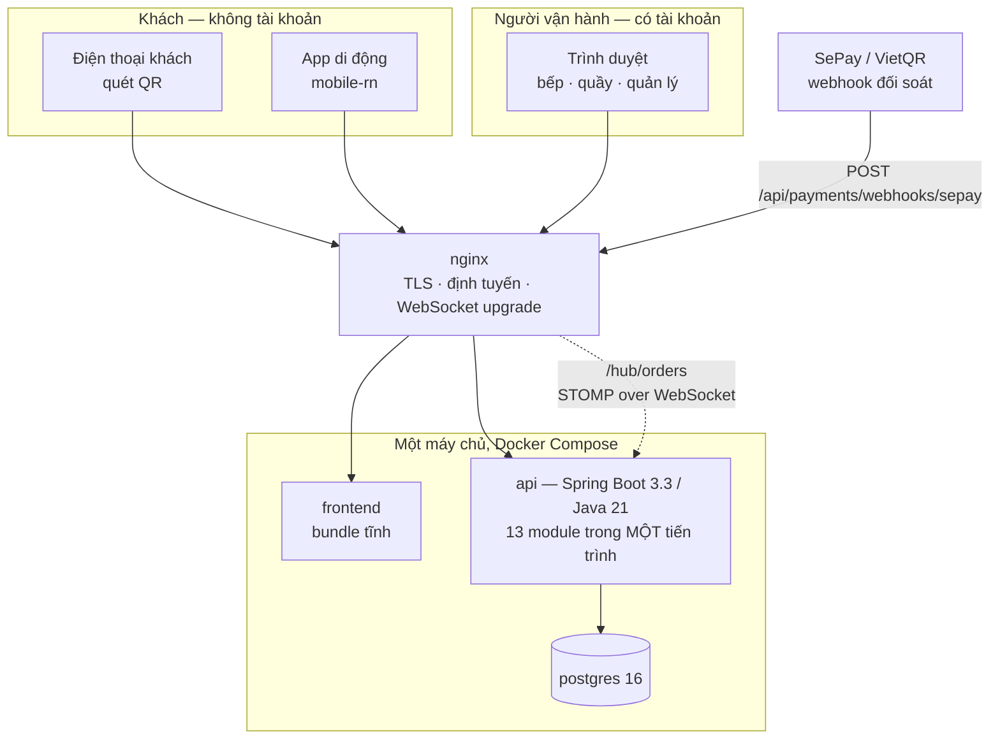
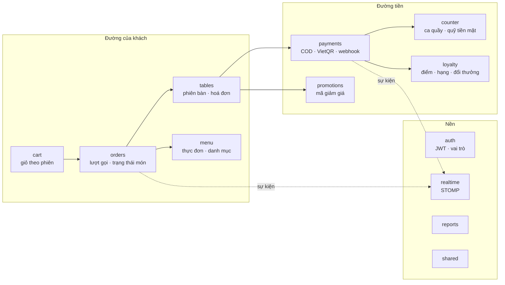
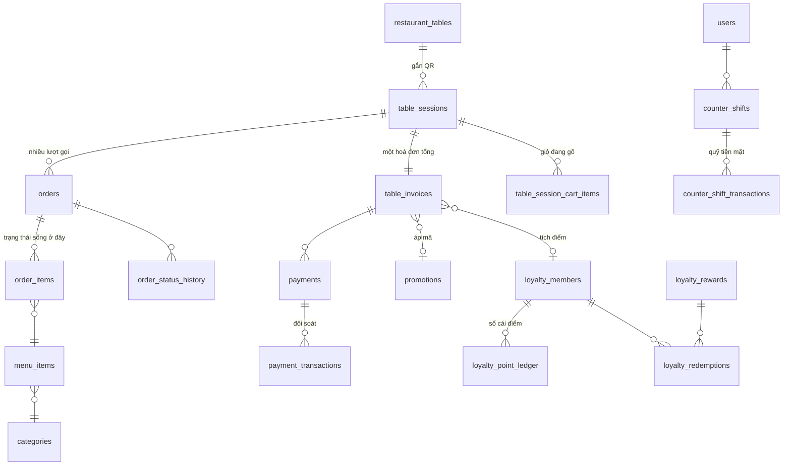
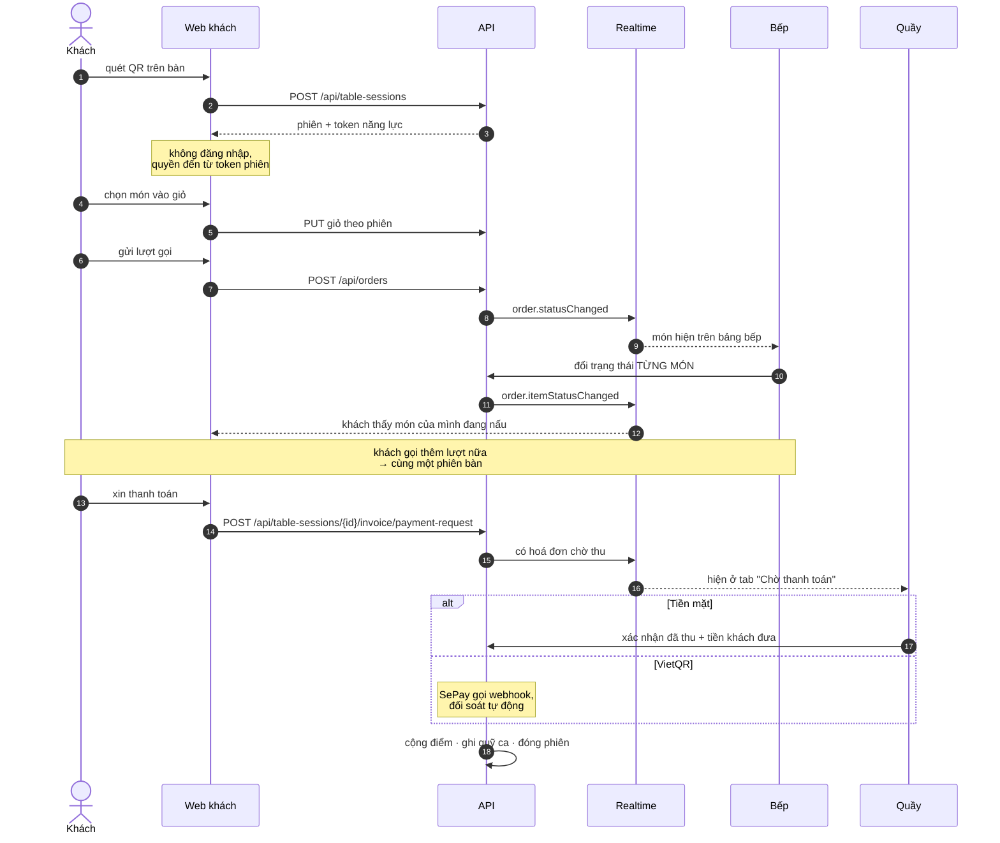
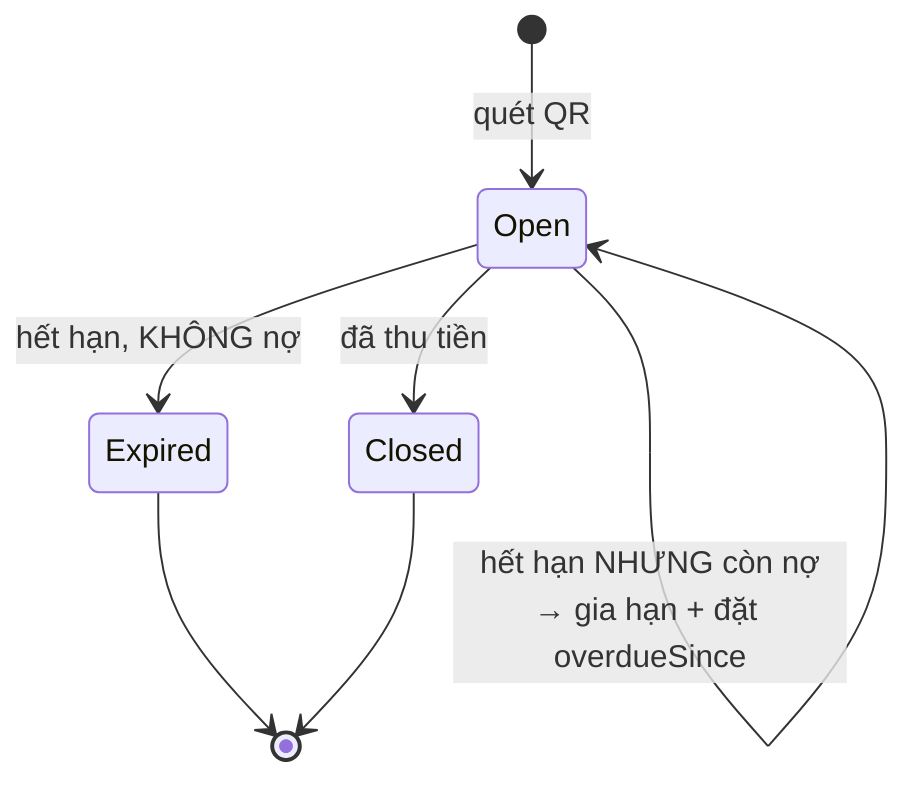
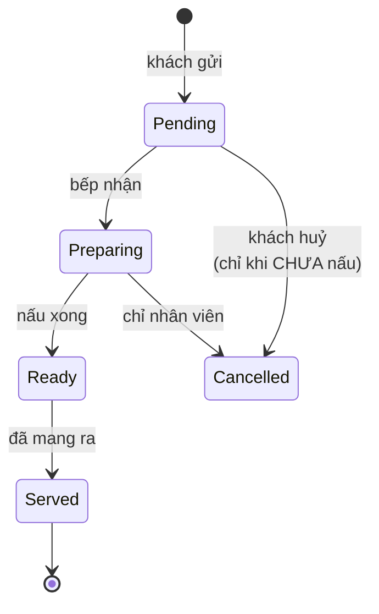
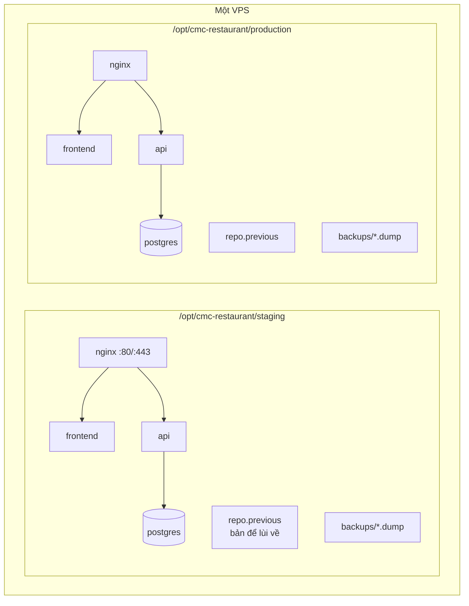
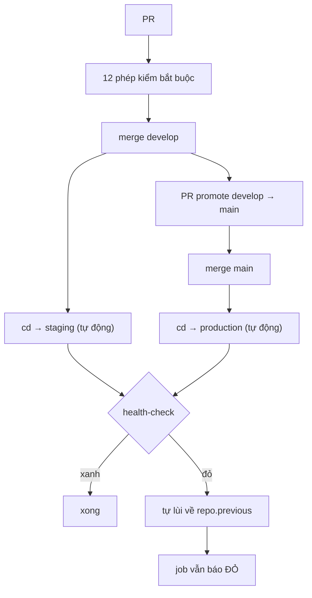

# Phân tích thiết kế hệ thống — CMC Restaurant QR

> **Tài liệu này là điểm vào, không phải điểm đến.** Nghiệp vụ, hợp đồng API, lược đồ cơ sở dữ liệu
> và đường ống CI/CD đều đã có tài liệu sâu riêng. Trang này ghép chúng thành một bức tranh, bổ
> sung những sơ đồ chưa ai vẽ, và trả lời câu hỏi *"hệ thống này gồm những gì và chạy ra sao"* mà
> không bắt người đọc mở sáu tệp.
>
> Mọi con số ở đây **đo trên mã đang chạy** ngày 08/09/2026, không ước lượng.

| Muốn biết | Đọc |
|---|---|
| Nghiệp vụ đầy đủ, tác nhân, luật, lỗ hổng đang mở | [`THIET_KE_NGHIEP_VU.md`](THIET_KE_NGHIEP_VU.md) |
| Bên trong backend: ranh giới module, máy trạng thái | [`backend/ARCHITECTURE.md`](backend/ARCHITECTURE.md) |
| Từng endpoint, tham số, mã lỗi | [`backend/API_CONTRACT.md`](backend/API_CONTRACT.md) |
| Bảng, cột, chỉ mục, migration | [`backend/DATABASE.md`](backend/DATABASE.md) |
| CI/CD, triển khai, quay lui | [`devops/PIPELINE_AND_DEPLOY.md`](devops/PIPELINE_AND_DEPLOY.md) |
| Đặc tả giao diện vận hành | [`DAC_TA_THIET_KE_VAN_HANH.md`](DAC_TA_THIET_KE_VAN_HANH.md) |

---

# PHẦN I — HỆ THỐNG LÀ GÌ

## 1. Bài toán, nói một câu

Khách ngồi vào bàn, quét mã QR dán trên bàn, tự gọi món bằng điện thoại của mình. Bếp thấy món
hiện lên ngay. Quầy thu tiền theo **phiên bàn** chứ không theo từng lượt gọi. Quản lý xem tình hình
và doanh thu.

Ba điều khiến nó không phải một ứng dụng đặt hàng thông thường:

1. **Khách không có tài khoản.** Quét QR là vào, không đăng ký, không đăng nhập. Quyền truy cập
   phiên bàn đến từ một *token năng lực* gắn với phiên, không từ danh tính.
2. **Một bàn ăn nhiều lượt.** Gọi thêm món giữa bữa là bình thường. Nên đơn vị thu tiền là **phiên
   bàn** (gồm nhiều lượt gọi), không phải một đơn.
3. **Trạng thái sống ở MÓN, không ở ĐƠN.** Một đơn 5 món có thể có 2 món đã ra, 2 đang nấu, 1 chưa
   tới lượt. Gộp lên tầng đơn là mất đúng thông tin bếp và khách cần.

## 2. Bốn vai và ranh giới

| Vai | Vào bằng | Làm gì | KHÔNG được làm |
|---|---|---|---|
| **Khách** | quét QR, không tài khoản | xem thực đơn, gọi món, huỷ món chưa nấu, xin thanh toán, gọi nhân viên | không thấy giá vốn, không tự chốt hoá đơn |
| **Bếp** (`Kitchen`) | tài khoản | đổi trạng thái món, khai độ trễ, tắt/mở món hết | không đụng tiền, không đụng bàn |
| **Quầy** (`CounterStaff`, `Staff`) | tài khoản | mở/chốt ca, thu tiền, hoàn tiền, phiếu tặng món, xử lý bàn quá giờ | không sửa thực đơn, không sửa khuyến mãi |
| **Quản lý** (`Admin`) | tài khoản | thực đơn, bàn, khuyến mãi, tích điểm, người dùng, báo cáo | không thao tác thu tiền tại quầy |

Ranh giới là **cố ý**, không phải thiếu tính năng. Xem §13 của `THIET_KE_NGHIEP_VU.md`.

---

# PHẦN II — KIẾN TRÚC

## 3. Hình dạng tổng thể

**Modular monolith, không phải microservices.** Lý do đầy đủ ở §2 của `backend/ARCHITECTURE.md`;
tóm tắt: một nhà hàng, một cơ sở dữ liệu, và mọi nghiệp vụ đáng kể đều cần giao dịch chạm nhiều
bảng cùng lúc. Tách tiến trình sẽ đổi một lời gọi hàm lấy một giao dịch phân tán.

## 4. Backend — 13 module

**199 lớp Java, 48 lớp kiểm, 22 controller, 90 endpoint.**

Mũi tên đứt là **sự kiện thời gian thực**; mũi tên liền là phụ thuộc trực tiếp.

## 5. Frontend — 5 workspace, 7 gói dùng chung

**113 tệp nguồn, 64 tệp kiểm.**

| Workspace | Phục vụ | Ghi chú |
|---|---|---|
| `customer-web` | khách quét QR | mặt khách hàng |
| `ordering-web` | luồng gọi món trong phiên | mặt khách hàng |
| `admin-web` | **cả ba vai vận hành** | một bundle, phân luồng theo vai |
| `kitchen-web`, `staff-web` | — | **stub chuyển hướng** sang `admin-web` |

Gói dùng chung: `api-client`, `auth`, `brand-ui`, `i18n`, `realtime-client`, `shared-types`,
`shared-ui`.

**Ba vai vận hành dùng chung một bundle.** Hệ quả cần nhớ: bất cứ thứ gì đặt trên `<html>` áp cho
cả ba vai, không riêng trang đang mở. Đây chính là lý do hệ thống chỉ có **một bảng màu sáng duy
nhất** — xem PHẦN VI.

## 6. Dữ liệu — 19 bảng đang sống

**32 migration Flyway (V1 → V32). Chỉ chạy tiến; Flyway bản cộng đồng không có đường lùi.**

Ngoài sơ đồ: `kitchen_delay` — **bảng đúng một hàng** (`CHECK (id = 1)`), nơi bếp tự khai độ
trễ đang có. Trần 60 phút đặt ở tầng cơ sở dữ liệu chứ không chỉ ở ứng dụng, và `expires_at`
khiến cờ tự hết hạn — không ai phải nhớ tắt nó.

**Tám bảng đã bị xoá** cùng với tính năng của chúng — bảy bảng trợ lý AI (`V28`) và
`loyalty_link_codes` (`V26`). Ghi ra đây vì tên chúng còn xuất hiện trong lịch sử migration.

---

# PHẦN III — QUY TRÌNH

## 7. Một bữa ăn, đầu đến cuối

## 8. Máy trạng thái — hai cái quan trọng nhất

**Phiên bàn.** Điều đáng nhớ: phiên còn nợ tiền thì **KHÔNG bị đóng khi hết hạn** — nó được **gia
hạn** và đánh dấu `overdueSince`. Nên `isExpired` của một bàn còn nợ luôn là `false`, và mọi bộ lọc
"bàn quá giờ" phải đọc `overdueSince`, không đọc `isExpired`.

**Món.** Trạng thái sống ở đây, không ở đơn.

`Ready` và `Served` **tách nhau có chủ đích**. Gộp lại thì món nấu xong trông y hệt món đã bưng đi,
và người trực không biết còn phải mang cái nào.

## 9. Đường tiền

| Phương thức | Ai xác nhận | Vì sao |
|---|---|---|
| **Tiền mặt (COD)** | thu ngân bấm tay | chính họ đếm tiền |
| **VietQR** | **webhook SePay**, tự động | tiền về mới xác nhận; bấm tay là khẳng định một khoản chưa kiểm |

Đây là lý do nút "thu hàng loạt" ở quầy **chỉ lọc COD**. Gom VietQR vào đó là mời người ta đánh dấu
đã thu một khoản tiền chưa về, đúng lúc đông khách.

**Hoàn tiền** đảo **ba** thứ cùng lúc: trạng thái hoá đơn, điểm thưởng đã cộng, và quỹ tiền mặt của
ca quầy. Không lùi được — nên giao diện bắt gõ lại mã hoá đơn trước khi cho bấm.

## 10. Thời gian thực

STOMP over WebSocket tại `/hub/orders`, broker đơn giản trên `/topic`.

`/hub/` **số ít** — bản .NET cũ dùng `/hubs/`. Sai một chữ `s` thì WebSocket không bao giờ kết nối,
và nó **hỏng im lặng**: bếp không tự thấy đơn mới, quầy không tự thấy trạng thái đổi, phải tải lại
trang mới có dữ liệu. Không lỗi nào hiện lên vì kết nối hỏng chỉ là một lần thử bất thành trong nền.

Mọi màn hình vận hành đều có **poll dự phòng** (5–15 giây) chạy song song, để mất WebSocket không
đồng nghĩa mất dữ liệu.

---

# PHẦN IV — TÍNH NĂNG

## 11. Danh mục, theo vai

### Khách
- Quét QR → mở phiên bàn, không cần tài khoản
- Xem thực đơn theo danh mục, ảnh WebP
- Giỏ hàng lưu theo phiên — quay lại đúng chỗ đang dở
- Gọi nhiều lượt trong một bữa
- Theo dõi **từng món** theo thời gian thực, kèm ước lượng thời gian lên món
- Tự huỷ món **chưa nấu**
- Gọi nhân viên tới bàn
- Áp mã khuyến mãi, xem ưu đãi đang chạy
- Xin thanh toán: tiền mặt hoặc VietQR
- Tích điểm bằng số điện thoại, xem hạng và ưu đãi đổi điểm
- Hoá đơn điện tử

### Bếp
- Bảng bếp bốn cột theo trạng thái, thời gian thực
- Đổi trạng thái từng món hoặc cả đơn; kéo-thả giữa cột; vuốt phải trên cảm ứng
- Ngưỡng chờ **12 phút** cảnh báo / **20 phút** khẩn — mã hoá bằng màu, viền và **nhãn chữ**
- Tự khai độ trễ để ước lượng của khách phản ánh thực tế
- Tắt/mở món hết, tìm món không dấu

### Quầy
- Mở ca / chốt ca, đối chiếu quỹ tiền mặt
- Thu tiền theo phiên bàn; tính tiền thối ngay trong lúc gõ
- **Bàn phím số trên màn** ở bậc máy POS
- Thu hàng loạt — **chỉ COD**
- Hoàn tiền hoá đơn, đảo cả điểm và quỹ
- Phiếu tặng món
- **Bàn quá giờ chưa thu** — đòi tiền, ép đóng phiên kèm lý do
- Điều phối yêu cầu "gọi nhân viên", dải thông báo **không tự tắt**
- Tra cứu lịch sử hoá đơn

### Quản lý
- Trung tâm điều hành: doanh thu hôm nay, bàn đang phục vụ, hoá đơn chờ, đơn đang nấu, **bàn quá
  giờ**, việc khẩn kèm link
- Thực đơn và danh mục, ảnh, giá, tình trạng còn/hết
- Bàn và mã QR, sơ đồ mặt bằng
- Khuyến mãi: phần trăm hoặc số tiền, trần giảm, đơn tối thiểu, flash sale, **giới hạn lượt dùng**
- Tích điểm: hạng, ưu đãi đổi điểm, sổ cái điểm
- Người dùng và vai trò
- Báo cáo doanh thu theo khoảng thời gian

## 12. Chất lượng — cổng chặn

| | Số |
|---|---|
| Phép kiểm bắt buộc trên `develop` và `main` | **12** |
| Lớp kiểm backend | 48 |
| Tệp kiểm frontend | 64 |
| Migration | 32 |

Ngoài phép kiểm chức năng, kho này có một nhóm **cổng canh chính nó**: mã chết không tới được từ
entrypoint, tài liệu sinh tự động phải khớp mã, chốt migration phải trỏ đúng thư mục, không nút nào
dưới 44px, không cỡ chữ nào dưới 13px, không style rời trên mặt vận hành, không backtick bị thực
thi ngoài ý muốn trong workflow và script triển khai.

Chúng tồn tại vì kho này đã gặp cùng một hình dạng lỗi nhiều lần: **thứ gì đó chạy đúng, không tìm
thấy gì, và không nói gì.**

---

# PHẦN V — TRIỂN KHAI

## 13. Một máy chủ, hai môi trường

Tách bằng **ba** thứ, không phải một: thư mục gốc riêng, tên project Compose riêng, cổng riêng.
Mỗi môi trường có bí mật và biến riêng trong GitHub Environments — **không giá trị thật nào nằm
trong kho mã**.

## 14. Từ commit tới máy chủ

Mỗi lượt triển khai **sao lưu cơ sở dữ liệu TRƯỚC khi chạy migration**. Nếu health-check đỏ, hệ
thống tự lùi về bản trước và **vẫn báo đỏ** — lùi êm mà báo xanh thì lần hỏng biến mất khỏi lịch sử.

Đường tự lùi **đã chứng minh trên máy thật** ngày 08/09/2026, hai lần: một lần thử có chủ đích, một
lần cứu hỏng thật khi Docker Hub trả 500. Chi tiết ở §6 của `devops/PIPELINE_AND_DEPLOY.md`.

---

# PHẦN VI — GIỚI HẠN, NÓI THẲNG

Một tài liệu thiết kế chỉ liệt kê thứ chạy được thì không dùng để ra quyết định được.

| Giới hạn | Vì sao còn |
|---|---|
| **Quay lui mã KHÔNG quay lui cơ sở dữ liệu** | Flyway bản cộng đồng chỉ chạy tiến. Mỗi thay đổi lược đồ phải nghĩ trước đường lùi: thêm cột thì lùi được, xoá cột thì không |
| **`restore-postgres.sh` chưa từng được thử** | Có script sao lưu không bằng có khả năng khôi phục. Bản sao lưu được TẠO RA đã kiểm; việc KHÔI PHỤC thì chưa |
| **Ảnh được dựng trên VPS, không kéo từ registry** | Thứ CI kiểm và thứ chạy trên máy chủ là hai lần build khác nhau. Đẩy image lên GHCR là việc còn nợ |
| **Không có tự động tạo release/tag** | 3 tag, 0 GitHub release. Không có gì ghi lại bản nào đã lên |
| **Mặt khách hàng chưa qua đợt thiết kế lại** | 23 chỗ đặt style rời — nhưng **cả 23 nằm trong một tệp duy nhất**, `CustomerHomePage.tsx`. Mọi trang khách khác sạch. Đây là một lần sửa có phạm vi rõ, không phải một đợt quét |
| **Huỷ món SAU khi bếp đã nấu không ghi hao hụt** | Tiền không sai — khách không bị tính. Nhưng báo cáo gộp chung "huỷ trước khi nấu" với "huỷ sau khi nấu", nên quán không đo được mất bao nhiêu nguyên liệu vì huỷ muộn. Đây là lỗ hổng nghiệp vụ **duy nhất còn mở** — bốn cái còn lại ở §22 của `THIET_KE_NGHIEP_VU.md` đều đã đóng |

## Một quyết định đã đảo: hệ thống chỉ có MỘT bảng màu sáng

Chế độ tối từng được xây, rồi bị **gỡ bỏ có chủ đích**. Ghi lại đây vì lý do gỡ không phải "làm
chưa xong" — nó đã chạy được — mà là **đo xong thấy nó tệ hơn không có**:

| Đo được | Con số | Hệ quả khi nhìn lâu |
|---|---|---|
| Năm mặt nền tối cách nhau | **1.02 – 1.12:1** | Mắt người không phân biệt nổi. Thẻ, nền và vùng chìm nhoè thành một mảng — ranh giới biến mất |
| Chữ chính trên nền thẻ | **14.1:1** | Vượt xa ngưỡng đọc được, nhưng ở nền tối thì đó là *halation*: chữ tự phát sáng nhoè viền. Vùng dễ chịu là 10–12:1 |
| Sắc trạng thái | **10 sắc, bão hoà TB 72%**, 6 cặp cách nhau <30° | Màu bão hoà cao trên nền tối gây quang sai. Sáu cặp gần nhau tới mức không mã hoá nổi ý nghĩa khác nhau — `info` 213° và `cancelled` 215° cách đúng **2°** |

Ba con số này giải thích một nghịch lý: mọi cặp màu đều **đạt WCAG 4.5:1**, mà người dùng vẫn báo
mỏi mắt. Tỷ lệ tương phản đo **đọc được**, nó không đo **nhìn cả ca có chịu nổi không**.

Nên bây giờ toàn hệ thống dùng đúng một bảng màu sáng, kể cả bảng bếp. Một phép kiểm quét **mọi**
tệp `css`/`ts`/`tsx` của frontend chặn `prefers-color-scheme` và `data-theme` quay lại — quét cả
kho chứ không riêng tệp token, vì bản trước của cổng chỉ canh `ops-tokens.css` và đã bỏ lọt khi
khối tối mọc sang ba tệp khác.

## Cách giữ tài liệu này khỏi nói dối

Nó **không được sinh tự động**, nên nó sẽ lạc khỏi mã nếu không ai sửa. Ba mốc khiến nó sai:

- thêm hoặc bỏ một **module backend** → §4
- thêm hoặc bỏ một **bảng** → §6
- đổi **luồng triển khai** → §13, §14

Những phần *có* cổng canh nằm ở tài liệu khác: bảng module và bảng workflow trong
`backend/ARCHITECTURE.md` và `devops/PIPELINE_AND_DEPLOY.md` được sinh từ mã và có
`docs/build_system_facts.py --check` chặn khi lệch.
