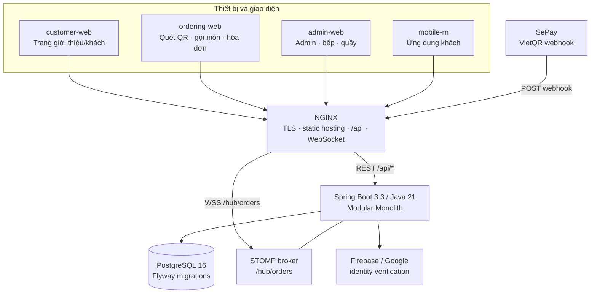
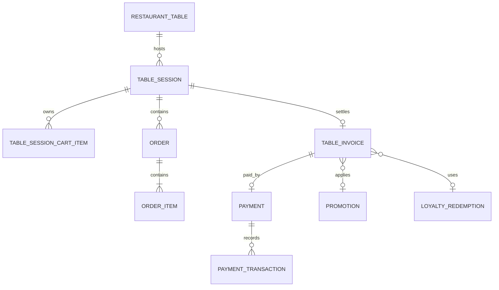
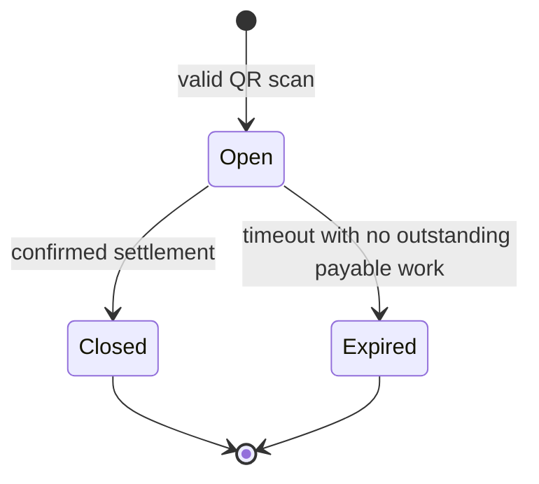
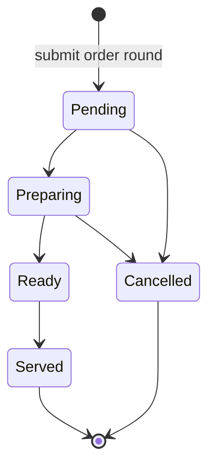

# Thiết kế hệ thống bám theo — CMC Restaurant

> **Baseline:** 2026-09-18  
> **Trạng thái:** chuẩn để refactor và phát triển tiếp  
> **Nguồn sự thật:** mã chạy → phần tài liệu sinh tự động → migration/API contract → tài liệu này. Khi mâu thuẫn, không đoán: kiểm tra source và bổ sung test trước khi đổi hành vi.

## 1. Mục tiêu và ranh giới

Hệ thống phục vụ **một nhà hàng ăn tại bàn**: khách quét QR cố định của bàn, cùng dùng một phiên bàn, gọi nhiều lượt món, bếp xử lý từng món, và quầy thu tiền một lần cho cả bàn.

Mục tiêu kiến trúc là một **modular monolith**: một API Spring Boot, một PostgreSQL và một giao dịch ACID cho các thay đổi tiền/trạng thái liên quan. Không tách microservice khi chưa có nhu cầu vận hành đo được; thanh toán, hóa đơn, điểm và ca quầy không được biến thành chuỗi gọi mạng có thể lệch nhau.

Phạm vi hiện tại:

| Có | Chưa thuộc phạm vi nền tảng hiện tại |
|---|---|
| Ăn tại bàn, QR, nhiều điện thoại/bàn | Giao hàng, mang về, đặt chỗ |
| Một nhà hàng, PostgreSQL dùng chung | Multi-branch, multi-tenant |
| COD và VietQR/SePay | Thẻ, ví điện tử khác |
| Web khách/vận hành và mobile-rn | ERP/kho nguyên vật liệu hoàn chỉnh |

Repo tham chiếu `jnwjn/restaurant-management-system` không truy cập được tại thời điểm baseline (GitHub trả `Repository not found`). Vì vậy tài liệu này **không** khẳng định đã sao chép hay đối chiếu nghiệp vụ từ repo đó; mọi fact bên dưới được rút từ checkout hiện tại.

## 2. Hình dạng hệ thống chuẩn



### Quyết định cố định

1. **Backend:** Spring Boot 3.3, Java 21, Spring MVC/Security, JPA/Hibernate, Gradle.
2. **Web:** React 19, TypeScript, Vite workspace. Ba app có entrypoint nghiệp vụ là `customer-web`, `ordering-web`, `admin-web`; `kitchen-web` và `staff-web` chỉ là redirect stub, không được phát triển thành app thứ hai nếu chưa có ADR.
3. **Data:** PostgreSQL 16. Chỉ Flyway migration versioned được đổi schema; production API không tự migrate schema khi khởi động.
4. **Realtime:** STOMP over WebSocket. REST vẫn là nguồn để reload trạng thái sau một event; client mất socket phải polling có giới hạn.
5. **Triển khai:** NGINX + Docker Compose. Staging và production dùng cấu hình/secrets/cổng độc lập.

## 3. Nghiệp vụ đã có

| Bounded context | Sở hữu | Năng lực hiện có |
|---|---|---|
| `auth` | tài khoản, JWT, vai trò | đăng ký, login, Google sign-in, phone identity, đổi mật khẩu, quản trị user |
| `menu` | danh mục, món, giá, khả dụng | CRUD menu/category, ảnh, tag, giá vốn, chuẩn bị số suất, khung giờ phục vụ, báo hết món/độ trễ |
| `tables` | bàn, QR, phiên bàn, hóa đơn | mở/đọc/đóng phiên, QR rotate, `resumeState`, gọi nhân viên, hóa đơn bàn, thanh toán/hoàn tiền |
| `cart` | giỏ dùng chung theo phiên bàn | xem, thêm món, xóa giỏ bằng token capability của phiên |
| `orders` | lượt đặt món, từng món, KDS | tạo order round, theo dõi, lịch sử, món ưa thích, cập nhật/huỷ món, hàng đợi và ước lượng bếp |
| `payments` | giao dịch nhận tiền | payment theo order lịch sử, VietQR payload, webhook SePay, đối soát |
| `promotions` | mã khuyến mãi | danh sách active, validate, CRUD admin |
| `loyalty` | hội viên, điểm, reward/redemption | gắn số điện thoại, đổi/xác nhận ưu đãi, lookup quầy, CRUD hội viên/reward, đảo điểm khi hoàn tiền |
| `counter` | ca quầy, tiền mặt | mở/chốt ca, điều chỉnh quỹ, thu/hoàn tiền mặt |
| `reports` | số liệu vận hành | summary cho admin |
| `realtime` | thông báo trạng thái | event order/bàn/menu tới STOMP topic được phân quyền |
| `shared` | cross-cutting | health, CORS, lỗi chuẩn, actor context, idempotency |

Các module trên là facts từ package backend hiện có. Danh sách endpoint/migration chính xác được sinh và kiểm trong `docs/backend/ARCHITECTURE.md`, không chép tay ở đây.

## 4. Mô hình domain chuẩn

### 4.1 Ngôn ngữ chung

- **Bàn (`RestaurantTable`)** là bàn vật lý; QR dán bàn là định danh lâu dài, không phải hóa đơn.
- **Phiên bàn (`TableSession`)** là một lượt khách ngồi tại một bàn. Nhiều điện thoại quét cùng QR phải vào cùng một phiên đang mở.
- **Lượt đặt món (`Order Round`)** là một lần gửi giỏ xuống bếp. Một phiên có nhiều lượt.
- **Món trong đơn (`OrderItem`)** là đơn vị bếp xử lý; trạng thái phục vụ sống ở đây.
- **Hóa đơn bàn (`TableInvoice`)** là bản quyết toán duy nhất của cả phiên; promotion, loyalty redemption và payment gắn vào hóa đơn, không gắn vào từng order round.



### 4.2 State machines





`OrderStatus` là aggregate/projection hỗ trợ KDS (`Placed`, `Confirmed`, `Preparing`, `Ready`, `Served`, `Completed`, `Cancelled`); không được thêm trạng thái order làm trái trạng thái từng món. `Completed` và `Cancelled` là terminal: item không còn đổi được.

Thanh toán chuẩn: `NotRequested → Pending → Confirmed/Paid`; có các nhánh `Failed`, `Cancelled`, `Refunded`. `Refunded` là terminal cho các thao tác xác nhận/thất bại lại.

### 4.3 Bất biến bắt buộc

1. Một bàn có nhiều nhất một `Open` session; phải được bảo vệ bằng database constraint/index, không chỉ kiểm tra trong Java.
2. Mọi request của khách tại bàn phải mang `X-Table-Session-Token` hợp lệ cho đúng session; token không được log.
3. Tạo order round và xóa giỏ phải cùng transaction; lặp request cùng `Idempotency-Key` trả kết quả cũ, key đổi payload trả conflict.
4. Khi invoice `Pending`, không cho thay đổi payable line qua huỷ order/item. Khi đã paid/confirmed, không nhận order mới trong session.
5. Settlement phải khóa/optimistic-lock session/invoice/payment; stale write trả lỗi conflict, không ghi đè im lặng.
6. Webhook chỉ xác nhận đúng reference/amount/method, có unique reference và idempotency; không có khóa webhook hợp lệ thì fail closed.
7. Hoàn tiền gồm trạng thái payment/invoice, reversal loyalty và nghiệp vụ tiền mặt-ca quầy. Nếu hậu xử lý có chính sách retry thì phải có audit/alert, không được che lỗi tiền.

## 5. Kiến trúc mã và quy tắc phụ thuộc

`orders` hiện là mẫu chuẩn theo hexagonal architecture:

```text
orders/
  domain/             # entity, state machine, invariant thuần Java
  application/        # use case, port đọc/ghi
  adapter/in/web/     # HTTP DTO/controller
  adapter/out/persistence/  # JPA entity/repository adapter
```

Các module còn lại được phép giữ cấu trúc phẳng trong giai đoạn hiện tại, nhưng phải tuân theo:

1. Controller chỉ parse/authorize/map DTO; không chứa transaction business.
2. Service/domain owner giữ luật và đặt transaction tại use case.
3. Một module không import `orders.adapter.*` hoặc repository/entity private của module khác. Hãy thêm application port/read model thay vì xuyên ranh giới.
4. Event realtime phát sau khi mutation thành công; event chỉ là tín hiệu reload, không phải source of truth.
5. DTO public và enum/string DB có versioning/deprecation trước khi breaking change.

## 6. Các luồng phải được giữ khi refactor

### A. Quét QR và quay lại phiên

1. Client đọc QR → tìm bàn → open/reuse session.
2. Backend hết hạn phiên cũ trước, sau đó tạo hoặc đọc lại phiên sống khi race condition.
3. Backend trả capability token và `resumeState`: `New`, `CartPending`, `OrderInProgress`, `ReadyForPayment`, `PaymentPending`, `Paid`.
4. Frontend map duy nhất `resumeState` sang màn menu/cart/order/invoice; không hard-code redirect menu.

### B. Gọi món và KDS

1. Khách sửa cart dùng session token.
2. Submit order round mang idempotency key; backend snapshot dữ liệu cần thiết, ghi order/item rồi clear cart trong một transaction.
3. Realtime gửi signal; KDS reload board. Mất socket chuyển polling 5 giây.
4. Kitchen/Staff chỉ được advance một bước hợp lệ; `Kitchen` không được thực hiện thao tác ngoài tuyến `Pending → Preparing → Ready → Served`.

### C. Chốt hóa đơn

1. Khách tạo payment request: server tính subtotal/discount/total từ payable order items và cố định lựa chọn promotion/loyalty/method vào invoice attempt.
2. COD do CounterStaff/Staff/Admin xác nhận, kiểm tiền khách đưa/thối tiền, close session, complete orders, ghi ca quầy và loyalty.
3. VietQR tạo payload; SePay webhook đối soát reference/amount rồi gọi chung settlement path.
4. Cancel request phải giải phóng promotion/loyalty/method/discount để bàn gọi tiếp. Refund có note/audit và reversal.

## 7. Bảo mật, vận hành và dữ liệu

| Vùng | Chuẩn bắt buộc |
|---|---|
| Xác thực | JWT cho Customer/nhân sự; capability token riêng cho khách QR. Không thay token QR bằng JWT giả danh. |
| Phân quyền | Check ở HTTP **và** method cho endpoint nhạy cảm; vai cũ `Staff` chỉ giữ compatibility có thời hạn, không cấp mới. |
| Secrets | chỉ dùng environment/secret store; `.env.example` không có secret thật; logs phải sanitize CR/LF và che token. |
| Database | migration tăng dần, không sửa migration đã chạy; migration chạy trước API; backup/restore phải được diễn tập. |
| Tiền | `BigDecimal`, VND format nhất quán; có idempotency, audit, concurrency guard, reconcile reference. |
| Health | hiện có `/api/health`. Trước production cần tách liveness/readiness có DB dependency rõ ràng thay vì mô tả endpoint chưa tồn tại. |
| Quan trắc | request ID, metric latency/error, payment reconciliation discrepancy, session overdue, kitchen delay; không log PII/token thô. |

## 8. Chương trình refactor đề xuất

| Ưu tiên | Hạng mục | Kết quả nghiệm thu |
|---|---|---|
| P0 | Đồng bộ tài liệu facts từ source | `py docs/build_system_facts.py --check` xanh; docs không kể sai endpoint/migration |
| P0 | Dọn contract chết | type/API/module không có consumer bị xóa kèm typecheck + test; public contract chỉ bỏ sau deprecation |
| P0 | Quyết định `Staff` | ADR + migration user/authorization; role cũ không còn cấp mới và mọi UI/API có owner rõ |
| P0 | Bảo toàn vòng tiền | Test integration cho request/confirm/cancel/refund COD/VietQR, retry webhook và stale concurrency |
| P1 | Tách application ports dần | Mỗi slice sửa được đưa về controller → application → domain → adapter; ArchUnit cấm phụ thuộc mới sai chiều |
| P1 | Business rule versioned | Thiết kế `business_rule` có `effective_from`, audit và cache invalidation; migrate từng rule tiền có test replay lịch sử |
| P1 | Observability/DR | readiness đúng thực tế, structured logs, metric/alert, backup-restore evidence |
| P2 | Inventory + Recipe/BOM | ingredient, unit, recipe version, stock ledger, wastage từ huỷ sau `Preparing`; không trừ kho trước khi recipe/version rõ |
| P2 | Multi-branch | chỉ khởi động sau khi tenant/branch isolation, pricing/menu ownership và reporting partition có ADR |

### Việc đã thực hiện trong baseline này

- Làm mới phần kiến trúc được sinh tự động để khớp source hiện tại.
- Xóa type `chat` không còn consumer/module/API; đây không phải xóa chức năng chat đang chạy (chat tables đã bị migration V28 gỡ).

## 9. Definition of Done cho mọi thay đổi tiếp theo

Một PR chỉ được coi là hoàn tất khi có đủ:

1. Một bounded context owner và use case cụ thể; không "tiện tay" sửa module khác.
2. State transition/invariant thay đổi có test công khai (unit + integration nếu qua DB/money).
3. Migration additive/backfill/rollback plan nếu động schema hoặc dữ liệu production.
4. API contract, frontend consumer và realtime payload được đổi cùng nhau; breaking change có deprecation window.
5. `npm --prefix frontend test`, `npm --prefix frontend run build`, `backend-java\\gradlew.bat build`, và `py docs\\build_system_facts.py --check` xanh từ root đúng.
6. Với luồng tiền/realtime/QR: có smoke hoặc integration evidence riêng; unit test không đủ để tuyên bố provider/device đã hoạt động thật.

## 10. Bản đồ tài liệu

- Nghiệp vụ hiện chạy: `docs/THIET_KE_NGHIEP_VU.md`
- Module/API/migration sinh từ code: `docs/backend/ARCHITECTURE.md`
- Hợp đồng API: `docs/backend/API_CONTRACT.md`
- Lược đồ/migration: `docs/backend/DATABASE.md`
- Triển khai/CI: `docs/devops/PIPELINE_AND_DEPLOY.md`
- Baseline refactor và hướng bám theo: **tài liệu này**

Tệp `docs/THIET_KE_HE_THONG_CHUAN.md` đã tồn tại nhưng chưa được Git theo dõi khi audit; không được ghi đè trong lần refactor này. Trước khi chọn một tài liệu làm canonical duy nhất, cần review/merge nội dung của tệp đó thay vì để hai bản cùng tự nhận là source of truth.
