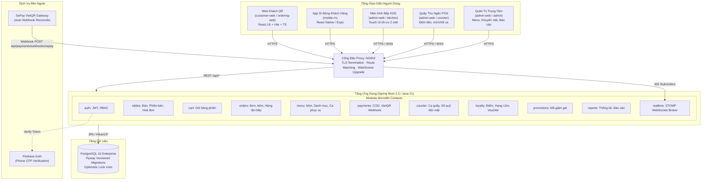
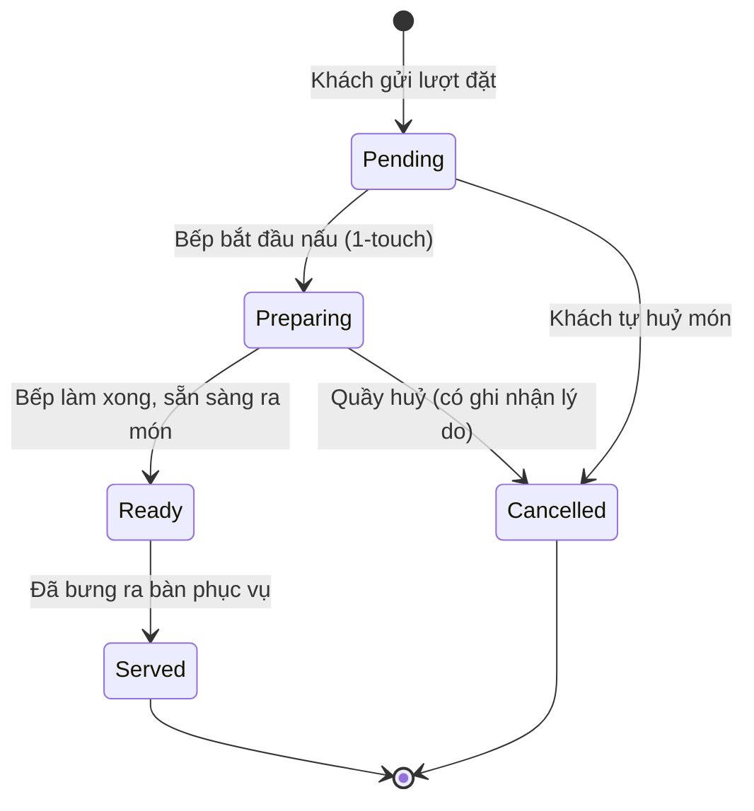
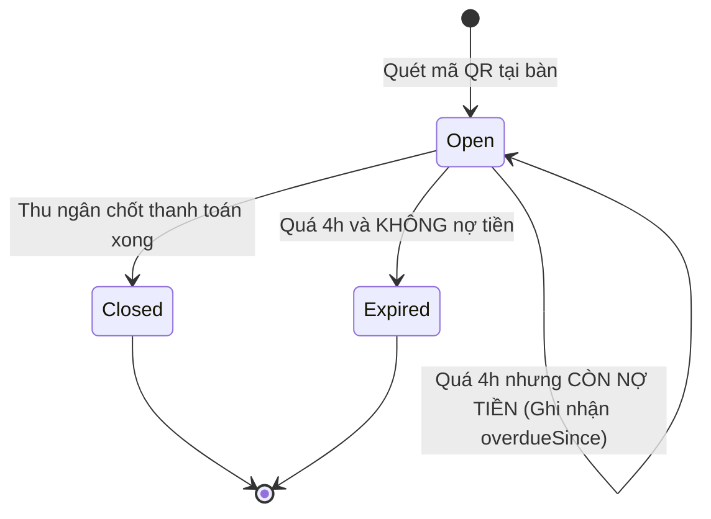

# BẢN THIẾT KẾ HỆ THỐNG CHUẨN — RESTAURANT MANAGEMENT SYSTEM (CMC RESTAURANT)

> **Mục tiêu**: Đây là tài liệu thiết kế kiến trúc chuẩn (System Architecture Blueprint) cho toàn bộ hệ sinh thái phần mềm nhà hàng (Web Khách QR, App Di động, Màn hình Bếp KDS, Quầy POS Thu ngân và Quản trị Admin). Tài liệu đóng vai trò là "kim chỉ nam" kỹ thuật để refactor, chuẩn hóa và mở rộng dự án trong dài hạn.

---

## PHẦN I: NGUYÊN TẮC THIẾT KẾ & BỐI CẢNH HỆ THỐNG

### 1. Triết lý kiến trúc (Architecture Principles)
1. **Modular Monolith thay vì Microservices**:
   - Một nhà hàng, một cụm cơ sở dữ liệu duy nhất, chạy trong cùng một tiến trình API (Spring Boot 3.3 / Java 21).
   - Ràng buộc nghiệp vụ sống còn: *Đặt món, thanh toán, trừ tồn kho và tích điểm phải thành công hoặc thất bại trong cùng một ACID Transaction*. Tránh phân tán giao dịch (Saga / Distributed 2PC) gây rủi ro lệch tiền và dữ liệu mồ côi trong giờ quán đông khách.
   - Phân chia module ranh giới cứng (Bounded Contexts) bằng package structure và ArchUnit enforcement.
2. **Trạng thái sống ở MÓN, không sống ở ĐƠN**:
   - Một bàn gọi nhiều món, mỗi món được làm bởi các khu vực khác nhau (Bếp nóng, Bếp nguội, Pha chế, Tráng miệng) và ra bàn ở các thời điểm khác nhau.
   - Trạng thái đơn hàng (`Order`) chỉ là phép suy diễn (derived projection) từ tập hợp trạng thái của từng dòng món (`OrderItem`).
3. **Mã QR định danh Bàn vật lý — Phiên bàn (Session) định danh Lượt khách**:
   - QR dán cố định trên mặt bàn, không in lại theo lượt khách.
   - Khách quét QR truy cập qua `TableSession` với token năng lực (`X-Table-Session-Token`), không bắt buộc đăng ký tài khoản.
   - Đơn vị tính tiền cuối cùng là **Hoá đơn bàn (`TableInvoice`)**, gộp tất cả các lượt gọi món (`Order Round`) trong suốt phiên.

---

## PHẦN II: TỔNG QUAN KIẾN TRÚC VẬT LÝ & HẠ TẦNG (C4 CONTAINER)

---

## PHẦN III: THIẾT KẾ DOMAIN & RANH GIỚI NGHIỆP VỤ (BOUNDED CONTEXTS)

### 1. Menu & Serving Period Context (Quản lý Thực đơn & Khung giờ)
* **Thực thể cốt lõi**: `Category`, `MenuItem`, `ServingPeriod`, `MenuItemServingPeriod`.
* **Nghiệp vụ**:
  - Quản lý danh mục và danh sách món ăn, giá bán, mô tả, ảnh, nhóm nhãn (`tags`).
  - **Khung ca phục vụ (`ServingPeriod`)**: Hỗ trợ chia ca linh hoạt (Sáng, Trưa, Tối) hoặc ca qua đêm (`startTime > endTime` như Lẩu đêm 18:00 - 02:00). Món không gán ca mặc định bán cả ngày.
  - **Chuẩn bị thực đơn hôm nay (`ChuanBiThucDon`)**: Quản lý bật/tắt bán từng ngày, cấu hình giới hạn số suất bán được trong ngày (`remainingQuantity`). Hết số suất (`remainingQuantity = 0`) tự ẩn khỏi thực đơn khách nhưng không đụng tới công tắc bán cố định của quán.
  - **Giá vốn (`costPrice`)**: Dùng cho tính toán biên lợi nhuận và đối soát hao hụt.

### 2. Table & Session Context (Quản lý Bàn & Phiên Bàn)
* **Thực thể cốt lõi**: `RestaurantTable`, `TableSession`, `TableInvoice`.
* **Nghiệp vụ**:
  - Mã QR dán bàn tĩnh: Sinh theo định dạng `cmc-table-{code}-qr`.
  - **Quy tắc phiên đơn nhất**: Tại một thời điểm, mỗi bàn chỉ có tối đa **1 phiên `Open`** (ép bằng Unique Index có điều kiện trong DB). Khách quét cùng bàn sẽ vào chung 1 phiên.
  - **Vòng đời phiên bàn**:
    - `Open` -> `Closed` (quầy chốt hoá đơn).
    - `Open` -> `Expired` (quá thời hạn 4 giờ mặc định).
    - **Cơ chế chống thất thoát (Overdue Protection)**: Nếu phiên bàn quá 4 giờ nhưng **vẫn còn nợ tiền món chưa thanh toán**, hệ thống **KHÔNG được tự đóng** sang `Expired` (tránh biến thành hoá đơn mồ côi), mà tự động gia hạn thêm và đánh dấu mốc `overdueSince` để cảnh báo quầy thu ngân.
  - **Khôi phục trạng thái khách (`resumeState`)**:
    - `New`: Chưa chọn món -> dẫn vào Menu.
    - `CartPending`: Đang có món trong giỏ -> dẫn vào Giỏ hàng.
    - `OrderInProgress`: Đã gửi bếp -> dẫn vào Màn hình theo dõi tiến độ món.
    - `ReadyForPayment` / `PaymentPending` / `Paid` -> dẫn vào Màn hình Hoá đơn bàn.

### 3. Cart, Order & Kitchen Execution Context (Gọi món & Vận hành Bếp)
* **Thực thể cốt lõi**: `TableSessionCartItem`, `Order`, `OrderItem`, `OrderStatusHistory`, `KitchenDelay`.
* **Nghiệp vụ**:
  - **Giỏ hàng dùng chung**: Thuộc về `TableSession`, mọi khách tại bàn cùng xem và cập nhật chung thời gian thực.
  - **Gửi lượt gọi món (`Order Round`)**: Trong 1 giao dịch nguyên tử: Ghi nhận đơn hàng mới (`Order` + `OrderItem`s) và xoá sạch giỏ hàng. Hỗ trợ `Idempotency-Key` ngăn chặn gửi trùng đơn do giật mạng.
  - **Hàng đợi bếp phân trạm song song (`BEP`, `QUAY`, `SAN`)**:
    - Bếp nấu nóng (`BEP`): Năng lực xử lý song song mặc định = 6 món.
    - Quầy pha chế (`QUAY`): Năng lực xử lý song song mặc định = 2 món.
    - Hàng lấy sẵn (`SAN`): Không xếp hàng chờ (rượu, bia lon, trái cây).
    - Thời gian chờ ước tính = `(Tổng số món đang xếp trước ở bếp đó) / Năng lực song song + Thời gian chế biến món`.
    - Cho phép Bếp trưởng khai báo độ trễ phát sinh (`KitchenDelay`, tối đa 60 phút, tự hết hạn).

### 4. Billing, Promotion & Payment Context (Thanh toán & Chiết khấu)
* **Thực thể cốt lõi**: `TableInvoice`, `Promotion`, `Payment`, `PaymentTransaction`.
* **Nghiệp vụ**:
  - **Hoá đơn bàn (`TableInvoice`)**: Tính lại từ toàn bộ các dòng `OrderItem` của tất cả các lượt gọi chưa huỷ, gộp theo cặp `(menuItemId, unitPrice)`.
  - **3 tầng trần giảm giá nghiêm ngặt (Discount Caps)**:
    1. *Tầng 1 (Mã khuyến mãi)*: Cắt theo `maxDiscountAmount` của từng mã.
    2. *Tầng 2 (Phiếu đổi điểm)*: Giảm tối đa `min(30% hoá đơn, 200.000 VNĐ)`.
    3. *Tầng 3 (Trần tổng chiết khấu)*: Tổng mọi khoản giảm giá **không vượt quá 50% tổng tiền món** (bảo vệ giá vốn nhà hàng).
  - **Phương thức thanh toán**:
    - Tiền mặt (`COD`): Thu ngân nhận tiền tại quầy, tính tiền thừa (`changeTendered`), đóng hoá đơn.
    - Chuyển khoản VietQR: Tự động sinh mã VietQR động chứa mã hoá đơn; Webhook SePay bắt giao dịch tiền vào, đối soát chuẩn xác và tự động chuyển hoá đơn sang `Paid`.

### 5. Counter & Shift Management Context (Quản lý Ca & Quỹ Tiền Mặt)
* **Thực thể cốt lõi**: `CounterShift`, `CounterShiftTransaction`.
* **Nghiệp vụ**:
  - Mở ca quầy: Ghi nhận nhân viên mở ca, thời gian và số tiền mặt đầu ca (`openingCashFloat`).
  - Giao dịch trong ca: Tự động ghi nhận tiền mặt thu từ hoá đơn, chi hoàn tiền, chi ngoài dự kiến.
  - Chốt ca quầy: Thu ngân đếm tiền mặt thực tế (`closingCashActual`), hệ thống tính chênh lệch thừa/thiếu (`cashDifference = closingCashActual - expectedCash`). Chốt ca ghi nhận bất biến, không cho phép mở lại.
  - Điều phối gọi nhân viên: Bắt tín hiệu khách gọi từ bàn, nhân viên quầy bấm điều phối bộ đàm, ghi nhận thời gian chờ.

### 6. Loyalty & CRM Context (Hội viên & Khách hàng thân thiết)
* **Thực thể cốt lõi**: `LoyaltyMember`, `LoyaltyPointLedger`, `LoyaltyReward`, `LoyaltyRedemption`.
* **Nghiệp vụ**:
  - **Đăng ký tức thì không rào cản**: Khách chỉ cần nhập Số điện thoại khi thanh toán là tự động sinh tài khoản tích điểm. Khi tải app, xác thực OTP Firebase để liên kết toàn bộ lịch sử điểm trước đó.
  - **Quy tắc tích điểm**: 10.000 VNĐ = 1 điểm (làm tròn xuống).
  - **Hệ thống hạng thẻ (Tiering)**:
    - Bạc (Silver): Hệ số tích điểm x1.0.
    - Vàng (Gold - Chi tiêu 12 tháng ≥ 5.000.000 VNĐ): Hệ số x1.25.
    - Kim cương (Diamond - Chi tiêu 12 tháng ≥ 15.000.000 VNĐ): Hệ số x1.5.
  - **Sổ cái điểm bất biến (Immutable Ledger)**: Điểm hết hạn theo nguyên tắc FIFO (12 tháng). Khi hoá đơn bị hoàn tiền (`Refund`), hệ thống tự động ghi nhận dòng sổ cái `REFUND` âm điểm tương ứng để tự triệt tiêu.

---

## PHẦN IV: CÁC MÁY TRẠNG THÁI CHUẨN (FINITE STATE MACHINES)

### 1. Máy trạng thái Món ăn (`OrderItemStatus`)

### 2. Máy trạng thái Phiên bàn (`TableSessionStatus`)

---

## PHẦN V: KẾ HOẠCH REFACTOR & TIẾP TỤC PHÁT TRIỂN (ROADMAP)

Dựa trên việc rà soát toàn bộ mã nguồn và lược đồ CSDL, dưới đây là kế hoạch hành động chuẩn hóa:

| Ưu tiên | Hạng mục Refactor | Mô tả chi tiết kỹ thuật |
|---|---|---|
| **P0** | **Bỏ vai trò `Staff` dở dang** | Chuyển đổi dứt điểm các tài khoản và quyền hạn cũ của `Staff` sang `CounterStaff` trong 12 vị trí backend và 2 vị trí frontend. Ngăn ngừa lỗi 403 Forbidden khi mở tab ca quầy. |
| **P0** | **Ghi nhận hao hụt huỷ món sau nấu** | Hiện tại khi huỷ món ở trạng thái `Preparing`, hoá đơn trừ tiền nhưng không ghi nhận giá vốn nguyên liệu bị mất (`Wasted Cost`). Cần thêm cột `wasted_cost` trong `order_items` để phục vụ báo cáo hao hụt bếp. |
| **P1** | **Bảng tham số nghiệp vụ `business_rule`** | Chuyển 6 hằng số đang hardcode trong mã (Tỷ lệ điểm 10.000đ, hạn phiên 4h, trần đổi điểm 30%, trần hoá đơn 50%) ra bảng CSDL có hiệu lực theo mốc thời gian (`effective_from`). |
| **P1** | **Đồng bộ chuẩn từ vựng `TramChuanBi` -> `Bep`** | Chuẩn hóa toàn bộ danh xưng từ vựng trong mã backend từ `Station` sang `KitchenStation` / `Bep` để khớp hoàn toàn với thực tế nhà hàng và tài liệu đặc tả. |
| **P2** | **Quản lý kho nguyên vật liệu & Định lượng (Recipe/BOM)** | Xây dựng phân hệ trừ kho tự động theo định lượng món ăn khi đơn hàng chuyển sang `Preparing`. |
