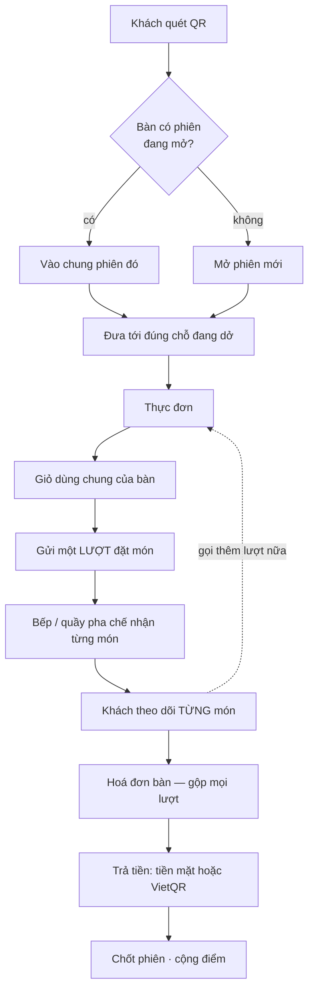
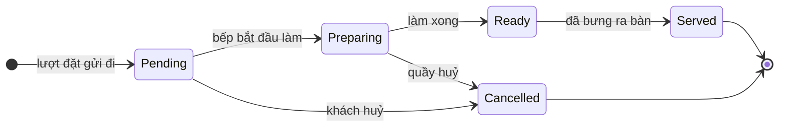

# Thiết kế nghiệp vụ — CMC Restaurant

> **Bản gộp, lập 2026-09-05.** Đây là tài liệu **duy nhất** mô tả nghiệp vụ của dự án. Nó thay cho
> `PHAN_TICH_NGHIEP_VU.md` và `THIET_KE_VAI_TRO_VA_TRAI_NGHIEM.md` — hai tệp đó đã xoá, vì ba tài
> liệu chồng nhau chính là cái bẫy "hai nơi cùng mô tả một sự thật" mà dự án này đã sập bốn lần
> (§23).
>
> **Cách đọc:**
> - Phần chữ thường mô tả **luật đang chạy**, rút từ mã chứ không từ trí nhớ.
> - Khối `ĐỀ XUẤT` là **thay đổi chờ bạn duyệt**, chưa cài đặt.
> - §24 là bảng duyệt — đọc phần đó trước nếu bạn chỉ có 5 phút.

---

# PHẦN I — NỀN TẢNG

## 1. Bài toán

Khách ngồi vào bàn, quét mã QR dán sẵn, gọi món trên điện thoại của chính mình, theo dõi từng món,
rồi trả tiền một lần cho cả bàn. Không cài ứng dụng, không phải chờ gọi nhân viên để gọi món.

Ba ràng buộc định hình toàn bộ thiết kế:

1. **Một bàn có nhiều điện thoại.** Bốn người cùng bàn cùng quét một mã. Họ phải thấy cùng một giỏ
   và cùng một hoá đơn, không phải bốn phiên riêng.
2. **Một bữa ăn có nhiều lượt gọi.** Món chính, rồi đồ uống, rồi tráng miệng. Ba lượt gọi, một lần
   trả tiền.
3. **Món không xong cùng lúc.** Bàn gọi 4 món thì 4 món ra ở 4 thời điểm khác nhau, từ những chỗ
   làm khác nhau trong quán.

Ràng buộc 3 là thứ tách hệ thống này khỏi một máy bán hàng thông thường, và nó lan ra khắp thiết
kế: trạng thái, ước lượng thời gian, màn hình bếp, và cả cách nói với khách.

### Phạm vi

| Trong phạm vi | Ngoài phạm vi |
|---|---|
| Ăn tại bàn (`DineIn`) | Giao hàng, mang về |
| Một nhà hàng | Nhiều chi nhánh, multi-tenant |
| Tiền mặt và VietQR | Thẻ, ví điện tử khác |
| Tiếng Việt và tiếng Anh | Ngôn ngữ khác |

## 2. Từ vựng

Dùng đúng những từ này trong mã, tài liệu và giao diện. Từ trong cột "tránh dùng" đã gây nhầm lẫn
thật.

| Từ | Nghĩa | Tránh dùng |
|---|---|---|
| **Phiên bàn** | Một lượt khách ngồi tại một bàn, từ lúc quét QR tới lúc chốt tiền | phiên đặt món, phiên giỏ |
| **Lượt đặt món** | Một lần gửi các món đã chọn xuống bếp. Một phiên bàn có nhiều lượt | đơn hàng, hoá đơn |
| **Hoá đơn bàn** | Bản tổng kết tiền duy nhất cho **mọi** lượt trong một phiên bàn | thanh toán đơn, tổng giỏ |
| **Món trong đơn** | Một dòng món của một lượt, có trạng thái riêng | — |
| **Bếp** | Nơi làm ra món. Có ba: **bếp nấu**, **quầy pha chế**, **hàng lấy sẵn** | trạm, station |

> **Vì sao không dùng "trạm".** Đó là từ dịch từ *station*. Trong bếp Việt người ta nói bếp nóng,
> bếp nguội, bếp bánh — "bếp" là từ có sẵn cho đúng khái niệm này, còn "trạm" thì phải giải thích
> mới hiểu. Tài liệu đã đổi hết; **mã thì chưa** — xem quyết định P ở §24.

## 3. Tác nhân

Hệ thống có **bốn** vai: một phía khách, ba phía vận hành.

| Tác nhân | Xác thực bằng | Làm được gì |
|---|---|---|
| **Khách tại bàn** | token phiên bàn (`X-Table-Session-Token`), **không cần tài khoản** | Xem thực đơn, sửa giỏ, gửi đơn, theo dõi món, huỷ món chưa nấu, xem hoá đơn, chọn cách trả tiền, gọi nhân viên |
| **Khách có tài khoản** (`Customer`) | JWT | Thêm: xem điểm, đổi ưu đãi, lịch sử đơn, đặt lại món cũ |
| **Nhân viên quầy** (`CounterStaff`) | JWT | Ca quầy, thu tiền, phiếu tặng món, điều phối gọi nhân viên |
| **Nhân viên bếp** (`Kitchen`) | JWT | Trạng thái từng món, báo hết món, khai độ trễ |
| **Quản lý** (`Admin`) | JWT | Thực đơn, bàn, người dùng, khuyến mãi, ưu đãi, báo cáo; **giám sát** quầy |

> **ĐỀ XUẤT 1 — bỏ vai `Staff`.**
>
> Hệ thống hiện còn vai thứ năm là `Staff`, **đang chết dở**: `AdminUserService` chỉ cho gán
> `Admin`/`CounterStaff`/`Kitchen` nên **không tạo mới được** tài khoản `Staff`, nhưng quyền của nó
> vẫn rải khắp backend và tài khoản cũ vẫn đăng nhập được.
>
> Hậu quả có thật: `CounterController` (toàn bộ ca quầy) yêu cầu `CounterStaff` hoặc `Admin`, trong
> khi frontend cấp cho `Staff` **đúng bộ tab của nhân viên quầy, gồm cả tab "Ca làm việc"**. Tài
> khoản `Staff` mở tab đó nhận 403 ở mọi thao tác — màn hình mời họ làm một việc mà máy chủ từ chối.
>
> Quy mô: **12 chỗ ở backend** (10 tệp), **2 chỗ ở frontend**, không có tài khoản `Staff` nào trong
> dữ liệu mẫu. Cần một migration đổi tài khoản `Staff` đang tồn tại sang `CounterStaff` — **không
> xoá tài khoản**, vì người đó vẫn đang đi làm.

---

# PHẦN II — NGHIỆP VỤ PHÍA KHÁCH

## 4. Bản đồ một bữa ăn



## 5. Phiên bàn

- Mã QR dán ở bàn **không đổi theo lượt khách**. Đổi mã mỗi lượt nghĩa là phải in lại, mà một tờ
  giấy dán bàn thì không in lại được giữa ca.
- Mỗi bàn **tối đa một phiên `Open`**. Ép bằng chỉ mục duy nhất có điều kiện ở cơ sở dữ liệu, không
  bằng kiểm tra trong mã — hai request cùng lúc thì cơ sở dữ liệu chặn, và API đọc lại phiên mà
  request kia vừa tạo thay vì báo lỗi cho khách.
- Vòng đời: `Open → Closed` (quầy chốt) hoặc `Open → Expired` (quá **4 giờ**).
- Mở phiên luôn chuyển các phiên quá hạn của bàn đó sang `Expired` **trước**, rồi mới tìm phiên còn
  sống.

### Quay lại đúng chỗ đang dở

Khách khoá màn hình giữa bữa rồi mở lại. Nếu quay về đầu thì họ phải tự nhớ đang làm dở gì.

| Trạng thái | Đưa tới |
|---|---|
| `New` | thực đơn |
| `CartPending` | giỏ hàng |
| `OrderInProgress` | theo dõi đơn |
| `ReadyForPayment` · `PaymentPending` · `Paid` | hoá đơn bàn |

Hai đầu phải nói cùng một chuyện: `TableSessionResumeStateResolver` (backend) và
`getSessionResumeDestination` (frontend). **Đây là chỗ dễ trôi nhất của hệ thống** — hai bản cài
đặt độc lập của cùng một luật, viết bằng hai ngôn ngữ, và không có gì tự động bắt lệch.

## 6. Giỏ và lượt đặt món

Giỏ thuộc **phiên bàn**, không thuộc thiết bị. Bốn điện thoại cùng bàn sửa cùng một giỏ.

Gửi một lượt đặt món làm hai việc **trong cùng một giao dịch**: ghi đơn, và xoá giỏ. Tách ra thì có
khoảnh khắc đơn đã tạo mà giỏ vẫn còn — người thứ hai bấm gửi sẽ đặt lại đúng những món đó.

Chống trùng bằng **khoá idempotency**: cùng khoá + cùng nội dung thì trả về đơn cũ; cùng khoá +
khác nội dung thì báo lỗi. Vế thứ hai quan trọng — nó bắt lỗi client dùng lại khoá cho một yêu cầu
khác, thứ mà im lặng bỏ qua sẽ làm mất một đơn thật.

## 7. Trạng thái: sống ở MÓN, không ở ĐƠN



Trạng thái đơn (`Draft`, `Placed`, `Confirmed`, `Preparing`, `Ready`, `Served`, `Completed`,
`Cancelled`) là **kết quả suy ra** từ các món, không phải một công tắc riêng.

**Vì sao không làm ngược lại.** Bàn gọi 4 món, xong 1. Nếu trạng thái sống ở đơn thì khách thấy
"đang chuẩn bị" suốt và không biết món nào đã lên; bếp cũng không có chỗ ghi rằng ba món kia vẫn
đang làm.

**Luật huỷ món.** Khách chỉ huỷ được món còn `Pending`. Khoá **theo từng món**, không theo đơn —
khách huỷ được món chưa ai đụng tới ngay cả khi món khác cùng đơn đang nấu dở.

**Luật `Ready → Served`.** Bếp bắt buộc đi qua bước này trước khi chốt phiên. Nhảy thẳng
`Ready → Completed` bị từ chối. Không phải để làm khó: **"đã bưng ra bàn" là sự kiện duy nhất chứng
minh khách thật sự nhận được món.**

## 8. Ước lượng thời gian lên món

Một quán **không có một hàng đợi**. Nó có mấy chỗ làm việc song song, và chúng không chờ nhau.

| Bếp | Món | Hàng đợi | Việc làm cùng lúc |
|---|---|---|---|
| **Bếp nấu** (`BEP`) | món nấu (có nhãn `method:`) | có | mặc định **6** |
| **Quầy pha chế** (`QUAY`) | đồ uống, nước ép | có | mặc định **2** |
| **Hàng lấy sẵn** (`SAN`) | rượu, trái cây, tráng miệng | không | — |

```
chờ = (việc đang xếp ở BẾP ĐÓ − chính món này) ÷ số việc bếp đó làm cùng lúc
```

Ly bia không chậm đi vì bếp đang đông.

**Độ trễ bếp tự khai.** Hàng đợi chỉ đo được thứ đã đi qua ứng dụng. Đầu bếp nghỉ ốm, hỏng lò, đoàn
đặt trước — không việc nào nằm trong bất kỳ đơn nào. Bếp nhập số phút cộng thêm (tối đa 60), và nó
**chỉ áp cho món của bếp nấu**.

> **Lỗi đã sập một lần:** truy vấn tải bếp cộng `prep_minutes` mà quên nhân `quantity`. 30 phần của
> một món bị đếm như 1. Không tập kiểm nào bắt được vì mọi ca kiểm đều dùng `quantity: 1`.

## 9. Hoá đơn bàn và ba tầng trần giảm giá

Hoá đơn **tính lại từ dòng món**, không cộng dồn tổng của từng đơn. Các dòng gộp theo
`(món, đơn giá)` — gọi phở ba lượt khác nhau thì lên hoá đơn là một dòng ×3.

```
tạm tính = Σ (đơn giá × số lượng)
tổng     = tạm tính − giảm giá        (không âm)
```

**Không có VAT, không phí phục vụ, không tip** — xem §24, quyết định C.

### Ba tầng trần

| Tầng | Trần | Chặn điều gì |
|---|---|---|
| Khuyến mãi của quán | `maxDiscount` của từng mã | một mã tự nó giảm quá sâu |
| Đổi điểm | `min(30% hoá đơn, 200.000đ)` | khách gom điểm cả năm đổi gần hết một bữa |
| **Tổng mọi nguồn** | **50% hoá đơn** | hai khoản hợp lệ cộng lại vẫn ăn quá sâu vào giá vốn |

Tầng thứ ba không thừa. Ví dụ đã tính: hoá đơn 760.000đ, mã quán giảm 20% (152.000đ) cộng ưu đãi
đổi điểm 200.000đ = 352.000đ — **gần một nửa hoá đơn, trong khi từng khoản đều hợp lệ**.

Trần tổng **cắt phần vượt chứ không từ chối hoá đơn**. Khách đã đứng ở quầy chờ trả tiền; bắt họ bỏ
bớt một mã ở khoảnh khắc đó là đổi một khoản lãi nhỏ lấy một trải nghiệm tệ.

> **Lỗi đã sập một lần:** ưu đãi đổi điểm từng trừ ở cấp **đơn**, trong khi hoá đơn bàn tính lại
> tạm tính từ dòng món rồi chỉ trừ ở cấp **hoá đơn**. Kết quả: **khách mất điểm và vẫn trả đủ
> tiền.** Bài học: nơi tính tiền và nơi ghi khoản giảm phải cùng một cấp.

## 10. Khuyến mãi và ưu đãi — đặt và áp

Hệ thống có **hai** cơ chế giảm giá, và chúng khác nhau về bản chất chứ không chỉ về tên.

| | Mã khuyến mãi | Phiếu đổi điểm |
|---|---|---|
| Ai tạo | Quản lý đặt sẵn một mã | Khách đổi bằng điểm của mình |
| Ai dùng được | **Bất kỳ ai biết mã** | Đúng người đã đổi |
| Dùng được mấy lần | **Không giới hạn** | **Một lần** |
| Truy được ai dùng | Chỉ qua từng hoá đơn | Có: mã riêng, ai xác nhận, lúc nào |
| Đảo ngược | Không có khái niệm | Có |
| Điều kiện | Đơn tối thiểu, khoảng ngày | Đủ điểm, đủ hạng |

### 10.1 Đặt một mã khuyến mãi (quản lý)

| Trường | Nghĩa | Bắt buộc |
|---|---|---|
| `code` | Mã khách gõ. **So khớp không phân biệt hoa thường**, lưu và đối chiếu ở dạng in hoa | có, **duy nhất** |
| `name`, `description` | Tên và mô tả hiện cho khách | tên bắt buộc |
| `type` | `Percentage` hoặc `FixedAmount` | có |
| `discountValue` | Số phần trăm, hoặc số tiền | có |
| `minOrderAmount` | Tạm tính phải đạt mức này | không |
| `maxDiscountAmount` | Trần cho **riêng mã này** | không |
| `startsAt`, `endsAt` | Khoảng hiệu lực | không |
| `active` | Công tắc bật/tắt ngay | có |
| `flashSale` | Cờ — xem cảnh báo dưới | không |

### 10.2 Áp mã lúc thanh toán — thứ tự kiểm

Kiểm theo đúng thứ tự này, dừng ở lỗi đầu tiên:

```
1. Mã rỗng            → bỏ qua, không giảm gì (không phải lỗi)
2. Không tìm thấy mã  → PROMOTION_NOT_FOUND
3. active = false     → PROMOTION_INACTIVE
4. Chưa tới startsAt  → PROMOTION_NOT_STARTED
5. Đã qua endsAt      → PROMOTION_EXPIRED
6. Tạm tính < minOrder→ PROMOTION_MIN_ORDER_NOT_MET  (kèm luôn số tiền còn thiếu)
7. Tính giảm:
     Percentage  → tạm tính × % , làm tròn HALF_UP
     FixedAmount → đúng số tiền
8. Cắt về maxDiscountAmount (nếu có)
9. Cắt về tạm tính — khoản giảm không bao giờ vượt hoá đơn
```

Bước 7 làm tròn **HALF_UP**, tức nửa đồng làm tròn **có lợi cho khách**. Cố ý — đây là lựa chọn
kinh doanh, không phải mặc định của thư viện.

Bước 9 là chốt cuối ở cấp một mã. Sau đó khoản giảm này còn đi qua **trần tổng 50%** ở §9 khi cộng
với ưu đãi đổi điểm.

### 10.3 Ai nhìn thấy và ai nhập mã

`GET /api/promotions/active` và `POST /api/promotions/validate` đều **công khai, không cần đăng
nhập**. Có lý do được ghi lại trong mã: mã khuyến mãi là thứ quán in lên tờ rơi, và khách vãng lai
trên web cũng phải xem được — bắt đăng nhập mới thấy khuyến mãi sẽ biến app di động thành cửa duy
nhất, điều không ai quyết định.

Khách nhập mã ở bước chọn cách trả tiền. Mã được lưu vào hoá đơn (`promotionCode`), nên tra ngược
được một hoá đơn đã dùng mã nào.

### 10.4 Ba lỗ hổng trong nghiệp vụ mã khuyến mãi

Đây là phần chưa từng được viết ra, và là lý do mục này tồn tại.

> **ĐỀ XUẤT 2 — giới hạn số lượt dùng của một mã.**
>
> Hiện **không có** `usageLimit`, không có `usedCount`, không có giới hạn theo khách. Một mã lọt ra
> ngoài — ảnh chụp màn hình lên nhóm chat, một người khoe trên mạng — thì **ai cũng dùng được, bao
> nhiêu lần cũng được**, cho tới khi có người vào tắt `active`.
>
> Thiệt hại bị chặn bởi ba tầng trần ở §9, nên không phải vô hạn. Nhưng "mỗi hoá đơn giảm tối đa
> 50%" áp cho **mọi** hoá đơn thì vẫn là một khoản lớn, và không ai biết cho tới khi đọc báo cáo.
>
> Đề xuất tối thiểu: `usage_limit` (tổng số lượt, `null` = không giới hạn) và `used_count` tăng
> nguyên tử lúc áp mã thành công. Bước sau nếu cần: giới hạn theo hội viên.
>
> Lưu ý cài đặt: tăng `used_count` phải nằm **trong cùng giao dịch** với việc ghi hoá đơn. Tách ra
> là mở đúng cửa mà hai người bấm cùng lúc đi qua được.

> **ĐỀ XUẤT 3 — `flashSale` hiện không có nghĩa nghiệp vụ nào.**
>
> Cờ này được lưu, được trả về API, được hiện trên giao diện — nhưng `Promotion.applyTo` **không
> bao giờ đọc nó**. Nó chỉ là một cái nhãn.
>
> Một trường trông như luật mà không phải luật là thứ nguy hiểm: người quản lý bật "flash sale"
> tưởng mình vừa đặt một quy tắc. Hai đường đi, chọn một:
>
> - **Bỏ cờ**, dùng `startsAt`/`endsAt` cho mọi khuyến mãi có hạn — đơn giản nhất, và đủ.
> - **Cho nó nghĩa thật**: ví dụ chỉ hiệu lực trong khung giờ hằng ngày, không phải một khoảng ngày
>   liên tục. Nhưng đó là một trường mới (`daily_from`, `daily_to`), không phải một cờ boolean.
>
> Khuyến nghị: **bỏ cờ**. Chưa ai cần nghĩa thứ hai.

> **ĐỀ XUẤT 4 — mã hết hạn giữa bữa ăn.**
>
> Khách xem thực đơn lúc 19:50, thấy mã giảm 20% hết hạn 20:00. Ăn xong, ra trả tiền lúc 20:15 →
> `PROMOTION_EXPIRED`, và người chịu là nhân viên quầy đứng giải thích.
>
> Hiện luật là **kiểm lúc trả tiền**. Đó là luật đúng về mặt kế toán nhưng tệ về mặt trải nghiệm ở
> đúng khoảnh khắc khó chịu nhất.
>
> Ba lựa chọn, cần bạn quyết:
> 1. **Giữ nguyên** — mã hết hạn là hết hạn. Đơn giản, nhưng khách cãi tại quầy.
> 2. **Chốt theo lúc mở phiên bàn** — mã còn hiệu lực lúc khách ngồi xuống thì áp được suốt bữa.
>    Công bằng với khách, và giải thích được.
> 3. **Chốt theo lúc gửi lượt đặt món đầu tiên** — chặt hơn (2), vẫn giải thích được.
>
> Khuyến nghị: **(2)**. Nó khớp với cách khách hiểu — "lúc tôi vào quán thì đang có khuyến mãi".
> Cài đặt: hoá đơn lưu thêm mốc thời gian dùng để kiểm, mặc định là `openedAt` của phiên bàn.

### 10.5 Ưu đãi đổi điểm — đặt và giao

Quản lý đặt danh mục phần thưởng: loại (`FREE_ITEM` món tặng / `DISCOUNT` giảm tiền), số điểm cần,
**hạng tối thiểu**, và bật/tắt.

Khách đổi điểm → hệ thống sinh một **phiếu có mã riêng**. Phiếu chỉ thành hiện thực khi **quầy xác
nhận đã giao** — điểm trừ tại đó, không trừ lúc đổi. Phiếu ghi lại ai xác nhận và lúc nào; đã dùng
thì không dùng lại được.

Đây là mô hình đúng, và là mẫu để §10.4 hướng tới: mã khuyến mãi hiện **thiếu** đúng ba thứ mà
phiếu đổi điểm đã có — giới hạn lượt, dấu vết người dùng, và đường đảo ngược.

## 11. Thanh toán và đối soát

`PaymentMethod`: `Unselected` (trạng thái đầu, không ai chọn được), `COD` (tiền mặt), `VietQR`.

`PaymentStatus`: `NotRequested → Pending → Confirmed`/`Paid`, hoặc rẽ sang `Failed`, `Cancelled`,
`Refunded`.

### Đối soát VietQR — ba luật

1. **Chỉ nhận giao dịch tiền VÀO.** Không lọc thì một khoản chuyển đi, tình cờ mang mã đơn trong
   nội dung, cũng đánh dấu đơn đó đã trả tiền.
2. **Không có khoá thì TỪ CHỐI tất cả.** Không phân biệt được webhook thật với giả, mà nhận nhầm
   một cái giả nghĩa là đánh dấu đã trả cho một bàn chưa trả đồng nào.
3. **Chỉ `confirmed` mới nghĩa là tiền đã ghi vào hoá đơn.** Mọi kết quả khác là tiền vào tài khoản
   mà không hoá đơn nào được chốt — phải ghi lại, không nuốt đi.

Mã QR **chỉ dựng khi hoá đơn thật sự chọn VietQR**. Dựng vô điều kiện sẽ trả mã quét được cho một
hoá đơn đang trả tiền mặt — khách quét rồi chuyển khoản thành hai lần thu.

## 12. Tích điểm và liên kết số điện thoại

| Luật | Giá trị |
|---|---|
| Tỷ lệ | 10.000đ = 1 điểm, **làm tròn xuống** |
| Hạng | Bạc ×1,0 · Vàng ×1,25 · Kim cương ×1,5 |
| Ngưỡng hạng | Theo **chi tiêu 12 tháng gần nhất**: ≥ 5tr lên Vàng, ≥ 15tr lên Kim cương |
| Xét lại hạng | Tác vụ chạy **03:00 ngày 1 hằng tháng** |
| Hạn dùng điểm | 12 tháng kể từ ngày tích |

### 12.1 Hạng tính theo cửa sổ trượt, không theo tích luỹ trọn đời

`lifetime_spend` có sẵn trong dữ liệu nhưng **cố ý không dùng để xét hạng**: nó chỉ cộng dồn và
không bao giờ giảm, nên hạng sẽ lên được mà không xuống được — tức không còn là hạng nữa. Nó được
giữ lại chỉ để báo cáo.

Hạng đọc từ `spend_12m`, và tác vụ hằng tháng **tính lại con số đó từ sổ điểm** chứ không trừ dần —
nên sổ là nguồn có thẩm quyền, và một lần ghi sai được tự chữa ở kỳ sau.

Chạy theo **tháng** chứ không theo ngày là có chủ ý: tụt hạng là chuyện khách cần đoán trước được;
xét mỗi ngày sẽ khiến hạng rơi vào một buổi sáng bất kỳ không lý do.

**Làm tròn xuống là có chủ ý**: nó bảo đảm chia nhỏ hoá đơn không bao giờ lợi hơn trả một lần —
điều ngược lại chính là thứ một chương trình khách quen phải tránh.

**Nhân hệ số hạng TRƯỚC khi chia, không phải sau.** Hoá đơn 330.000đ ở hạng Vàng: đúng cách cho
33 × 1,25 = 41,25 → **41 điểm**; nhân sau cho 33 → mất phần lẻ hai lần.

**Điểm hết hạn tính bằng số học, không theo từng lô.** Gắn cho mỗi lô một cột "còn lại" sẽ tạo
nguồn sự thật thứ hai bên cạnh `loyalty_members.points`, và hai nguồn thì sẽ có ngày lệch nhau.
Khách luôn tiêu điểm cũ trước — đó là *định nghĩa* của FIFO. Nên chỉ cần hai tổng chạy trên sổ:

```
hết hạn = (tổng ACCRUE quá 12 tháng) − (tổng REDEEM + EXPIRE từ trước tới nay)
```

**Đổi ưu đãi phải quầy xác nhận.** Điểm chỉ trừ khi ưu đãi thật sự được giao.

### 12.2 Liên kết số điện thoại — hai đường vào, một hồ sơ

Ý tưởng gốc, và nó gọn: **hồ sơ điểm khoá theo SỐ ĐIỆN THOẠI, không theo tài khoản.**

Nhờ vậy hai đường vào dưới đây dẫn tới **cùng một hồ sơ**, không cần bước gộp nào:

| | Đường 1 — gõ số lúc trả tiền | Đường 2 — nối số trong app |
|---|---|---|
| Cần tài khoản? | **Không** | Có, vai `Customer` |
| Xác minh? | **Không** — chuỗi trần trong thân request | **Có, bắt buộc OTP** (Firebase) |
| Chưa có hồ sơ thì? | **Tự tạo** hồ sơ cho số đó | — |
| Endpoint | trường `customerPhoneNumber` khi yêu cầu thanh toán | `POST /api/loyalty/me/phone` |

Tự tạo hồ sơ lúc tích điểm đầu tiên là có chủ ý: **khách gõ số lúc trả tiền, và đó là toàn bộ việc
đăng ký.** Không có màn hình ghi danh nào.

Kết quả: khách ăn ở quán nhiều lần qua web, tích điểm theo số, rồi mới tải app và xác minh số bằng
OTP — **toàn bộ điểm cũ về đúng chủ ngay tại thời điểm đó**. Không có bước chuyển, không có yêu cầu
gửi tới nhân viên.

Một số chỉ nối được vào **một** tài khoản (`LOYALTY_PHONE_TAKEN`).

### 12.3 Đường nối tại quầy đã bị gỡ — và vì sao

Bản trước có `POST /api/loyalty/link` và mã nối một lần (`/me/link-code`), để nhân viên quầy nối
hộ. Cả hai đã gỡ.

Lý do ghi lại trong mã, và nó đúng: bản đó nhận **số trần** nên buộc phải **chặn số đã có hồ sơ
điểm** — cho gõ một số đã có điểm là cho người lạ chiếm hồ sơ của khách quen. Nhưng cái chặn đó rơi
đúng vào ca phổ biến nhất (ăn qua web trước, tải app sau), và đẩy khách ra quầy nhờ nối hộ.

Mã nối chỉ chứng minh khách **sở hữu tài khoản**, không nói gì về việc họ **sở hữu số** — yếu hơn
hẳn OTP, mà OTP thì hệ thống đã có sẵn cho luồng đăng ký. Nên đường vòng bị bỏ, và chỗ chặn cũng
bỏ theo.

### 12.4 Ba chỗ hở của đường gõ số lúc trả tiền

> **ĐỀ XUẤT Q — số gõ lúc trả tiền không được xác minh và không sửa được.**
>
> Gõ nhầm một chữ số thì điểm về một hồ sơ hoàn toàn khác — có thể là hồ sơ của người lạ, có thể là
> một hồ sơ mới toanh vừa được tự tạo. Khách không biết, quầy không biết, và **không có đường nào
> chuyển điểm về đúng chỗ**: quản trị chỉ đặt được số điểm lúc tạo hội viên, không có thao tác
> chuyển giữa hai hồ sơ.
>
> Không đề xuất bắt OTP ở quầy — làm thế là giết luôn ưu điểm lớn nhất của đường này. Ba việc nhỏ
> hơn và đủ:
> 1. **Hiện lại số vừa gõ để khách xác nhận** trước khi chốt, dạng `09xx xxx 789`, không phải chỉ
>    một ô nhập rồi thôi.
> 2. **Báo ngay kết quả tích điểm** — xem ĐỀ XUẤT R.
> 3. **Cho quản trị chuyển điểm giữa hai hồ sơ**, ghi lại lý do. Đây là đường sửa sai duy nhất, và
>    hiện không có.

> **ĐỀ XUẤT R — khách không được báo là vừa tích được bao nhiêu điểm.**
>
> `TableInvoicePaymentService` gọi `loyaltyService.accrue(...)` và **bỏ luôn giá trị trả về**;
> `InvoiceResponse` không có trường điểm nào. Khách gõ số, trả tiền, rồi không thấy gì cả — không
> biết số mình gõ có đúng không, không biết được cộng bao nhiêu.
>
> Đây cũng là thứ khiến lỗi ở ĐỀ XUẤT Q không bao giờ bị phát hiện: gõ sai một chữ số trông y hệt
> gõ đúng.
>
> Đề xuất: `InvoiceResponse` trả thêm `diemVuaTich` và `tongDiemHienCo`, màn hoá đơn hiện *"+41
> điểm cho số 09xx xxx 789"*. Không được để việc này làm hỏng lệnh thanh toán — cùng nguyên tắc mã
> đã áp cho chính việc cộng điểm.

> **ĐỀ XUẤT S — không có luật nào cấm gõ số của nhân viên.**
>
> Hệ thống đã chặn email của nhân viên ở đường đăng ký khách (`EMAIL_BELONGS_TO_STAFF`), nhưng
> không có luật tương đương cho số điện thoại ở đường tích điểm. Nhân viên quầy gõ số của chính
> mình vào hoá đơn của khách là cách gian lận đơn giản nhất mà hệ thống này hiện không chặn và
> không ghi lại.
>
> Đề xuất tối thiểu: **ghi lại ai là người thao tác** trên mỗi lần tích điểm (sổ điểm đã có cột cho
> việc đó ở chiều đổi ưu đãi — `honoured_by`), rồi để báo cáo tự lộ ra nếu một số nhận điểm bất
> thường nhiều lần trong cùng ca. Chặn cứng thì không nên: nhân viên cũng là khách hàng ngoài giờ.

---

# PHẦN III — NGHIỆP VỤ VẬN HÀNH

## 13. Ba vai và ranh giới

### Nguyên tắc phân vai

**Người gần việc nhất là người có quyền.** Không phải người cấp cao nhất.

Người mở tủ lạnh mới biết hết cá, nên bếp tự tắt món. Người đếm ngăn kéo mới biết thiếu tiền, nên
quầy chốt ca. Quản lý đặt luật và đọc kết quả.

### Ai sở hữu cái gì

| | Quản lý | Quầy | Bếp |
|---|---|---|---|
| **Câu hỏi họ trả lời** | "Quán chạy thế nào, và luật là gì?" | "Bàn nào cần gì bây giờ?" | "Nấu gì tiếp?" |
| **Nhịp làm việc** | vài lần/ngày, phiên dài | liên tục, bị cắt ngang | liên tục, liếc 1–2 giây |
| Thực đơn, giá, thời gian lên món | **sở hữu** | — | tắt/bật còn hàng |
| Bàn, mã QR | **sở hữu** | xem sơ đồ | — |
| Khuyến mãi, ưu đãi, hạng | **sở hữu** | áp dụng, xác nhận đã giao | — |
| Tài khoản và vai | **sở hữu** | — | — |
| Ca quầy và tiền mặt | **giám sát** | **sở hữu** | — |
| Thu tiền, chốt hoá đơn | — | **sở hữu** | — |
| Điều phối gọi nhân viên | — | **sở hữu** | — |
| Trạng thái từng món | — | — | **sở hữu** |
| Độ trễ bếp | — | — | **sở hữu** |
| Báo cáo | **sở hữu** | xem ca của mình | — |

### Cố ý KHÔNG cho làm

Phần này quan trọng hơn bảng trên. **Một vai được định nghĩa bằng thứ nó không làm.**

| Vai | Không được | Vì sao |
|---|---|---|
| **Quản lý** | Mở ca, chốt ca, thu tiền | Người chịu trách nhiệm về con số lệch quỹ không được là người tạo ra nó |
| **Quản lý** | Đổi trạng thái món ở bảng bếp | Chỉ người đứng bếp biết món đã ra chưa. Bấm hộ là ghi một sự kiện chưa xảy ra |
| **Quầy** | Sửa giá, sửa thời gian lên món | Giá là luật của quán, không phải quyết định lúc thu tiền |
| **Quầy** | Đẩy trạng thái món | Cùng lý do với quản lý |
| **Bếp** | Đổi trạng thái ĐƠN, trừ `Ready → Served` | Bếp biết món xong, không biết bàn đã trả tiền chưa |
| **Bếp** | Xem tiền, xem hoá đơn | Không cần cho việc của họ, và ít quyền hơn thì ít rủi ro hơn |

### Mỗi vai vào thẳng chỗ làm việc

Đăng nhập xong là ở đúng nơi cần đứng, không có menu chọn:

| Vai | Vào đâu |
|---|---|
| Bếp | Bảng bếp |
| Quầy | Quầy thu ngân — và **nếu đang có hoá đơn chờ thu thì mở thẳng tab đó** |
| Quản lý | Trung tâm điều hành |

Chi tiết thứ hai là luật nghiệp vụ, không phải tiện ích: người ở quầy mở máy lên là vì có việc.

## 14. Bếp

| Việc | Chi tiết |
|---|---|
| Nhìn hàng đợi | Bốn cột: `Đơn mới → Đang nấu → Chờ ra món → Đã ra món` |
| Đẩy từng món | Một chạm đẩy đúng một bước. Không kéo thả |
| Báo hết món | Tắt còn hàng ngay tại bếp; thực đơn khách đổi lập tức |
| Khai độ trễ | Số phút cộng thêm, tối đa 60, chỉ áp cho món của bếp nấu |
| Thấy mức gấp | Chờ ≥ **12 phút** cảnh báo, ≥ **20 phút** gấp |

## 15. Quầy

| Việc | Chi tiết |
|---|---|
| Ca làm việc | Mở ca với tiền đầu ca → ghi thu chi → chốt ca |
| Thu tiền | Hoá đơn bàn: tiền mặt hoặc VietQR |
| Phiếu tặng món | Xác nhận khách đã nhận ưu đãi đổi điểm |
| Điều phối | Nhận yêu cầu gọi nhân viên, bấm bộ đàm, đánh dấu đã điều phối |
| Tra cứu | Lịch sử hoá đơn đã chốt |

**Chốt ca.** `lệch = tiền đếm được − tiền hệ thống ghi`. **Dấu có nghĩa và không được lấy trị tuyệt
đối**: âm là thiếu tiền, dương là ngăn kéo nhiều hơn hệ thống biết — hai vấn đề khác nhau. Chốt ca
không mở lại được.

**Dải điều phối nằm NGOÀI mọi tab.** Người phục vụ bàn không cầm điện thoại, họ nhận lệnh qua bộ
đàm; quầy là điểm điều phối. Thông báo nổi tự tắt sau 5 giây — đủ cho một tin báo, quá ngắn cho
**một việc phải làm**. Người đang đếm tiền chưa kịp ngẩng lên thì yêu cầu đã rơi vào một tab không
ai mở. Nên dải này chỉ mất khi có người bấm "Đã điều phối", và hiện **số phút đã chờ** vì đó là thứ
quyết định bàn nào đi trước.

> Nguyên tắc rút ra, áp cho cả hệ thống: **thông báo có thể tự tắt, việc phải làm thì không.**

## 16. Quản lý

**Trung tâm điều hành** — bốn khối, tất cả đều trả lời "cái gì đang cần tôi": việc cần xử lý, sơ đồ
bàn, trạng thái ca quầy, doanh thu hôm nay.

| Màn | Nghiệp vụ |
|---|---|
| **Thực đơn** | Món và danh mục. Món có tên, giá, mô tả, ảnh, nhãn, **thời gian lên món (phút)** và công tắc còn/hết hàng. Trường thời gian lên món là đầu vào của toàn bộ mô hình §8 — sửa nó là sửa con số hiện cho khách |
| **Bàn** | Sơ đồ / phiên, QR & link để in, quản lý bàn |
| **Đơn** | Xác nhận, từ chối, phục vụ, hoàn tất, huỷ, xác nhận thu, hoàn tiền |
| **Khuyến mãi** | Mã, loại (`Phần trăm`/`Số tiền cố định`), giảm tối đa, đơn tối thiểu, khoảng ngày, flash sale |
| **Hội viên & ưu đãi** | Hội viên (họ tên, SĐT, hạng); phần thưởng (`Món tặng`/`Giảm tiền`, điểm cần, hạng tối thiểu) |
| **Người dùng** | Tài khoản và vai. Hai chốt an toàn: không tự xoá mình, không tự gỡ vai Admin của mình |
| **Báo cáo** | Khoảng ngày → doanh thu gộp, tổng giảm giá, doanh thu thực, số đơn / đã trả, món bán chạy, doanh thu theo ngày |
| **Giám sát quầy** | Xem tiền theo ca và lịch sử hoá đơn — **không thao tác** |

---

# PHẦN IV — TRẢI NGHIỆM

## 17. Bối cảnh vận hành quyết định giao diện

Ba vai không khác nhau ở màu thương hiệu mà khác nhau ở **điều kiện vật lý lúc họ chạm vào màn
hình**.

| Trục | Bếp | Quầy | Quản lý |
|---|---|---|---|
| **Khoảng cách nhìn** | 1,5–2 m, màn treo | 40–60 cm | 40–60 cm |
| **Tay** | dính dầu, ướt, có thể đeo găng | một tay bận (tiền, máy POS) | rảnh, có chuột |
| **Sự tập trung** | ở cái chảo — liếc 1–2 giây | bị cắt ngang liên tục | liên tục, phiên dài |
| **Giá của một lần bấm nhầm** | món không bao giờ ra bàn | sai tiền, có sổ sách | sai giá cho **mọi** đơn về sau |
| **Môi trường** | hơi nước, nóng, chói, ồn | ồn, có khách đang nhìn | yên |

Năm trục này quyết định gần như mọi lựa chọn giao diện bên dưới.

## 18. Bếp — nguyên tắc trải nghiệm

**a. Đọc được từ 2 mét.** Chữ nhìn từ 2m cần lớn gấp 3–4 lần chữ nhìn từ 50cm để cùng một góc nhìn.

| Thành phần | Đang là | ĐỀ XUẤT |
|---|---|---|
| Tên món | ~14px | **28–32px**, đậm |
| Số lượng | ~14px | **32px**, to nhất trên thẻ |
| Mã bàn | ~14px | **24px** |
| Nhãn phụ (thời gian chờ) | 12px | **18px** |
| Chữ trang trí | 12px | **bỏ hẳn** |

Phép thử thay cho bảng số: **đứng cách màn 2m mà phải nheo mắt là chưa xong.**

**b. Chạm bằng khớp ngón tay.** Chuẩn 44×44px là cho ngón tay trần cầm điện thoại. Bếp không có
điều kiện đó — tay dính dầu, có thể đeo găng, và người ta hay chạm bằng khớp ngón để khỏi bôi bẩn
màn hình.

- Nút đẩy trạng thái: **tối thiểu 72px cao**, rộng hết thẻ.
- Khoảng cách giữa hai vùng chạm: **tối thiểu 16px**.
- **Không** thao tác cần chính xác: không kéo thả, không nhấn giữ, không vuốt để xoá.

**c. Màu không bao giờ là tín hiệu duy nhất.** Hơi nước, ánh chói, người mù màu — cả ba đều làm màu
mất tác dụng. Mức gấp mã hoá bằng **ba** thứ: màu, **vị trí**, và **chữ** ("chờ 22 phút").

**d. Bảng không được nhảy dưới ngón tay.** Đơn mới chèn ở **cuối cột**. Một thẻ dịch chỗ đúng lúc
ngón tay đang hạ xuống là một lần bấm nhầm — và ở đây bấm nhầm nghĩa là món không ra bàn. Ngoại lệ:
thẻ chuyển sang mức **gấp** được lên đầu, nhưng phải có chuyển động ~200ms để mắt bám theo.

**e. Không hỏi lại, nhưng hoàn tác được.** Hộp thoại tốn một giây và một lần chạm nữa, ở đúng lúc
tay bận nhất. Thay bằng: hành động xảy ra ngay, có **nút hoàn tác 5 giây** tại thẻ. Ngoại lệ: **huỷ
món** vẫn hỏi lại, vì không hoàn tác được về phía khách.

**f. Âm thanh là phụ.** Bếp ồn. Mọi thông tin phải đọc được bằng mắt.

### Hiện trạng bếp

| Vấn đề | Hệ quả |
|---|---|
| Thang chữ 12–14px, đệm 12px | Không đọc được và không chạm chắc ở khoảng cách làm việc thật |
| Bốn cột cùng một hàng ở màn rộng | Cột hẹp, chữ càng nhỏ. Bếp thường chỉ cần **hai** cột đầu |
| Ô nhập độ trễ chỉ có bàn phím | Tay bẩn gõ số. Nên có **cả** ô nhập **và** 2–3 mức nhanh — không quay lại bỏ ô nhập |

## 19. Quầy — nguyên tắc trải nghiệm

**a. Bị cắt ngang là trạng thái mặc định, không phải ngoại lệ.** Người ở quầy gần như không bao giờ
làm xong một việc trong một mạch.

- **Không mất dữ liệu đang gõ khi đổi tab.**
- **Không có hộp thoại chặn toàn màn hình** cho việc dài.
- Việc đang dở phải **thấy được từ tab khác**.

**b. Việc phải làm thì không tự tắt.** (§15)

**c. Tiền hiện theo luật của tiền.** Chữ số đều bề ngang, căn phải, số phải trả to nhất màn, tiền
thối tính ngay khi gõ, lệch quỹ giữ dấu và có nhãn chữ ("thiếu 50.000đ").

**d. Việc đụng tiền thì hỏi lại; việc khác thì không.** Ngược với bếp — ở quầy tiền đã ra khỏi ngăn
kéo thì không hoàn tác được. Hộp hỏi lại phải **nhắc lại con số**, không hỏi chung chung.

**e. Một tay.** Tay kia đang cầm tiền hoặc máy POS.

**f. Có khách đang nhìn.** Không hiện thông tin bàn khác, không hiện số điện thoại đầy đủ của hội
viên khác.

### Hiện trạng quầy — hai mục ĐÃ đạt

| Nguyên tắc | Hiện trạng |
|---|---|
| **c. Tiền** | **Đã đạt.** `tabular-nums`, cỡ `clamp(20px, 3vw, 28px)`, đậm 800 |
| **d. Hỏi lại** | **Đã đạt, và đúng cách.** Chốt ca hỏi: *"Thực đếm 4.850.000đ. Thiếu 50.000đ so với hệ thống. Ca đã chốt thì không mở lại được."* — nêu đúng con số cần cân nhắc, tự tính chênh lệch thay vì bắt thu ngân đang mệt nhẩm, bật cờ `danger` khi lệch khác 0 |

Còn đúng một chỗ chưa đạt:

| Vấn đề | Hệ quả |
|---|---|
| **a.** Mất dữ liệu đang gõ khi đổi tab | `CounterHubPage` dựng tab theo điều kiện nên đổi tab là **huỷ component**. Đang gõ số tiền khách đưa, có bàn gọi, bấm sang tab điều phối rồi quay lại — **số đã gõ biến mất** |

Sửa nhỏ hơn vẻ ngoài: dựng cả tab rồi ẩn bằng `hidden`, hoặc nâng trạng thái đang gõ lên
`CounterHubPage`. Không đụng nghiệp vụ.

## 20. Quản lý — nguyên tắc trải nghiệm

**a. Dày là được, nhưng phải trả lời một câu hỏi.** "Doanh thu hôm nay: 12.400.000đ" một mình không
nói được gì. Phải kèm **mốc so** — so hôm qua, so cùng thứ tuần trước.

**b. Sửa cấu hình phải nói trước nó ảnh hưởng tới đâu.** Đây là ranh giới lớn nhất giữa quản lý và
hai vai kia: **lỗi ở đây im lặng và lan rộng**. Bếp bấm nhầm thì hỏng một món; quản lý gõ nhầm giá
thì sai mọi đơn từ đó về sau, và không ai báo.

**c. Trung tâm điều hành trả lời "cái gì cần tôi", không phải "hệ thống thế nào".** Đã đúng hướng.

**d. Giám sát nhìn thấy, không chạm được.** Nút thao tác **không hiện**, kèm một dòng giải thích.
Nút bị vô hiệu mà không nói lý do là cách tệ nhất — người dùng tưởng hệ thống hỏng.

### Hiện trạng quản lý

Nguyên tắc (b) **đã đạt một nửa**: tắt bán hàng loạt có hỏi lại và nói hệ quả bằng lời — *"Ngừng
bán 3 món? Những món này biến khỏi thực đơn khách đang xem ngay lập tức."* Xoá món và xoá danh mục
cũng hỏi lại.

| Vấn đề | Hệ quả |
|---|---|
| Cảnh báo nói **hệ quả** nhưng chưa nói **số lượng** | Thiếu vế "và **3 phần đang trong hàng đợi bếp**" — đó mới là thứ quyết định có nên tắt lúc này |
| **Sửa giá** không cảnh báo gì | Thay đổi lan rộng nhất mà quản lý làm được, hiện lặng lẽ hơn cả tắt một món |
| Số liệu không có mốc so | Không biết 12,4 triệu là tốt hay tệ |

## 21. Luật giao diện dùng chung

1. **Nhãn nói bằng ngôn ngữ người dùng, không bằng tên trạng thái trong mã.** Bếp thấy "Bắt đầu
   nấu", không thấy `Preparing`.
2. **Mỗi vai một màu nhấn** (đã có trong `tokens.css`). Màu nhấn chỉ để định vị "tôi đang ở đâu",
   **không** mang nghĩa trạng thái.
3. **Màu ngữ nghĩa tách khỏi màu vai.**
4. **Tiêu điểm bàn phím luôn thấy được.**
5. **Trạng thái kết nối realtime luôn hiện** — mất kết nối mà im lặng là để người ta quyết định
   trên dữ liệu cũ.
6. **Mọi màn có đường lùi thủ công** (nút làm mới).
7. **Tôn trọng `prefers-reduced-motion`.**

---

# PHẦN V — DUYỆT VÀ THỰC HIỆN

## 22. Lỗ hổng nghiệp vụ đang mở — soát theo tình huống thật

Soát bằng cách hỏi những câu một quán thật sẽ gặp, rồi đối chiếu mã. Bốn chỗ hở, xếp theo mức
nghiêm trọng.

### L. Phiên hết hạn khi khách chưa trả tiền → hoá đơn mồ côi

**Nghiêm trọng nhất. Đây là mất tiền, im lặng.**

Chuỗi sự việc:

```
1. Bàn 6 người, tiệc sinh nhật, ngồi hơn 4 giờ.
2. Phiên bàn hết hạn (DEFAULT_SESSION_LIFETIME = 4 giờ).
3. Khách mở điện thoại để trả tiền → 410 GONE, "Phiên đã hết hạn. Vui lòng quét lại QR."
4. Khách quét lại → phiên CŨ đã Expired nên hệ thống mở phiên MỚI.
5. Phiên mới: giỏ rỗng, không đơn nào, hoá đơn 0đ.
6. Toàn bộ món đã ăn nằm ở phiên cũ, đã Expired.
```

Vì sao không ai thấy:

- **Không có hoá đơn nào được tạo.** Hoá đơn chỉ sinh ra khi khách bấm thanh toán
  (`requestPayment`), mà đường đó đòi `session.isActiveAt(now)` — phiên hết hạn thì gọi không được.
- **Danh sách "chờ thu" của quầy chỉ đọc hoá đơn `Pending`.** Không có hoá đơn thì không có dòng nào.
- **Trung tâm điều hành lọc thẳng phiên hết hạn ra**:
  `sessions.filter(s => s.status === "Open" && !s.isExpired)`.
- **Quầy không có đường nào tạo hoá đơn hộ khách.** `requestPayment` không có `@PreAuthorize`, nó
  đòi **token phiên bàn của khách** — thứ quầy không cầm.

Nghĩa là: món đã ăn, không ai được hỏi tiền, và **không màn hình nào hiện việc đó**.

> **ĐỀ XUẤT L.** Hai việc, làm cùng nhau:
>
> 1. **Không cho phiên hết hạn khi còn món chưa thanh toán.** `expireIfPast` phải kiểm: còn đơn nào
>    chưa vào hoá đơn đã tất toán thì **giữ `Open`** và đánh dấu `quaHan = true` thay vì chuyển
>    `Expired`. Bàn quá giờ vẫn là bàn còn nợ tiền, không phải bàn đã xong.
> 2. **Quầy phải thấy và xử lý được.** Thêm mục "Bàn quá giờ, chưa thanh toán" ở màn quầy, và cho
>    quầy tạo yêu cầu thanh toán hộ (endpoint mới, `@PreAuthorize('CounterStaff','Admin')`, không
>    đòi token của khách).
>
> Hạn 4 giờ vẫn giữ nguyên tác dụng ban đầu — dọn phiên của bàn khách đã đi mà không gọi món.

### M. Nhân viên quầy KHÔNG đóng được phiên bàn

`POST /api/table-sessions/{id}/close` khai `@PreAuthorize("hasAnyRole('Staff', 'Admin')")`.

`CounterStaff` **không có trong danh sách**. Vai duy nhất còn gán được mà làm việc ở quầy thì bị
chặn, còn vai được phép (`Staff`) thì không tạo mới được nữa (§3).

Đây là triệu chứng thứ hai của cùng một chuyện với ĐỀ XUẤT 1, nhưng nó tự nó là một lỗi phân quyền:
người đóng bàn trong đời thật không đóng được bàn trong hệ thống.

> **ĐỀ XUẤT M.** Đổi thành `hasAnyRole('CounterStaff', 'Admin')`. Làm cùng lượt bỏ vai `Staff`.

### N. Đóng phiên bằng tay không kiểm đã trả tiền chưa

`closeSession` đặt `status = Closed` và xong. **Không kiểm** còn đơn chưa thanh toán, không kiểm
hoá đơn đang `Pending`, không cảnh báo gì.

Một lần bấm nhầm ở màn sơ đồ bàn là một bàn đóng lại với tiền chưa thu — và vì đã `Closed`, khách
quét QR sẽ mở phiên mới, giống hệt tình huống L.

> **ĐỀ XUẤT N.** Đóng phiên còn nợ tiền phải:
> - **chặn mặc định**, báo `TABLE_SESSION_HAS_UNPAID_ITEMS` kèm số tiền;
> - cho phép ép đóng bằng một cờ riêng (`force=true`) **kèm lý do bắt buộc**, và ghi lý do đó lại.
>
> Có tình huống thật cần ép đóng — khách bỏ chạy, hoặc quán quyết định miễn. Nhưng đó phải là một
> quyết định được ghi tên, không phải một lần bấm im lặng.

### O. Hoàn tiền không trừ lại điểm đã cộng

Khách trả tiền → cộng điểm. Quầy hoàn tiền → `payment.refund(now)` và hết. **Điểm vẫn còn.**

Hệ thống đã có sẵn cơ chế đảo ngược (`LoyaltyLedgerEntity` với lý do `REVERSE`), nhưng nó chỉ dùng
cho việc **hoàn ưu đãi khi huỷ đơn** — tức chiều tiêu điểm. Chiều **tích** điểm không có đường lùi.

Khoản rò nhỏ hơn L, nhưng nó là sai lệch sổ sách. Cơ chế chính xác: hoàn tiền **không ghi gì vào
sổ điểm**, nên dòng `ACCRUE` của hoá đơn đó vẫn nằm nguyên. Tác vụ hằng tháng tính lại
`spend_12m` **từ sổ**, nên nó không những không sửa mà còn **xác nhận lại** con số sai — khách có
thể **lên hạng bằng tiền chưa từng trả**.

(Không phải qua `lifetime_spend` như tôi viết ở bản trước: cột đó chỉ dùng để báo cáo, không xét
hạng — xem §12.1.)

> **ĐỀ XUẤT O.** Khi hoàn tiền, ghi một dòng sổ đảo ngược đúng số điểm và đúng số tiền của hoá đơn
> đó. Vì tác vụ hằng tháng tính lại `spend_12m` từ sổ, một dòng đảo là đủ để hạng **tự chữa** ở kỳ
> sau — không cần sửa tay cột nào.
>
> Lưu ý: **không** để việc trừ điểm làm hỏng lệnh hoàn tiền — cùng nguyên tắc mà mã đã áp cho chiều
> cộng ("khách đã trả tiền không được thấy lỗi vì một dòng điểm không ghi được"). Ghi nhật ký và
> xử tay nếu trừ thất bại.

### Một chỗ không phải lỗi, nhưng đáng biết

Món bị quầy huỷ **sau khi bếp đã nấu** thì không tính tiền khách — đúng. Nhưng cũng **không có chỗ
nào ghi lại phần hao hụt đó**. Báo cáo không phân biệt "huỷ trước khi nấu" với "huỷ sau khi nấu",
nên quán không đo được mình mất bao nhiêu nguyên liệu vì huỷ muộn. Đưa vào cùng đợt mở rộng báo cáo
(quyết định D).

## 23. Bốn lỗi đã xảy ra, một hình dạng

Không phải để kể tội, mà vì cả bốn đều giống nhau: **hai nơi cùng mô tả một sự thật, và không có gì
bắt chúng lệch nhau.**

| Đã sai | Hình dạng |
|---|---|
| Ưu đãi đổi điểm trừ ở cấp đơn, hoá đơn tính ở cấp hoá đơn | hai cấp cùng nói về "khoản giảm" |
| Tải bếp cộng `prep_minutes` mà quên `× quantity` | mọi ca kiểm đều dùng `quantity: 1` |
| Frontend dùng SignalR khi backend đã sang STOMP | mỗi bên tự kiểm bằng client của chính mình |
| Tài liệu khai 13 module/97 endpoint khi mã có 12/88 | văn xuôi kể lại trạng thái mã |

Cách chống đã áp: **sinh ra thay vì viết lại** (kiểm kê endpoint, bảng module, chỉ mục tài liệu —
đều có cổng CI), và **nối hai đầu thật lại** (`realtime-e2e` chạy mã client thật với backend thật).

Chỗ **chưa** có cách chống: quy tắc "quay lại đúng chỗ đang dở" (§5) vẫn là hai bản cài đặt độc lập
ở backend và frontend.

## 24. Bảng duyệt

Đánh dấu từng dòng rồi tôi làm. Cột "Khuyến nghị" là ý kiến của tôi, không phải quyết định.

### Nghiệp vụ

| # | Quyết định | Khuyến nghị | Ảnh hưởng |
|---|---|---|---|
| **A** | Bỏ vai `Staff`, di trú tài khoản sang `CounterStaff` | **Làm** | 12 chỗ backend, 2 frontend, 1 migration. Đang có lỗi thật |
| **B** | Sáu hằng số nghiệp vụ ra bảng `business_rule` có hiệu lực theo thời gian | **Làm**, nhưng xem B1 | Bảng mới + đóng băng giá trị vào sổ điểm |
| **B1** | Có màn hình quản trị cho `business_rule` không? | **Chưa làm màn hình.** Sửa bằng migration có review | Màn hình mở ra đường đổi luật tiền mà không qua review |
| **C** | Thêm VAT / phí phục vụ / tip? | **Chờ bạn trả lời** — tôi không biết quán có xuất hoá đơn đỏ không | Đụng công thức tính tiền và hoá đơn đã lưu |
| **D** | Báo cáo mở rộng sang thời gian phục vụ, tỷ lệ huỷ món, giờ cao điểm? | **Làm sau A và E** — cần số đo thật trước | Endpoint mới + màn hình |
| **I** | Giới hạn số lượt dùng của mã khuyến mãi (§10.4) | **Làm** — hiện một mã lọt ra ngoài là dùng vô hạn | 2 cột + migration; tăng đếm phải cùng giao dịch với ghi hoá đơn |
| **J** | Cờ `flashSale` — bỏ hay cho nó nghĩa thật? | **Bỏ cờ.** Dùng `startsAt`/`endsAt` là đủ | Bỏ 1 cột, sửa màn đặt khuyến mãi |
| **K** | Mã hết hạn giữa bữa: kiểm lúc trả tiền, hay chốt theo lúc mở phiên bàn? | **Chốt theo lúc mở phiên** — khớp cách khách hiểu, và giải thích được ở quầy | Hoá đơn lưu thêm mốc thời gian dùng để kiểm |
| **L** | Phiên hết hạn khi còn nợ tiền → hoá đơn mồ côi (§22) | **Làm NGAY** — đây là mất tiền và không màn hình nào hiện | Sửa `expireIfPast` + endpoint mới cho quầy + mục mới ở màn quầy |
| **M** | `CounterStaff` không đóng được phiên bàn (§22) | **Làm cùng A** | Một dòng `@PreAuthorize` |
| **N** | Đóng phiên bằng tay không kiểm đã trả tiền (§22) | **Làm** | Chặn mặc định + cờ ép đóng kèm lý do bắt buộc |
| **O** | Hoàn tiền không trừ lại điểm đã cộng (§22) | **Làm** | Dùng lại cơ chế `REVERSE` đã có; cũng phải trừ `lifetimeSpend` |
| **P** | Đổi tên `TramChuanBi` → `Bep` trong mã cho khớp từ vựng §2 | **Làm cùng một việc khác đụng vùng đó** — đừng làm riêng | 41 chỗ, 6 tệp, thuần đổi tên. Để lệch là tự tạo lại đúng lỗi §23 |
| **Q** | Số gõ lúc trả tiền: hiện lại để khách xác nhận + cho quản trị chuyển điểm giữa hai hồ sơ (§12.4) | **Làm** — hiện gõ sai một chữ số là mất điểm vĩnh viễn, không có đường sửa | Một màn xác nhận + một thao tác quản trị mới |
| **R** | Báo ngay số điểm vừa tích trên màn hoá đơn (§12.4) | **Làm cùng Q** — không có nó thì lỗi ở Q không bao giờ lộ | Thêm 2 trường vào `InvoiceResponse` |
| **S** | Ghi lại ai thao tác mỗi lần tích điểm, để báo cáo lộ bất thường (§12.4) | **Làm cùng D** — chặn cứng thì không nên, nhân viên cũng là khách ngoài giờ | Thêm cột vào sổ điểm |

### Trải nghiệm

| # | Quyết định | Khuyến nghị | Ảnh hưởng |
|---|---|---|---|
| **E** | Thang chữ và vùng chạm riêng cho bảng bếp | **Làm** | Chỉ CSS, không đụng nghiệp vụ |
| **F** | Giữ dữ liệu đang gõ khi đổi tab ở quầy | **Làm** | Đổi cách dựng tab |
| **G** | Cảnh báo phạm vi khi **sửa giá**; thêm số lượng vào cảnh báo tắt món | **Làm** | Cần một endpoint đếm "đang trong hàng đợi" |
| **H** | Mốc so sánh cho số liệu quản lý | **Làm cùng D** | Mở rộng endpoint báo cáo |

### Chi tiết ĐỀ XUẤT B — bảng cấu hình

Sáu hằng số đang chôn trong mã:

| Hằng số | Giá trị | Ở đâu |
|---|---|---|
| Tỷ lệ tích điểm | 10.000đ/điểm | `LoyaltyMember.VND_PER_POINT` |
| Hệ số và ngưỡng hạng | 1,0/1,25/1,5 tại 0/5tr/15tr | `MemberTier` |
| Trần đổi điểm | `min(30%, 200.000đ)` | `TranDoiDiem` |
| Trần tổng giảm giá | 50% | `TranGiamGiaHoaDon` |
| Hạn dùng điểm | 12 tháng | `HetHanDiem` |
| Hạn phiên bàn | 4 giờ | `TableSessionService` |

Chúng là **chính sách kinh doanh**, không phải hằng số kỹ thuật. Chủ quán muốn chạy "cuối tuần nhân
đôi điểm" phải sửa mã và triển khai lại.

**Không đưa ra biến môi trường.** Biến môi trường sửa được nhưng vẫn phải triển khai lại, và không
để lại dấu vết ai đổi, đổi lúc nào — với luật đụng tới tiền thì đó là thứ thiếu quan trọng nhất.

```
business_rule(
  rule_key,        -- 'loyalty.vnd_per_point', 'discount.total_cap_ratio', ...
  value,
  effective_from,  -- có hiệu lực TỪ lúc nào
  created_at, created_by, note
)
```

Ba tính chất bắt buộc, mỗi cái ứng một cách hỏng cụ thể:

1. **Có hiệu lực theo thời gian, không ghi đè.** Đổi tỷ lệ hôm nay **không được** làm thay đổi số
   điểm của một hoá đơn tháng trước.
2. **Đóng băng giá trị đã dùng vào chứng từ.** Hoá đơn đã lưu khoản giảm — tốt. Nhưng
   `loyalty_point_ledger` cần lưu thêm **tỷ lệ và hệ số hạng đã dùng** lúc tích, nếu không thì
   không ai đối chiếu lại được một dòng sổ cũ.
3. **Hạn dùng điểm là ca đặc biệt.** Rút cửa sổ 12 tháng xuống 6 sẽ làm **điểm biến mất ngược về
   quá khứ** ngay lúc lưu. Phải chặn riêng: chỉ cho nới dài, hoặc chỉ áp cho điểm tích **sau**
   `effective_from`.

## 25. Thứ tự làm

| # | Việc | Vì sao thứ tự này |
|---|---|---|
| 1 | **L** — phiên hết hạn còn nợ tiền | Mất tiền, im lặng, không màn hình nào hiện. Không có việc nào đắt hơn |
| 2 | **A + M** — bỏ vai `Staff`, mở quyền đóng phiên cho quầy | Cùng một gốc; và mọi việc phân quyền sau đó dựa trên mô hình ba vai |
| 3 | **I + J** — giới hạn lượt dùng mã, bỏ cờ `flashSale` | Lỗ hổng tiền đang mở, và sửa gọn: 2 cột thêm, 1 cột bỏ, cùng một migration |
| 4 | **N + O** — chặn đóng phiên còn nợ, trừ điểm khi hoàn tiền | Hai lỗ rò sổ sách, sửa gọn, cùng vùng với (1) |
| 5 | **E** — thang chữ và vùng chạm cho bếp | Ảnh hưởng mọi món của mọi bàn; chỉ CSS, rủi ro thấp nhất |
| 6 | **F** — giữ dữ liệu đang gõ ở quầy | Lỗi mất dữ liệu, gặp mỗi lần bị cắt ngang |
| 7 | **K** — chốt hiệu lực mã theo lúc mở phiên | Cùng vùng mã với (2), nên làm liền sau để chỉ đụng một chỗ một lần |
| 8 | **B** — bảng `business_rule` | Việc lớn nhất, đụng tiền, nên làm khi những việc trên đã ổn định |
| 9 | **G** — cảnh báo phạm vi khi sửa giá | Cần endpoint đếm mới |
| 10 | **D + H** — báo cáo và mốc so | Cần số đo thật, tức cần quan trắc trước |

## 26. Phép thử nghiệm thu

Bốn phép thử làm được trong 10 phút, không cần công cụ:

| Phép thử | Vai | Đạt khi |
|---|---|---|
| **Đứng lùi 2 mét** | Bếp | Đọc được tên món và số lượng mà không nheo mắt |
| **Đeo găng cao su chạm 20 lần** | Bếp | Không lần nào trúng nút bên cạnh |
| **Cắt ngang giữa chừng** | Quầy | Gõ dở số tiền → đổi tab → quay lại: số còn nguyên |
| **Đọc một con số** | Quản lý | Nói được ngay nó tốt hay tệ so với hôm qua |

Chúng bắt được thứ mà không phép kiểm tự động nào bắt được, vì vấn đề nằm ở khoảng cách giữa màn
hình và con người, không nằm trong mã.
