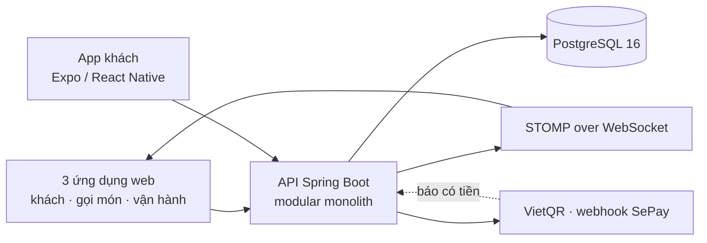
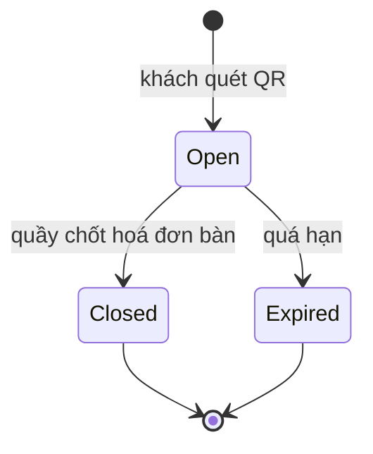
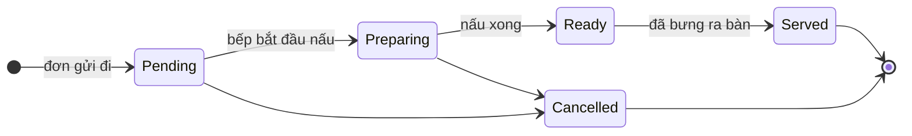

# Kiến trúc backend

> **Kiểm lần cuối: 2026-09-05.**
>
> Phần **SINH TỪ MÃ** bên dưới có cổng CI đối chiếu (`docs/build_system_facts.py --check`), nên nó
> không thể nói sai về việc *cái gì tồn tại*. Phần còn lại do người viết: nó nói *ý nghĩa*, và máy
> không kiểm được ý nghĩa. Đối chiếu với mã trước khi tin phần chi tiết.

<!-- SINH:backend-modules -->

## Module và bề mặt API — SINH TỪ MÃ

**12 module**, **88 endpoint**, **28 migration** cơ sở dữ liệu.

> Bảng này chỉ nói **cái gì tồn tại**. Ý nghĩa nghiệp vụ của từng module là phần người
> viết ở các mục dưới.

| Module | Endpoint | Số tệp |
|---|---:|---:|
| `auth` | 10 | 28 |
| `cart` | 3 | 9 |
| `counter` | 4 | 12 |
| `loyalty` | 15 | 24 |
| `menu` | 14 | 13 |
| `orders` | 10 | 20 |
| `payments` | 6 | 21 |
| `promotions` | 7 | 12 |
| `realtime` | 0 | 6 |
| `reports` | 1 | 6 |
| `shared` | 1 | 8 |
| `tables` | 17 | 28 |

<!-- HET:backend-modules -->

## 1. Hình dạng hệ thống



Một API, một cơ sở dữ liệu, một tiến trình. Không có dịch vụ phụ trợ nào — mọi lời gọi từ mọi giao
diện đều vào cùng một chỗ.

## 2. Vì sao là modular monolith, không phải microservices

Nghiệp vụ ở đây có một ràng buộc nuốt gọn lựa chọn kiến trúc: **đặt món, thanh toán và tích điểm
phải xong hoặc hỏng cùng nhau**. Một đơn đã đánh dấu trả tiền mà điểm chưa cộng, hoặc điểm đã trừ
mà đơn chưa chốt, là trạng thái không ai sửa được bằng tay ở một quán đang đông.

Tách dịch vụ nghĩa là mất giao dịch phân tán ấy, và phải mua lại bằng saga, hộp thư đi, bù trừ.
Với quy mô một nhà hàng, đó là trả giá hạ tầng cho một vấn đề chưa tồn tại. Nên: **một giao dịch
cơ sở dữ liệu, nhiều module có ranh giới rõ**.

Ranh giới vẫn thật, chỉ là được giữ bằng cấu trúc gói và kiểm ArchUnit chứ không bằng ranh giới
mạng.

## 3. Ranh giới module

| Module | Sở hữu | Điểm vào chính |
|---|---|---|
| `auth` | tài khoản, đăng nhập, vai trò, token | `AuthController`, `AdminUserController` |
| `menu` | danh mục, món, giá, tình trạng còn/hết, nhãn | `MenuController`, `AdminMenuItemController` |
| `tables` | bàn, mã QR, phiên bàn, hoá đơn bàn | `TableController`, `TableInvoicePaymentController` |
| `cart` | giỏ dùng chung của một phiên bàn | `CartController` |
| `orders` | đơn, từng món trong đơn, dòng thời gian, ước lượng | `OrderController`, `KitchenDelayController` |
| `payments` | yêu cầu thanh toán, VietQR, webhook SePay | `PaymentController`, `SePayWebhookController` |
| `loyalty` | hội viên, điểm, ưu đãi đổi điểm | `LoyaltyController`, `AdminLoyaltyController` |
| `promotions` | khuyến mãi áp cho đơn | `PromotionController`, `AdminPromotionController` |
| `counter` | ca quầy, thu chi trong ca, chốt ca | `CounterController` |
| `reports` | số liệu vận hành | `ReportController` |
| `realtime` | phát sự kiện tới các giao diện | STOMP, không có REST |
| `shared` | dùng chung: lỗi, phân trang, cấu hình | — |

Bốn vai trò người dùng: `Customer`, `Staff`, `Kitchen`, `Admin` (`auth/UserRole.java`).

## 4. Phiên bàn QR — máy trạng thái

Mã QR dán ở bàn **không đổi theo lượt khách**. Đổi mã mỗi lượt nghĩa là phải in lại, và một tờ giấy
dán bàn thì không in lại được giữa ca.



Một bàn **chỉ có tối đa một phiên `Open`** — đảm bảo bằng chỉ mục duy nhất có điều kiện ở tầng cơ
sở dữ liệu, không bằng kiểm tra trong mã. Hai điện thoại cùng quét một bàn thì cùng vào một phiên,
không tạo hai phiên song song.

Mỗi lần quét trả về một `resumeState` tất định, để khách mở lại điện thoại giữa bữa thì về đúng chỗ
đang dở chứ không về đầu:

| `resumeState` | Khách được đưa tới |
|---|---|
| `New` | thực đơn |
| `CartPending` | giỏ hàng |
| `OrderInProgress` | theo dõi đơn |
| `ReadyForPayment` · `PaymentPending` · `Paid` | hoá đơn bàn |

Nơi quyết định: `TableSessionResumeStateResolver` (backend) và `getSessionResumeDestination`
(frontend). Hai đầu phải nói cùng một chuyện — đây là một trong những chỗ dễ trôi nhất của hệ thống.

## 5. Vòng đời đơn và từng món

Đây là chỗ hệ thống khác hẳn một máy bán hàng thông thường: **trạng thái sống ở từng MÓN, không
phải từng ĐƠN**.



Trạng thái đơn (`OrderStatus`: `Draft`, `Placed`, `Confirmed`, `Preparing`, `Ready`, `Served`,
`Completed`, `Cancelled`) là **kết quả suy ra** từ các món của nó, không phải một công tắc riêng.

Vì sao quan trọng: bàn gọi 4 món, xong 1 món. Nếu chỉ có trạng thái đơn thì khách thấy "đang chuẩn
bị" suốt và không biết món nào đã lên; bếp cũng không có chỗ ghi rằng ba món kia vẫn đang làm. Tách
theo món thì cả hai phía nhìn thấy đúng việc đang xảy ra.

`Completed` và `Cancelled` là trạng thái cuối của đơn: món trong một đơn đã kết thúc thì không đổi
trạng thái được nữa.

Bếp bắt buộc đi qua `Ready → Served` trước khi chốt phiên. Nhảy thẳng `Ready → Completed` bị tầng
nghiệp vụ từ chối — không phải để làm khó, mà vì "đã bưng ra bàn" là sự kiện duy nhất chứng minh
khách thật sự nhận được món.

## 6. Ước lượng thời gian lên món — theo TRẠM, không theo một hàng đợi chung

Một quán không có một hàng đợi. Nó có mấy chỗ làm việc song song, và chúng không chờ nhau.

| Bếp | Món điển hình | Có hàng đợi? | Số việc làm cùng lúc |
|---|---|---|---|
| `BEP` | món nấu (có nhãn `method:`) | có | `KITCHEN_PARALLEL_DISHES`, mặc định **6** |
| `QUAY` | đồ uống, nước ép | có | `KITCHEN_PARALLEL_BAR_ITEMS`, mặc định **2** |
| `SAN` | rượu, trái cây, tráng miệng — lấy sẵn | không | — |

Bếp nào làm món nào suy ra từ chính dữ liệu món (`orders/domain/TramChuanBi.java`): có nhãn `method:` thì là
bếp; còn lại xếp theo danh mục.

Thời gian chờ của một món = (việc đang xếp ở **bếp đó**, trừ đi chính món này) ÷ số việc bếp đó làm
cùng lúc. Ly bia không chậm đi vì bếp nấu đang đông.

Hai con số song song là **cấu hình, không phải hằng số nghiệp vụ** — quán tự đo rồi chỉnh.

Ngoài ra bếp tự khai được một khoảng trễ (`KitchenDelayController`). Hàng đợi chỉ đo được thứ đã đi
qua ứng dụng; đầu bếp nghỉ ốm, hỏng lò, đoàn đặt trước đang làm ở trong thì không nằm trong đơn
nào. Đây là chỗ duy nhất con người nói ra được phần máy không thấy — và nó **chỉ cộng cho món của
bếp**, vì không việc nào trong số đó làm chậm một ly cà phê.

## 7. Thanh toán và đối soát

Ăn tại bàn chốt bằng **hoá đơn bàn** (`TableInvoice`), không phải trả từng đơn. Khách gọi thêm ba
lượt thì vẫn là một lần trả tiền.

`PaymentMethod`: `Unselected` (trạng thái đầu, không ai chọn được), `COD` (tiền mặt tại quầy),
`VietQR`.

`PaymentStatus`: `NotRequested` → `Pending` → `Confirmed`/`Paid`, hoặc rẽ sang `Failed`,
`Cancelled`, `Refunded`. (`Unpaid` còn trong enum vì dữ liệu cũ mang chuỗi đó; thiếu hằng số này là
lỗi *đọc dữ liệu*, không phải lỗi logic.)

Với VietQR, tiền vào được xác nhận bằng **webhook SePay**, không bằng nhân viên bấm nút. Webhook
không có khoá thì **TỪ CHỐI mọi lời gọi** — vì không phân biệt được webhook thật với giả, mà nhận
nhầm một cái giả nghĩa là đánh dấu đã trả cho một bàn chưa trả đồng nào.

## 8. Tích điểm và ưu đãi

Khách tự tải app, tự tạo tài khoản và tự gắn số điện thoại vào tài khoản của mình. Không có bước
nhân viên nối hộ.

Đổi điểm lấy ưu đãi phải được **quầy xác nhận** (`POST /api/loyalty/counter/redeem` và
`/redemptions/{id}/honour`): điểm chỉ trừ khi món ưu đãi thật sự được giao.

`promotions` là chuyện khác `loyalty`: khuyến mãi áp theo đơn và không cần điểm.

## 9. Ca quầy

`counter` mô hình hoá một ca làm việc ở quầy: mở ca với số tiền đầu ca, ghi các khoản thu chi phát
sinh trong ca, rồi chốt ca (`CounterShiftStatus`: `Open`, `Closed`). Chốt ca là lúc đối chiếu tiền
mặt đếm được với tiền hệ thống ghi nhận — chênh lệch phải lộ ra ở đây, không phải cuối tháng.

## 10. Thời gian thực

STOMP over WebSocket (Spring `@EnableWebSocketMessageBroker`). Bốn đích:

| Đích | Ai nghe |
|---|---|
| `/topic/order.<mã đơn>` | khách theo dõi đơn của chính mình |
| `/topic/orders.operations` | bếp và nhân viên |
| `/topic/table.<mã bàn>` | màn hình theo bàn |
| `/topic/menu` | mọi giao diện, khi món đổi giá hoặc hết hàng |

Backend chặn ở bước SUBSCRIBE: khách không đăng ký được đích của bàn khác.

## 11. Bất biến vận hành

- Phiên bàn dùng được phải `Open`, chưa đóng và chưa quá hạn.
- Mỗi bàn tối đa một phiên `Open` — ép bằng chỉ mục duy nhất có điều kiện ở cơ sở dữ liệu.
- `Completed` và `Cancelled` là trạng thái cuối của đơn.
- Cấu hình để trống thì cổng liên quan **từ chối tất cả**, không phải nhận tất cả. Áp cho
  `GOOGLE_CLIENT_ID`, Firebase và khoá webhook SePay.
- Thực đơn đọc giá và tình trạng còn/hết **từ cơ sở dữ liệu lúc gọi**, không dùng ảnh chụp lúc
  khởi động.

## 12. Giao dịch và cạnh tranh

Mở phiên QR: chuyển các phiên quá hạn của bàn sang `Expired` trước, rồi tìm phiên còn sống. Hai
request cùng lúc thì chỉ mục duy nhất chặn phiên trùng, và API đọc lại phiên mà request kia vừa tạo
— không báo lỗi cho khách.

Tạo một lượt đặt món xoá giỏ dùng chung **trong cùng một giao dịch** với việc ghi đơn. Khoá chống
trùng (idempotency) ngăn hai thiết bị cùng bàn tạo hai lượt giống nhau.

## 13. Kiểm chứng

| Lớp | Chạy bằng | Bắt được gì |
|---|---|---|
| Đơn vị + kiến trúc | JUnit 5, ArchUnit | logic miền, và cả việc module gọi lấn sang nhau |
| Tích hợp | Testcontainers, PostgreSQL thật | truy vấn, migration, ràng buộc duy nhất |
| Frontend | Vitest | logic hiển thị, từ vựng, hợp đồng phía client |
| Đầu-cuối realtime | job CI `realtime-e2e` | mã client THẬT nói với backend THẬT |

```bash
cd backend-java && ./gradlew build     # build + Checkstyle + test
npm --prefix frontend test
```

Vì sao có `realtime-e2e`: frontend từng dùng SignalR suốt thời gian backend đã chuyển sang STOMP.
Hai giao thức không nói chuyện được với nhau nên mọi tính năng thời gian thực im lặng chết — mà
không tập kiểm nào đỏ, vì test backend kiểm STOMP bằng client STOMP, còn test frontend là kiểm đơn
vị đọc mã. Job đó nối đúng hai đầu ấy lại.

## 14. Quy tắc thay đổi

1. Không xoá mã trước khi chứng minh không còn ai gọi, và chạy build/test.
2. Chuyển trạng thái mới phải có test đi qua đường công khai, không test thẳng vào trạng thái trong.
3. Mỗi thay đổi lược đồ phải có migration, có bước soát dữ liệu nếu có thể đụng dữ liệu thật, và có
   đường quay lui rõ ràng.
4. Bỏ một đường API công khai phải qua giai đoạn báo trước. "Không thấy ai gọi trong kho mã" không
   phải bằng chứng đủ — app đã cài trên máy khách vẫn gọi.
