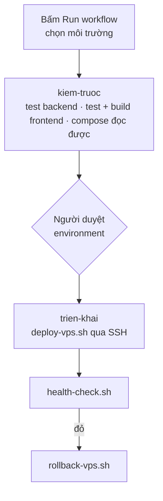

# CI/CD, triển khai và vận hành

> **Kiểm lần cuối: 2026-09-05.**
>
> Phần **SINH TỪ CẤU HÌNH** bên dưới có cổng CI đối chiếu (`docs/build_system_facts.py --check`),
> nên danh sách workflow và cổng chặn không thể nói sai. Phần còn lại do người viết.

<!-- SINH:devops-facts -->

## Workflow và cổng chặn — SINH TỪ CẤU HÌNH

**7 workflow**, **6 cổng `--check`** trong CI.

| Workflow | Kích hoạt bởi |
|---|---|
| `auto-merge.yml` | pull_request_target |
| `cd.yml` | workflow_dispatch |
| `ci-java.yml` | pull_request, push, workflow_dispatch |
| `ci-mobile.yml` | pull_request, push, workflow_dispatch |
| `ci.yml` | pull_request, push, workflow_dispatch, workflow_call |
| `dependency-review.yml` | pull_request |
| `security.yml` | pull_request, push, schedule, workflow_dispatch |

### Cổng `--check` — tệp sinh ra phải khớp nguồn

Mỗi cổng đối chiếu một tệp đã commit với kết quả sinh lại. Đỏ nghĩa là ai đó sửa tay
tệp dẫn xuất mà không chạy lại bộ sinh — lớp lỗi đã xảy ra ba lần trong dự án này.

| Bộ sinh |
|---|
| `docs/build_api_inventory.py` |
| `docs/build_docs_index.py` |
| `docs/build_system_facts.py` |
| `scripts/menu-tags/audit_method_tags.py` |
| `scripts/menu-tags/build_tag_dictionary.py` |
| `scripts/menu-tags/build_tag_migration.py` |

<!-- HET:devops-facts -->

## 1. Đường ống CI — cổng nào chặn cái gì

CI chạy trên mọi pull request, và trên push vào `develop` / `main`. Nhánh tính năng **cố ý không**
kích hoạt: mọi thay đổi đều đi qua PR, nên để cả hai thì mỗi lần đẩy chạy CI hai lần trên cùng một
commit.

| Job | Ở đâu | Chặn được gì |
|---|---|---|
| `frontend-build` | `ci.yml` | test Vitest và bản dựng của 5 ứng dụng |
| `menu-data` | `ci.yml` | dữ liệu thực đơn và tài liệu sinh ra phải khớp nguồn |
| `realtime-e2e` | `ci.yml` | mã client THẬT nói được với backend THẬT qua STOMP |
| `docker-compose-config` | `ci.yml` | tệp compose đọc được với đúng bộ biến của môi trường |
| `backend-java-build` | `ci-java.yml` | build + Checkstyle + test, gồm Testcontainers |
| `mobile-rn-build` | `ci-mobile.yml` | app Expo dựng được |
| `codeql`, `secret-scan`, `trivy-fs` | `security.yml` | lỗ hổng mã, bí mật lọt vào kho, CVE của phụ thuộc |
| `dependency-review` | `dependency-review.yml` | phụ thuộc mới có lỗ hổng đã biết |

Ruleset của `develop` bắt buộc `backend-java-build` xanh và bắt buộc đi qua PR.

### Vì sao có nhóm cổng `--check`

Bốn cổng trong `menu-data` đối chiếu một tệp **đã commit** với **kết quả sinh lại**. Đỏ nghĩa là ai
đó sửa tay một tệp dẫn xuất mà không chạy lại bộ sinh.

Lớp lỗi này đã xảy ra nhiều lần trong dự án, luôn cùng một hình dạng — **văn xuôi kể lại trạng thái
mã thì trôi khỏi mã**. Lần gần nhất: kiểm kê endpoint thiếu hẳn `POST /api/loyalty/counter/redeem`
trong khi vẫn liệt kê 8 endpoint đã xoá, vì cổng của chính nó từng bị gỡ khỏi CI. Bộ sinh không có
cổng thì chỉ là một script không ai chạy.

### `realtime-e2e` đo cái mà không tập nào khác đo

Job này dựng postgres + backend thật bằng compose, chờ tới khi container `api` báo `healthy`, mở
một phiên bàn thật qua HTTP, rồi chạy **chính mã client STOMP của frontend** nói với backend đó.

Nó tồn tại vì một lỗi có thật: frontend dùng SignalR suốt thời gian backend đã chuyển sang STOMP.
Hai giao thức không nói chuyện được với nhau nên mọi tính năng thời gian thực im lặng chết, mà
không cổng nào đỏ — test backend kiểm STOMP bằng client STOMP, còn test frontend là kiểm đơn vị đọc
mã. Cả hai đều "tự nhất quán với chính mình".

## 2. Triển khai — bấm tay, có người duyệt

`cd.yml` **chỉ chạy khi bấm tay** (`workflow_dispatch`), chọn `staging` hoặc `production`.

Vì sao không tự chạy theo push: máy chủ đích là tài nguyên dùng chung, và một lần đẩy nhầm nhánh là
một lần thay đổi thứ người khác đang dùng. Bấm tay bắt người triển khai chọn môi trường một cách có
ý thức, còn `environment:` của GitHub bắt phải có người duyệt trước khi job chạm vào máy chủ.

Hai lần triển khai cùng môi trường không chạy chồng nhau, và lần đang chạy **không bị huỷ giữa
chừng**: cắt ngang lúc chạy migration để lại cơ sở dữ liệu ở trạng thái nửa vời, thứ mà một lần
triển khai lại không sửa được.



`kiem-truoc` chạy lại toàn bộ phép kiểm **trước khi** chạm máy chủ. Trùng với CI là có chủ ý: CI
xanh ở commit lúc mở PR không chứng minh commit đang triển khai cũng xanh.

### `deploy-vps.sh` làm gì trên máy chủ

1. Dựng `known_hosts` bằng `ssh-keyscan` và bật `StrictHostKeyChecking=yes` — không tắt kiểm khoá
   máy chủ để cho tiện.
2. Kiểm mọi biến bắt buộc **trước khi** đụng vào máy chủ. Thiếu biến thì thoát ngay, chứ không thoát
   giữa chừng sau khi đã qua cửa duyệt.
3. Chép mã sang `/opt/cmc-restaurant/<môi trường>/repo`, giữ bản cũ ở `repo.previous`.
4. Ghi `.env` từ secrets và vars của environment.
5. `up -d --build postgres` → `--profile migrate run --rm migrate` → `up -d --build --remove-orphans`.

**`migrate` là container một-lần, chạy riêng.** API cố ý không tự migrate lúc khởi động: nhiều
instance cùng migrate một cơ sở dữ liệu là loại lỗi chỉ xảy ra khi triển khai thật.

## 3. Hai môi trường trên cùng một máy chủ

Tách bằng ba thứ, không phải một:

| | staging | production |
|---|---|---|
| Tên project compose | `cmc-restaurant-staging` | `cmc-restaurant-production` |
| Cổng frontend | 8081 | 8080 |
| Cổng backend | 5001 | 5000 |
| Cổng PostgreSQL | 5433 | 5432 |
| Thư mục | `/opt/cmc-restaurant/staging` | `/opt/cmc-restaurant/production` |

Tách project không tách cổng: compose vẫn gắn cổng ra máy chủ, nên trùng số thì môi trường lên sau
chết với `port is already allocated` — và người triển khai thấy một lỗi Docker chứ không thấy
nguyên nhân là hai tệp cấu hình ghi cùng một con số. Có một phép kiểm tự động chặn đúng chuyện này
(`DeploymentConfigTest`).

nginx sinh lại cấu hình mỗi lượt triển khai bằng `write-nginx-config.sh`. TLS là **tuỳ chọn**, bật
bằng cách trỏ `TLS_CERT_DIR` vào thư mục có `fullchain.pem`/`privkey.pem` — vì nginx từ chối khởi
động nếu khối 443 trỏ vào chứng chỉ chưa tồn tại, tức bật mặc định sẽ làm hỏng mọi lượt triển khai
đầu tiên.

## 4. Bí mật và biến

Không có giá trị thật nào nằm trong kho mã. Mọi thứ đến từ **GitHub Environments**, tách riêng cho
`staging` và `production`.

| Loại | Ví dụ | Nằm ở |
|---|---|---|
| Bí mật | `SSH_KEY`, `POSTGRES_PASSWORD`, `JWT_SIGNING_KEY`, `PAYMENTS_SEPAY_APIKEY` | Environment secrets |
| Biến | `COMPOSE_PROJECT_NAME`, các cổng, tên miền | Environment variables |

Quy tắc **mặc định an toàn**: biến để trống thì cổng liên quan TỪ CHỐI mọi lời gọi, không phải nhận
tất cả. Một bản triển khai quên cấu hình phải đóng lại, không phải mở ra.

Cái bẫy đã sập một lần và đáng nhớ: khai một biến mới trong `docker-compose.java.yml` và trong tệp
`.env.example` là **chưa đủ** — nó còn phải được liệt kê trong `deploy-vps.sh` và trong `cd.yml`,
nếu không nó không bao giờ tới được máy chủ, mà mọi thứ vẫn chạy nhờ giá trị mặc định.

## 5. Kiểm sức khoẻ sau triển khai

`health-check.sh` gọi frontend và `/api/health` với `--retry 10 --retry-delay 5
--retry-all-errors`. Phần `--retry-all-errors` có lý do: ngay sau khi nginx nạp lại chứng chỉ, một
vài lời gọi đầu có thể lỗi TLS tạm thời — bỏ cờ đó thì lượt triển khai đỏ vì một chuyện tự khỏi
trong năm giây.

## 6. Quay lui

`rollback-vps.sh` đổi `repo.previous` về thành `repo`, giữ bản hỏng lại ở `repo.failed.<dấu thời
gian>` để còn xem được vì sao hỏng, rồi dựng lại stack.

Giới hạn phải nói rõ: **quay lui mã không quay lui cơ sở dữ liệu.** Một migration đã chạy thì vẫn ở
đó. Nên mỗi thay đổi lược đồ phải nghĩ trước đường lùi — thêm cột thì lùi được, xoá cột thì không.

## 7. Sao lưu và khôi phục

`backup-postgres.sh` ghi bản kết xuất vào `/opt/cmc-restaurant/<môi trường>/backups`, đặt tên theo
dấu thời gian UTC và lý do chạy. `restore-postgres.sh` đi ngược lại.

Điều cần thành thật: có script sao lưu **không** bằng có khả năng khôi phục. Một bản sao lưu chưa
từng được khôi phục thử là một giả định, không phải một bảo đảm. Đây là việc còn nợ.

## 8. Vận hành hằng ngày

```bash
# xem trạng thái một môi trường
ssh <user>@<máy chủ> "cd /opt/cmc-restaurant/production && docker compose \
  --env-file .env -f repo/deploy/docker-compose.java.yml \
  -p cmc-restaurant-production ps"

# xem log API
... logs --tail 200 api
```

`--remove-orphans` trong lượt triển khai xoá container **không còn trong tệp compose của cùng
project**. Dịch vụ nào khác chạy trên cùng máy chủ phải có project compose riêng, nếu không một
lượt triển khai bình thường sẽ xoá nó.
