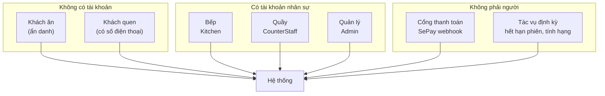

# Phần 2 — Tác nhân và phân quyền

> Đáp ứng: YC-KH-01, YC-NS-01, YC-NS-02, YC-NS-03, YC-NS-04, YC-PCN-02, YC-PCN-03

---

## 2.1. Vì sao phần này đứng trước phần nghiệp vụ

Chủ quán đặt hai yêu cầu nhìn thì trái nhau:

- **RB-1**: khách không phải đăng ký tài khoản.
- **YC-PCN-02**: khách bàn A không được xem hoá đơn bàn B.

Nếu không có tài khoản thì hệ thống lấy gì để biết người đang gọi API là ai? Trả lời câu này quyết
định hình dạng của toàn bộ phần còn lại, nên nó phải đứng đầu.

Câu trả lời: **hệ thống dùng hai cơ chế định danh khác hẳn nhau, cho hai nhóm người khác hẳn nhau.**

| Nhóm | Cơ chế | Đặc điểm |
|---|---|---|
| Khách ăn | **Vé năng lực** (capability token) — ai cầm vé thì có quyền, không cần biết là ai | Không tài khoản, phạm vi hẹp, hết hạn theo phiên bàn |
| Nhân viên | **Tài khoản + vai** (JWT có role) | Có danh tính, có tên người, phạm vi theo vai |

Đây không phải hai cách làm cùng một việc. Đây là hai câu hỏi khác nhau: với khách, câu hỏi là *"cái
điện thoại này có quyền xem bàn này không?"*; với nhân viên, câu hỏi là *"người này là ai và được
làm gì?"*.

## 2.2. Danh sách tác nhân



### 2.2.1. Khách ăn — tác nhân chính, không có tài khoản

| Thuộc tính | Giá trị |
|---|---|
| Định danh | Không có. Chỉ có **vé** |
| Vào hệ thống bằng | Quét QR dán trên bàn |
| Thiết bị | Điện thoại của chính khách (RB-2) |
| Kênh | Web `customer-web` / `ordering-web` mở bằng trình duyệt, **hoặc** ứng dụng Expo (tuỳ chọn, không bắt buộc) |
| Vòng đời quyền | Bằng vòng đời phiên bàn. Phiên đóng là vé hết giá trị |

**Hai loại vé, hai phạm vi khác nhau** — phân biệt này quan trọng:

| Vé | Lấy từ đâu | Cho phép làm gì |
|---|---|---|
| `qrToken` của bàn | In trong mã QR dán trên bàn | Mở phiên bàn, xem thực đơn |
| `X-Order-Token` của đơn | Trả về khi gửi đơn thành công | Xem đơn đó, huỷ món trong đơn đó, theo dõi realtime đơn đó |

`X-Order-Token` là **vé theo từng đơn**, không phải theo bàn. Nghĩa là: chụp màn hình QR của bàn 7
không cho bạn quyền huỷ món của người ngồi bàn 7 trước đó. Vé được so sánh bằng **thuật toán so sánh
thời gian hằng** (`CustomerTokenGuard`), để không rò rỉ thông tin qua thời gian phản hồi.

Vé này gác **cả hai đường**: HTTP (`OrderController`, `PaymentController`) và WebSocket
(`StompSubscriptionGuard` — không có vé đúng thì không đăng ký được kênh `/topic/orders/{orderCode}`).
Gác một đường mà quên đường kia là lỗ hổng kinh điển; ở đây cả hai dùng chung một `CustomerTokenGuard`.

> **YC-PCN-03 — QR bị phát tán.** Mã QR của bàn **xoay được**:
> `POST /api/admin/tables/{tableCode}/qr/rotate`. Mã cũ chết ngay khi xoay. Quy trình đề xuất: xoay
> định kỳ hàng tháng, và xoay ngay khi nghi ngờ.

### 2.2.2. Khách quen — vẫn không có tài khoản bắt buộc

Khách quen **không phải** một vai đăng nhập. Đó vẫn là khách ẩn danh, cộng thêm một **số điện thoại**
gắn vào hoá đơn.

| Cách nhận diện | Ai nhập | Endpoint |
|---|---|---|
| Khách tự nhập trên điện thoại | Khách | `POST /api/loyalty/me/phone` |
| Quầy nhập giúp lúc thu tiền | Nhân viên quầy | trường `customerPhoneNumber` trên hoá đơn |
| Khách có tài khoản thật (tuỳ chọn) | Khách | `POST /api/auth/register`, `POST /api/auth/google` |

Khách **có thể** lập tài khoản (email/mật khẩu hoặc Google) để xem lịch sử và điểm ở nhiều thiết bị,
nhưng đó là **tuỳ chọn cộng thêm**, không phải điều kiện để ăn một bữa. RB-1 được giữ nguyên.

> `[MỘT PHẦN]` **YC-KH-11.** Số điện thoại gõ tại quầy hiện **không được xác thực** và **không hiện
> lại cho khách xác nhận**. Gõ nhầm một chữ số thì điểm rơi vào một hồ sơ khác, và không có thao tác
> chuyển điểm giữa hai hồ sơ để sửa. Xem Phần 9, hạng mục **KT-04**.

### 2.2.3. Nhân viên — năm vai, ba vai còn cấp mới

Hằng số vai khai tại `auth/UserRole.java`:

```java
public static final String CUSTOMER      = "Customer";
public static final String STAFF         = "Staff";         // vai cũ
public static final String COUNTER_STAFF = "CounterStaff";
public static final String KITCHEN       = "Kitchen";
public static final String ADMIN         = "Admin";

public static final List<String> ADMIN_ASSIGNABLE = List.of(ADMIN, COUNTER_STAFF, KITCHEN);
```

| Vai | Ai | Còn cấp mới? |
|---|---|---|
| `Customer` | Khách tự đăng ký | Có — nhưng do khách tự tạo, quản lý không gán |
| `Staff` | Vai chạy bàn thời kỳ đầu | **Không.** Tài khoản cũ vẫn đăng nhập được |
| `CounterStaff` | Nhân viên quầy thu ngân | Có |
| `Kitchen` | Nhân viên bếp | Có |
| `Admin` | Chủ quán, quản lý ca | Có |

**Về vai `Staff`:** hệ thống ban đầu thiết kế ba vai vận hành (chạy bàn / quầy / bếp). Thực tế vận
hành cho thấy việc "chạy bàn" sau khi có QR chỉ còn là *bưng món ra và thu tiền hộ*, tức là trùng
hoàn toàn với quầy. Vai `Staff` vì thế **ngừng cấp mới** nhưng **không xoá**: tài khoản cũ còn đăng
nhập được, và các `@PreAuthorize` vẫn liệt kê `Staff` bên cạnh `CounterStaff` một cách có chủ ý —
gỡ quyền của một nhóm người trong cùng một lần sửa là khoá họ ra ngoài mà không ai yêu cầu.

Việc dọn hẳn vai này (12 chỗ backend, 2 chỗ frontend, 1 migration di trú tài khoản) nằm ở Phần 9,
hạng mục **KT-01**.

### 2.2.4. Tác nhân không phải người

| Tác nhân | Vào bằng đường nào | Xác thực bằng gì |
|---|---|---|
| **Cổng thanh toán SePay** | `POST /api/payments/webhooks/sepay` | Chữ ký/khoá cấu hình phía máy chủ; `referenceCode` **duy nhất** (migration V23) nên gọi lại nhiều lần không cộng tiền hai lần |
| **Tác vụ hết hạn phiên bàn** | Trong tiến trình | Không qua HTTP |
| **Tác vụ tính lại hạng thành viên** | Trong tiến trình, hằng tháng | Không qua HTTP |

Ràng buộc duy nhất trên `referenceCode` là thứ trả lời trực tiếp **YC-PCN-01** cho đường tiền vào:
webhook gửi lại lần hai thì bản ghi thứ hai bị cơ sở dữ liệu từ chối, không phải bị mã ứng dụng từ
chối. Chống trùng ở tầng dữ liệu bền hơn chống trùng ở tầng mã, vì nó đúng kể cả khi có hai tiến
trình chạy song song.

## 2.3. Ma trận phân quyền

Ký hiệu: **✔** được · **—** không · **◑** được trong phạm vi của mình

| Chức năng | Khách | `Kitchen` | `CounterStaff` | `Admin` |
|---|:---:|:---:|:---:|:---:|
| **Thực đơn và bàn** | | | | |
| Xem thực đơn công khai | ✔ | ✔ | ✔ | ✔ |
| Mở phiên bàn bằng QR | ✔ | — | ✔ | ✔ |
| Thêm/sửa/xoá món, nhóm món, giá | — | — | — | ✔ |
| Bật/tắt món hết hàng | — | ✔ | — | ✔ |
| Đặt khung giờ bán, số suất trong ngày | — | — | — | ✔ |
| Tạo bàn, xoay mã QR | — | — | — | ✔ |
| **Gọi món** | | | | |
| Thêm món vào giỏ, gửi lượt đặt | ◑ | — | ✔ | ✔ |
| Xem đơn | ◑ vé | ✔ | ✔ | ✔ |
| Huỷ **món** khi chưa nấu | ◑ vé | — | ✔ | ✔ |
| Đổi trạng thái món (nấu/xong/phục vụ) | — | ✔ | ✔ | ✔ |
| Đặt mức chậm chung của bếp | — | ✔ | — | ✔ |
| **Tiền** | | | | |
| Xem hoá đơn bàn mình | ◑ | — | ✔ | ✔ |
| Yêu cầu mã thanh toán chuyển khoản | ◑ | — | ✔ | ✔ |
| Xác nhận đã nhận tiền mặt | — | — | ✔ | ✔ |
| Hoàn tiền | — | — | ✔ | ✔ |
| Áp mã khuyến mãi | ◑ | — | ✔ | ✔ |
| Đóng phiên bàn | — | — | ✔ | ✔ |
| **Ép đóng** bàn còn nợ (kèm lý do) | — | — | ✔ | ✔ |
| **Ca quầy** | | | | |
| Mở ca / đóng ca / ghi điều chỉnh | — | — | ✔ | ✔ |
| **Khách quen** | | | | |
| Xem điểm của mình | ◑ | — | — | ✔ |
| Đổi điểm lấy ưu đãi | ◑ | — | ✔ | ✔ |
| Tra cứu hồ sơ khách theo số điện thoại | — | — | ✔ | ✔ |
| Sửa hồ sơ, sửa điểm, đặt ưu đãi | — | — | — | ✔ |
| **Quản trị** | | | | |
| Xem báo cáo doanh thu | — | — | — | ✔ |
| Tạo/sửa/xoá tài khoản nhân viên | — | — | — | ✔ |
| Đặt lại mật khẩu nhân viên | — | — | — | ✔ |
| Đặt khuyến mãi | — | — | — | ✔ |

**Ba điểm đáng chú ý trong ma trận:**

1. **Bếp không xem được tiền.** Không một dòng nào ở nhóm "Tiền" mở cho `Kitchen`. Đây là yêu cầu
   trực tiếp của chủ quán (YC-NS-02) và cũng là nguyên tắc quyền tối thiểu.
2. **Quầy không sửa được giá.** `CounterStaff` thu tiền nhưng không đổi được con số đầu vào của
   phép tính. Tách hai quyền này là biện pháp chống gian lận cơ bản nhất trong ngành bán lẻ.
3. **Admin không tự gỡ quyền Admin của chính mình.** `AdminUserService` chặn riêng trường hợp này
   (*"The current administrator cannot remove their own Admin role"*), để không ai tự khoá mình ra
   ngoài và biến hệ thống thành không có ai quản trị.

## 2.4. Cơ chế kỹ thuật của phân quyền

### Ba lớp gác, không lớp nào thay được lớp nào

| Lớp | Gác cái gì | Cài ở đâu |
|---|---|---|
| **1. Giao diện** | Không vẽ nút mà vai này không được bấm | Frontend, theo `role` trong token |
| **2. Endpoint** | Từ chối request sai vai | `@PreAuthorize` trên controller |
| **3. Nghiệp vụ** | Từ chối thao tác sai **phạm vi**, kể cả khi đúng vai | Trong service |

Lớp 1 là **tiện lợi**, không phải bảo mật — ai cũng gọi thẳng API được. Lớp 2 chặn sai vai. Lớp 3
chặn thứ mà vai không đủ diễn tả: một `CounterStaff` đúng vai vẫn không được đóng một bàn còn nợ
tiền nếu không kèm lý do. Quy tắc đó không phải câu hỏi về *ai*, mà về *trạng thái*, nên nó thuộc
lớp 3.

### Bảo vệ tài khoản nhân viên

`UserEntity` có hai trường phục vụ riêng YC-NS-04:

```java
private int failedLoginCount;
private OffsetDateTime lockoutEndAt;
```

Đăng nhập sai nhiều lần thì tài khoản khoá tạm tới `lockoutEndAt`. Khoá **có hạn**, không khoá vĩnh
viễn — khoá vĩnh viễn biến một trò nghịch thành một cuộc gọi cho quản lý lúc 11 giờ trưa.

Mật khẩu lưu bằng `passwordHash`, không bao giờ lưu bản rõ. Tài khoản Google gắn qua `googleSub`
(migration V21) — nhân viên và khách đều đăng nhập Google được mà không cần mật khẩu riêng.

### Đường quên mật khẩu

`POST /api/users/{userId}/reset-password` — chỉ `Admin` gọi được (YC-NS-03). Không có đường "quên
mật khẩu" tự phục vụ qua email cho tài khoản nhân sự, và đó là chủ ý: quán có một người quản lý
ngồi tại chỗ, đặt lại mật khẩu trực tiếp nhanh hơn và ít đường tấn công hơn gửi mail.

## 2.5. Khoảng trống của phần này

| Mã | Khoảng trống | Yêu cầu bị ảnh hưởng | Mức |
|---|---|---|---|
| **KT-01** | Vai `Staff` chết nhưng còn trong mã 14 chỗ; tài khoản cũ chưa di trú | YC-NS-02 | Trung bình |
| **KT-04** | Số điện thoại tại quầy không xác thực, không hiện lại để khách xác nhận, không có đường chuyển điểm khi gõ nhầm | YC-KH-11 | Cao |
| **KT-05** | Không có quy tắc chặn nhân viên nhập số của chính mình để tự cộng điểm | YC-NS-05 | Thấp — xem ghi chú |
| **KT-06** | Nhật ký thao tác chưa gom thành một sổ tra cứu được; đang rải rác ở nhiều bảng | YC-NS-05, YC-NS-10 | Cao |

> **Ghi chú về KT-05.** Chặn cứng là sai: nhân viên cũng là khách của quán ngoài giờ làm. Cách đúng
> là **đo rồi soi**, tức là ghi lại ai thao tác mỗi lần tích điểm (chính là KT-06) rồi để báo cáo
> làm nổi mẫu hình bất thường. Chi tiết ở Phần 9.

---

**Trước:** [Phần 1 — Lời đặt hàng](01-YEU-CAU-CHU-QUAN.md) · **Tiếp:** [Phần 3 — Nghiệp vụ đặt món](03-NGHIEP-VU-DAT-MON.md)
