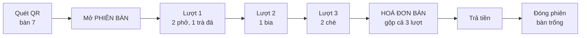
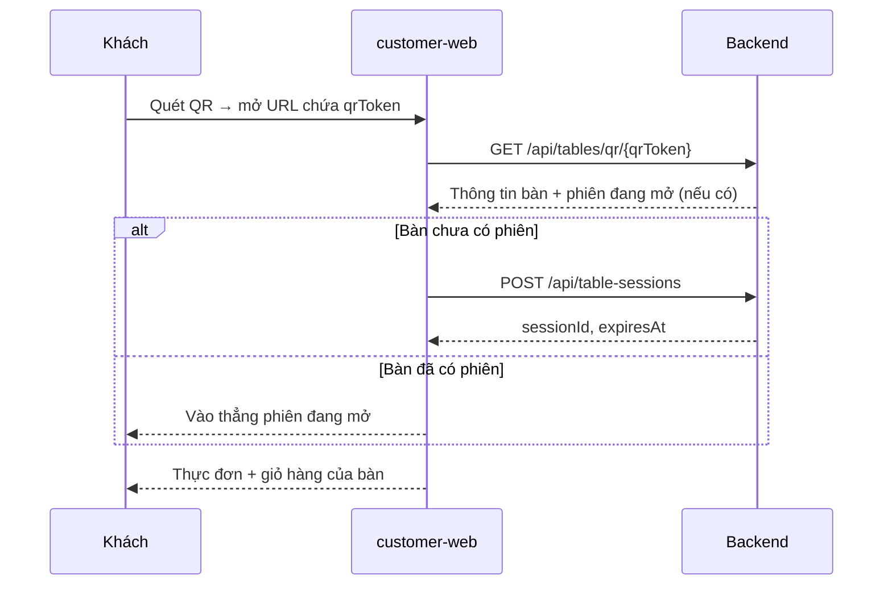
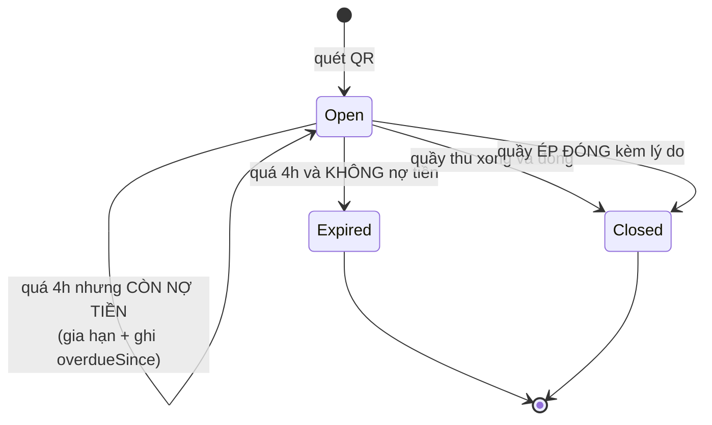
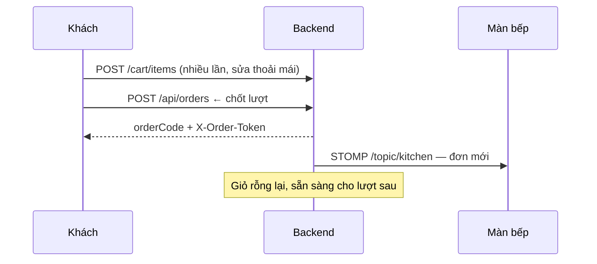
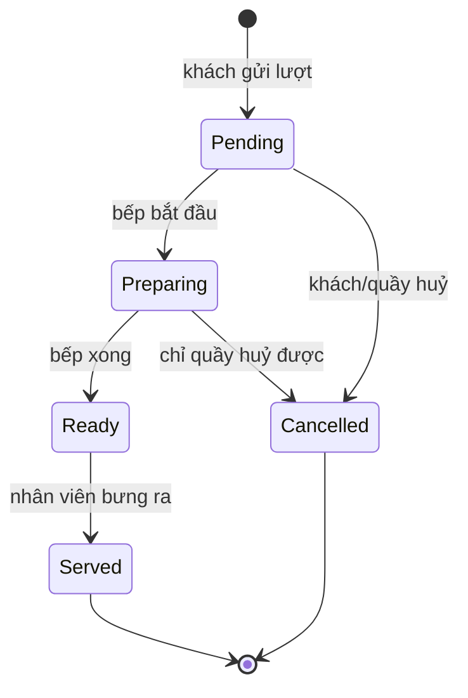

# Phần 3 — Nghiệp vụ đặt món bằng QR

> Đáp ứng: YC-KH-01 → YC-KH-13, YC-VH-10, YC-PCN-01, YC-PCN-02

---

## 3.1. Một bữa ăn trông như thế nào

Trước khi nói cấu trúc dữ liệu, phải thống nhất bữa ăn thật diễn ra ra sao. Chủ quán mô tả ở §1.2:
khách gọi món chính, ăn, gọi thêm đồ uống, cuối bữa gọi tráng miệng, rồi trả **một** lần.

Đó là ba lần gọi và một lần trả. Hệ thống phải mô hình hoá đúng như vậy, chứ không phải ba đơn hàng
độc lập.



### Ba khái niệm, ba mức, không được lẫn

| Khái niệm | Bảng | Một bữa có bao nhiêu | Trả lời câu hỏi |
|---|---|---|---|
| **Phiên bàn** `TableSession` | `table_sessions` | 1 | "Ai đang ngồi bàn này, từ lúc nào?" |
| **Lượt đặt** `Order` | `orders` | 0..n | "Lần gọi này gồm món gì, bếp làm tới đâu?" |
| **Hoá đơn bàn** `TableInvoice` | `table_invoices` | 0..1 | "Cả bữa hết bao nhiêu tiền?" |

**Bất biến V14** — phát biểu trong `SPEC.md`, và là xương sống của toàn bộ thiết kế:

> Một phiên bàn có **nhiều** lượt đặt và **một** hoá đơn bàn. Khuyến mãi, tích điểm và thanh toán
> **không bao giờ** thuộc về một lượt đặt.

Lý do phát biểu nó thành bất biến: đã từng sai đúng chỗ này. Ưu đãi đổi điểm có lúc bị trừ ở cấp
lượt đặt trong khi hoá đơn tính ở cấp hoá đơn — hai nơi cùng mô tả "khoản giảm" và không có gì bắt
chúng khớp nhau. Sau khi đưa V14 thành bất biến, mọi khoản giảm chỉ có **một** chỗ để tồn tại.

## 3.2. Bước 1 — Quét QR và mở phiên bàn

### Luồng



### Bất biến V4 — mỗi bàn tối đa một phiên sống

Hai người cùng bàn quét QR cùng lúc thì **không** được tạo hai phiên. Nếu tạo hai, hoá đơn tách đôi
và khách trả hai lần cho một bữa.

Cách chặn: ràng buộc ở tầng cơ sở dữ liệu, cộng cột `version` trên `TableSessionEntity` để khoá lạc
quan. Hai request đồng thời thì một thắng, một nhận lại phiên đã có — chứ không phải một thắng, một
tạo thêm.

> Chốt thiết kế: chặn ở tầng dữ liệu, không chặn bằng câu `if` trong mã ứng dụng. Câu `if` đúng khi
> chỉ có một tiến trình; ràng buộc cơ sở dữ liệu đúng kể cả khi chạy nhiều bản sao.

### Trạng thái phiên bàn



### Quy tắc hết hạn — chỗ này từng làm mất tiền

Phiên bàn hết hạn sau **4 giờ**. Quy tắc nguyên thuỷ là: quá 4 giờ → `Expired`. Nó có một lỗ hổng
chết người:

> Bàn tiệc ngồi quá 4 giờ → phiên `Expired` → khách quét lại QR, mở phiên **mới**, giỏ rỗng, hoá đơn
> 0đ. Món đã ăn nằm ở phiên cũ. **Không hoá đơn nào được tạo, nên không màn hình nào hiện việc đó.**
> Tiền mất hoàn toàn im lặng.

Quy tắc hiện tại tách làm hai nhánh, cài tại `TableSession.expireIfPast`:

```java
if (conNoTien) {
    if (overdueSince == null) {
        overdueSince = expiresAt;   // mốc GỐC, ghi đúng một lần
    }
    expiresAt = now.plus(GIA_HAN_KHI_CON_NO);
    return true;
}
status = TableSessionStatus.Expired;
```

**Bàn còn nợ thì được gia hạn, không bị đóng.** Tham số `conNoTien` là **bắt buộc**, không có giá
trị mặc định — javadoc ghi rõ lý do: *"để không ai gọi được hàm này mà chưa trả lời câu hỏi đó."*

Hệ quả phải nhớ khi đọc dữ liệu:

| Câu hỏi | Đọc cột nào | Đừng đọc cột nào |
|---|---|---|
| "Bàn này quá giờ từ bao giờ?" | `overdueSince` | `expiresAt` — bị đẩy tới liên tục |
| "Bàn nào đang quá giờ chưa thu?" | `overdueSince IS NOT NULL` | `isExpired` — bàn còn nợ **luôn** là `false` |

Phía người dùng: `AdminCommandCenter` hiện thẻ *"Bàn quá giờ chưa thu"* kèm số bàn và tổng tiền chưa
thu, link thẳng sang `/counter?tab=overdue`, và `CounterOverduePanel` là nơi quầy xử lý. Đây là
**YC-VH-10**, đáp ứng đủ.

## 3.3. Bước 2 — Giỏ hàng và lượt đặt

### Vì sao tách giỏ khỏi lượt đặt

| | Giỏ hàng `cart_items` | Lượt đặt `orders` |
|---|---|---|
| Bếp thấy không? | **Không** | **Có** |
| Sửa được không? | Thoải mái, bao nhiêu lần cũng được | Chỉ huỷ được, và chỉ khi chưa nấu |
| Thuộc về | Phiên bàn | Phiên bàn |
| Tính tiền không? | Không | Có |

Giỏ là **nháp chung của cả bàn**. Bốn người cùng bàn cùng thêm món vào một giỏ, thấy nhau thêm gì —
đúng như cách một bàn bốn người thật sự gọi món, bàn bạc rồi mới chốt.

Bấm "Gửi bếp" là ranh giới: giỏ hoá thành **một lượt đặt**, giỏ rỗng trở lại, và từ giây đó món
thuộc về bếp.



### Vé `X-Order-Token`

Gửi đơn thành công thì khách nhận một **vé riêng cho lượt đặt đó**. Vé này là thứ duy nhất cho phép
khách xem và huỷ món trong lượt đó (xem §2.2.1). Ứng dụng di động lưu vé vào kho an toàn của thiết
bị (Android Keystore / iOS Keychain); web lưu trong bộ nhớ phiên trình duyệt.

### Chống trùng khi mạng chập chờn — YC-PCN-01

Khách bấm "Gửi bếp", mạng treo, khách bấm lại. Nếu hệ thống tạo hai lượt đặt thì bếp nấu hai lần và
khách trả hai lần.

Cách chặn: `POST /api/orders` nhận **khoá bất biến** (idempotency key) do client sinh. Cùng một khoá
gửi lại thì trả về **đúng lượt đặt cũ**, không tạo lượt mới. Đường thanh toán dùng cùng cơ chế
(`PaymentController` nhận `idempotencyKey`).

> Nguyên tắc chung áp cho mọi thao tác đụng tiền: **thao tác lặp lại phải cho cùng kết quả, không
> phải cho kết quả nhân đôi.**

## 3.4. Bước 3 — Trạng thái ở mức MÓN, không phải mức ĐƠN

Đây là quyết định thiết kế đáng giải thích nhất trong phần này.

Một lượt đặt gồm 3 món. Bếp nấu xong món 1, món 2 còn trên bếp, món 3 chưa bắt đầu. Nếu trạng thái
chỉ có ở mức **đơn**, hệ thống buộc phải chọn một nhãn cho cả ba — và nhãn nào cũng sai:

- Gọi cả đơn là "đang nấu" → khách hỏi "phở tôi xong chưa", không trả lời được.
- Gọi cả đơn là "xong" → nhân viên bưng ra thiếu hai món.

Nên trạng thái sống ở **`order_items`**:

```java
public enum OrderItemStatus {
    Pending,     // bếp đã nhận, chưa bắt đầu
    Preparing,   // đang nấu
    Ready,       // xong, chờ bưng
    Served,      // đã ra bàn
    Cancelled    // huỷ
}
```

Trạng thái ở mức đơn (`OrderStatus`: `Draft`, `Placed`, `Confirmed`, `Preparing`, `Ready`, `Served`,
`Completed`, `Cancelled`) vẫn tồn tại, nhưng nó là **tổng hợp** của các món con, không phải nguồn
sự thật độc lập.



### Ai được huỷ món, và khi nào — YC-KH-05

| Trạng thái món | Khách tự huỷ | Quầy huỷ |
|---|:---:|:---:|
| `Pending` | ✔ | ✔ |
| `Preparing` | — | ✔ |
| `Ready` | — | ✔ |
| `Served` | — | — |

Khách chỉ huỷ được khi bếp **chưa động vào**. Sau đó nguyên liệu đã mất, nên quyết định huỷ là
quyết định của quán, có người chịu trách nhiệm — không phải một nút bấm ẩn danh trên điện thoại.

Endpoint: `POST /api/orders/{orderCode}/items/{orderItemId}/cancel`, gác bằng `X-Order-Token`.

### Huỷ món và hao hụt nguyên liệu — YC-VH-13 `[ĐỦ]`

Món huỷ sau khi bếp đã nấu **không tính tiền khách** — đúng. Nhưng nguyên liệu thì đã mất, và quán
cần đo được phần mất đó.

`OrderItemEntity` giữ **hai** trường phục vụ riêng việc này:

```java
private BigDecimal    unitCost;             // giá vốn CHỤP LẠI lúc gọi món
private OrderItemStatus cancelledFromStatus; // huỷ TỪ trạng thái nào
```

`cancelledFromStatus` là thứ phân biệt được *"huỷ lúc còn chờ"* với *"huỷ lúc đang nấu"* — chính là
câu hỏi chủ quán đặt ra. `unitCost` được **chụp lại** tại thời điểm gọi món, không tra ngược về
`menu_items` lúc làm báo cáo: giá vốn đổi theo mùa, và một báo cáo tháng trước phải phản ánh giá vốn
tháng trước.

Cách báo cáo đọc hai trường này trình bày ở §5.5.

> Chi tiết lịch sử: tài liệu nghiệp vụ cũ (`docs/THIET_KE_NGHIEP_VU.md`, bản 2026-09-05) còn ghi mục
> này là "vẫn còn mở". Mục đó **đã lạc hậu** — `cancelled_from_status` vào từ migration V33 và
> `ReportService.haoHut()` đã có. Tài liệu này ghi theo mã nguồn, theo đúng quy ước §0.5.

## 3.5. Bước 4 — Quay lại đúng chỗ đang dở — YC-KH-09

Khách đóng trình duyệt, chuyển sang nghe điện thoại, rồi mở lại. Hệ thống phải đưa họ về đúng chỗ,
không phải về trang chủ.

Trạng thái khôi phục (bất biến V51–V55) trả lời ba câu hỏi:

| Câu hỏi | Nguồn |
|---|---|
| Bàn này còn phiên mở không? | `GET /api/tables/qr/{qrToken}` |
| Giỏ còn gì? | `GET /api/table-sessions/{id}/cart` |
| Đã gọi những lượt nào, tới đâu rồi? | `GET /api/table-sessions/{id}/orders` |

> `[MỘT PHẦN]` **Khoảng trống KT-07.** Quy tắc "quay lại đúng chỗ đang dở" hiện có **hai bản cài
> đặt độc lập** — một ở backend, một ở frontend — và không có gì bắt chúng khớp nhau. Đây đúng hình
> dạng của bốn lỗi đã từng xảy ra trong dự án: *hai nơi cùng mô tả một sự thật, không có gì bắt
> chúng lệch nhau*. Cách chống đã áp cho các chỗ khác là **sinh ra thay vì viết lại**, hoặc **nối
> hai đầu thật lại bằng phép kiểm đầu-cuối**. Chỗ này chưa áp. Xem Phần 9.

## 3.6. Các tiện ích cho khách

### Gọi nhân viên — YC-KH-08 `[ĐỦ]`

`POST /api/table-sessions/{sessionId}/assistance`. Khách bấm một nút, quầy nhận tín hiệu kèm số bàn.
Thay cho việc vẫy tay và nhìn quanh.

### Gọi lại món đã ăn lần trước — YC-KH-13 `[ĐỦ]`

`GET /api/orders/mine/favourites`. Chỉ có ý nghĩa với khách đã nhận diện được (có tài khoản hoặc số
điện thoại). Khách ẩn danh hoàn toàn thì hệ thống không có gì để nhớ — và đó là cái giá hợp lý của
RB-1.

### Ước lượng thời gian chờ — YC-KH-10 `[MỘT PHẦN]`

Cách tính hiện tại: tổng `prep_minutes × quantity` của các món đang trong hàng đợi, cộng mức chậm
chung mà bếp tự đặt (`GET/PUT /api/kitchen/delay`).

> **Lỗi đã từng xảy ra ở đúng công thức này:** tải bếp cộng `prep_minutes` mà **quên nhân
> `quantity`**. Lỗi sống lâu vì mọi ca kiểm đều dùng `quantity: 1`, nên phép nhân thiếu không bao
> giờ lộ. Bài học đã ghi vào quy ước viết phép kiểm: **ca kiểm không được dùng giá trị trung tính
> cho biến mà công thức phụ thuộc vào.**

Vì sao vẫn là `[MỘT PHẦN]`: con số này là **ước lượng tĩnh**, không học từ thời gian nấu thật. Bếp
đông hay vắng, món dễ hay khó, người nấu nhanh hay chậm — không yếu tố nào đi vào công thức. Muốn
con số đúng hơn thì phải đo thời gian nấu thật trước, tức là phụ thuộc **KT-10** ở Phần 9.

## 3.7. Đối chiếu yêu cầu Phần 3

| Mã | Yêu cầu | Trạng thái | Cài ở đâu |
|---|---|---|---|
| YC-KH-01 | Quét QR, không cài app | `[ĐỦ]` | `GET /api/tables/qr/{qrToken}` |
| YC-KH-02 | Thực đơn có ảnh, giá, món hết hiện rõ | `[ĐỦ]` | `GET /api/menu` |
| YC-KH-03 | Nhiều lượt, một hoá đơn | `[ĐỦ]` | V14 — `table_sessions` → `orders` → `table_invoices` |
| YC-KH-04 | Trạng thái từng món | `[ĐỦ]` | `OrderItemStatus` trên `order_items` |
| YC-KH-05 | Huỷ món khi chưa nấu | `[ĐỦ]` | `POST /orders/{code}/items/{id}/cancel` |
| YC-KH-08 | Gọi nhân viên | `[ĐỦ]` | `POST /table-sessions/{id}/assistance` |
| YC-KH-09 | Quay lại đúng chỗ đang dở | `[MỘT PHẦN]` | V51–V55 — hai bản cài đặt, chưa có phép kiểm nối |
| YC-KH-10 | Biết bao lâu nữa món ra | `[MỘT PHẦN]` | Ước lượng tĩnh, chưa học từ số đo thật |
| YC-KH-13 | Gọi lại món cũ | `[ĐỦ]` | `GET /orders/mine/favourites` |
| YC-VH-10 | Bàn quá giờ còn nợ không tự đóng | `[ĐỦ]` | `expireIfPast` + `overdueSince` + `CounterOverduePanel` |
| YC-PCN-01 | Mạng chập chờn không nhân đôi đơn | `[ĐỦ]` | Khoá bất biến trên `POST /orders` |
| YC-PCN-02 | Không xem được bàn khác | `[ĐỦ]` | `X-Order-Token` + `CustomerTokenGuard` |

---

**Trước:** [Phần 2 — Tác nhân](02-TAC-NHAN-VA-PHAN-QUYEN.md) · **Tiếp:** [Phần 4 — Nghiệp vụ vận hành](04-NGHIEP-VU-VAN-HANH.md)
