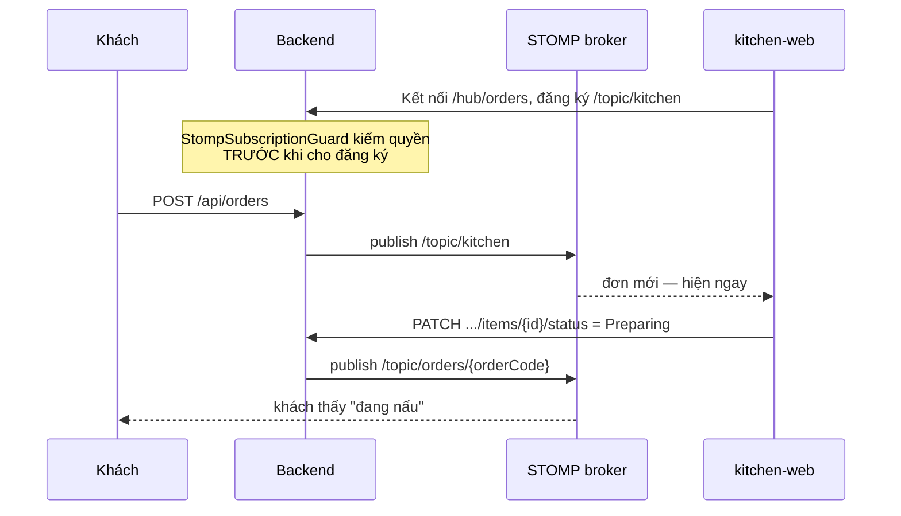
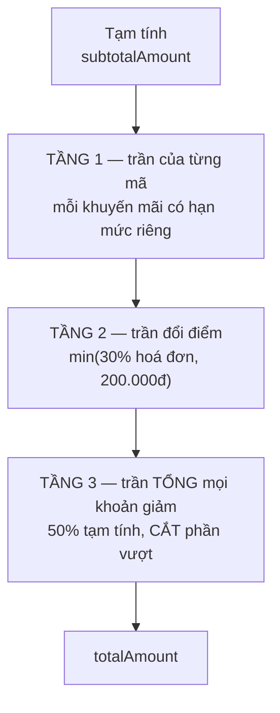
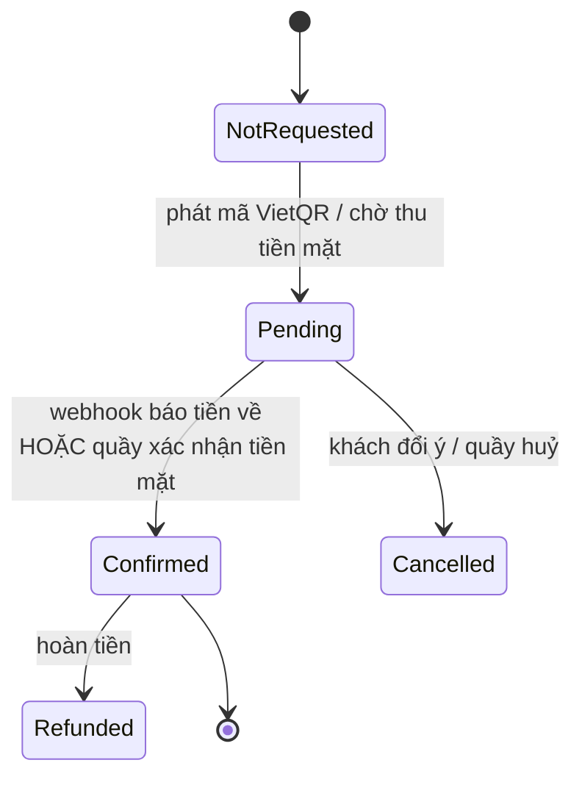
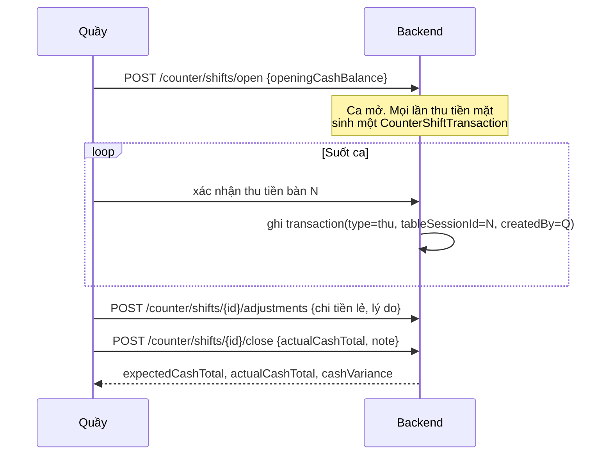

# Phần 4 — Nghiệp vụ vận hành: bếp, quầy, tiền

> Đáp ứng: YC-VH-01 → YC-VH-13, YC-KH-06, YC-KH-07, YC-PCN-01, YC-PCN-05

---

## 4.1. Màn hình bếp

### Yêu cầu gốc, nhắc lại nguyên văn

> *"Bếp có một màn hình treo trên tường. Món mới hiện lên **ngay**, không phải bấm tải lại."*
> *"Màn hình bếp phải đọc được khi đứng lùi 2 mét và bấm được khi tay đeo găng."*

Hai câu này yêu cầu hai thứ khác hẳn nhau: câu đầu là **kỹ thuật truyền tin**, câu sau là **thiết
kế giao diện cho môi trường bếp**. Hệ thống đáp ứng câu đầu, chưa đáp ứng câu sau.

### Truyền tin thời gian thực — YC-VH-01 `[ĐỦ]`

Kênh: **STOMP trên WebSocket**, điểm nối `/hub/orders`, phát ra các chủ đề `/topic/*`.



**Bài học đã trả giá ở đây:** frontend từng dùng SignalR trong khi backend đã chuyển sang STOMP. Lỗi
sống được vì **mỗi bên tự kiểm bằng client của chính mình** — backend kiểm bằng client STOMP, frontend
kiểm bằng giả lập SignalR, cả hai đều xanh, và không phép kiểm nào chạy qua ranh giới thật.

Cách chống đã áp: một bộ kiểm **`realtime-e2e`** chạy mã client thật đấu với backend thật. Đây là
nguyên tắc chung rút ra được và áp cho mọi ranh giới trong hệ thống: *hai bên tự kiểm bằng giả lập
của mình thì cả hai đều xanh trong khi hệ thống đỏ.*

### Bếp tắt món hết hàng — YC-VH-03 `[ĐỦ]`

`PATCH /api/kitchen/menu-items/{menuItemId}/availability`

Đổi có hiệu lực **tức thì** vì nó phát lên kênh realtime, không chờ khách tải lại trang. Chủ quán
nói rõ vì sao điều này quan trọng: *"nếu khách vẫn gọi được món cá trong 10 phút sau đó thì hệ thống
còn tệ hơn tờ giấy."*

Bếp cũng tự đặt được mức chậm chung khi quá tải (`PUT /api/kitchen/delay` — YC-VH-04), và số đó cộng
thẳng vào ước lượng thời gian chờ mà khách nhìn thấy.

> **Phân quyền đáng chú ý:** `Kitchen` được tắt món nhưng **không** được sửa giá. Sửa giá thuộc
> `Admin`. Bếp biết còn nguyên liệu hay không — đó là tri thức của bếp. Bếp không quyết định giá —
> đó là quyết định kinh doanh.

### Xếp món trên màn bếp

Bất biến V58–V60 quy định cách gom món thành làn (lane) trên bảng bếp — theo trạng thái, không theo
bàn. Bếp nghĩ theo *"cái gì đang trên chảo"*, không theo *"bàn nào đang chờ"*; ép bếp nghĩ theo bàn
là bắt họ dịch ngược mỗi lần nhìn màn hình.

### `[THIẾU]` YC-VH-11 — giao diện cho môi trường bếp

Chưa có thang chữ và vùng chạm riêng cho bảng bếp. Hiện dùng chung hệ thống thiết kế với các màn
khác, vốn dựng cho người ngồi nhìn gần và bấm bằng đầu ngón tay trần.

Chi phí sửa: **chỉ CSS, không đụng nghiệp vụ** — đây là hạng mục rủi ro thấp nhất trong toàn bộ lộ
trình, mà ảnh hưởng tới **mọi món của mọi bàn**. Xem Phần 9, hạng mục **KT-02**.

Cách nghiệm thu đã thống nhất với chủ quán, không cần công cụ:

| Phép thử | Đạt khi |
|---|---|
| Đứng lùi 2 mét | Đọc được tên món và số lượng mà không nheo mắt |
| Đeo găng cao su chạm 20 lần | Không lần nào trúng nút bên cạnh |

## 4.2. Màn hình quầy

### Quầy nhìn thấy gì — YC-VH-05 `[ĐỦ]`

| Mục | Nguồn | Trả lời câu hỏi |
|---|---|---|
| Danh sách bàn đang mở | `GET /api/admin/table-sessions` | "Bàn nào đang có khách?" |
| Hoá đơn từng bàn | `GET /api/table-sessions/{id}/invoice` | "Bàn này hết bao nhiêu?" |
| **Bàn quá giờ chưa thu** | lọc `overdueSince IS NOT NULL` | "Bàn nào ngồi lâu mà chưa trả tiền?" |
| Tín hiệu gọi nhân viên | STOMP | "Bàn nào vừa bấm gọi?" |
| Ca hiện tại | `GET /api/counter/shifts/current` | "Ca tôi mở lúc nào, thu được bao nhiêu?" |

Mục "bàn quá giờ chưa thu" (`CounterOverduePanel`) là nơi lỗ hổng mất tiền ở §3.2 được đưa ra ánh
sáng. Trước khi có nó, tiền mất mà không màn hình nào hiện.

### `[THIẾU]` YC-VH-12 — đổi tab làm mất dữ liệu đang gõ

Quầy đang gõ dở số tiền khách đưa, có việc cắt ngang, chuyển sang tab khác rồi quay lại — số đã mất.

Đây là **lỗi mất dữ liệu**, gặp mỗi lần bị cắt ngang, mà quầy giờ cao điểm thì bị cắt ngang liên
tục. Nguyên nhân: các tab dựng lại từ đầu khi chuyển, thay vì giữ trạng thái. Xem Phần 9, **KT-03**.

Nghiệm thu: *gõ dở số tiền → đổi tab → quay lại: số còn nguyên.*

## 4.3. Hoá đơn bàn

### Cấu trúc

```java
class TableInvoiceEntity {
    String     invoiceCode;
    String     tableSessionId;      // ← khoá về phiên bàn, V14
    String     status;              // Pending | Paid | Cancelled | Refunded
    BigDecimal subtotalAmount;      // tổng tiền món, chưa giảm
    BigDecimal discountAmount;      // TỔNG mọi khoản giảm
    BigDecimal totalAmount;         // số khách thật sự trả
    String     promotionCode;
    String     loyaltyRedemptionId;
    BigDecimal loyaltyDiscountAmount;
    String     customerPhoneNumber; // để tích điểm
    String     method;              // Cash | BankTransfer
}
```

Mọi số tiền là `BigDecimal`, **không** `double`. Đây là câu trả lời cho **YC-PCN-05**: `double` là
số nhị phân dấu phẩy động, không biểu diễn chính xác được những số thập phân bình thường, và sai số
tích luỹ qua vài trăm phép cộng mỗi ngày. `BigDecimal` cộng đúng từng đồng.

Làm tròn dùng `RoundingMode.DOWN` ở các phép tính trần — làm tròn **xuống** có lợi cho quán ở phía
trần, và quan trọng hơn là **nhất quán**: cùng một hoá đơn tính lại bao nhiêu lần cũng ra cùng số.

### Bất biến V17 — hoá đơn đang chờ thì khoá dòng tiền

> Khi hoá đơn ở trạng thái `Pending` (đã phát mã thanh toán, đang chờ tiền về), **không được** thay
> đổi các dòng tính tiền của phiên bàn.

Vì sao: khách quét mã VietQR cho số tiền 450.000đ. Trong lúc đang chuyển khoản, bàn gọi thêm một
món. Nếu hoá đơn đổi thành 480.000đ thì số tiền khách chuyển không khớp hoá đơn, và hệ thống không
biết nên coi là trả thiếu hay là trả cho hoá đơn cũ.

Cài đặt: `TableInvoicePaymentService` kiểm `"Pending".equals(invoice.getStatus())` trước mọi thao
tác đụng số tiền, và từ chối bằng mã lỗi rõ ràng thay vì âm thầm tính lại.

### Ba tầng trần giảm giá

Đây là phần có nhiều suy nghĩ nhất trong toàn bộ nghiệp vụ tiền, nên trình bày đủ.



**Tầng 2 — `TranDoiDiem`.** Hai giới hạn cùng lúc, lấy cái nhỏ hơn:

```java
public static final BigDecimal TY_LE         = new BigDecimal("0.30");
public static final BigDecimal TRAN_TUYET_DOI = BigDecimal.valueOf(200_000);

return tongHoaDon.multiply(TY_LE).setScale(0, RoundingMode.DOWN).min(TRAN_TUYET_DOI);
```

Lý do cần **cả hai**, ghi trong javadoc: *"Chỉ 30% thì hoá đơn 3 triệu cho phép giảm 900.000đ. Chỉ
200.000đ thì hoá đơn 250.000đ cho phép giảm 200.000đ, tức 80%. Mỗi giới hạn một mình đều hở ở một
đầu."*

**Tầng 3 — `TranGiamGiaHoaDon`.** Trần cho tổng, 50%:

```java
public static final BigDecimal TY_LE = new BigDecimal("0.50");

/** Cắt tổng giảm về trong trần. Trả về phần được giữ lại. */
public static BigDecimal cat(BigDecimal tongGiam, BigDecimal tamTinh) { ... }
```

Vì sao cần tầng 3 khi đã có tầng 1 và 2: một hoá đơn mang **cùng lúc** một mã của quán và một ưu đãi
đổi điểm. Từng khoản đều hợp lệ trong hạn mức riêng, nhưng cộng lại vẫn ăn quá sâu. Ví dụ đã tính
trong javadoc: *hoá đơn 760.000đ, mã quán giảm 20% (152.000đ) cộng ưu đãi đổi điểm 200.000đ là
352.000đ — gần một nửa hoá đơn, trong khi từng khoản đều hợp lệ.*

**Và một quyết định về trải nghiệm, ghi thẳng trong mã:**

> *"Cắt phần vượt chứ không từ chối cả hoá đơn: khách đã đứng ở quầy chờ trả tiền, và bắt họ bỏ bớt
> một mã ở khoảnh khắc đó là đổi một khoản lãi nhỏ lấy một trải nghiệm tệ."*

Đây là ví dụ tốt cho việc quy tắc nghiệp vụ có **hai nửa**: nửa "giới hạn là bao nhiêu" và nửa "vượt
thì xử lý thế nào". Nửa thứ hai thường bị bỏ quên, và nó là nửa khách nhìn thấy.

## 4.4. Thanh toán

### Hai phương thức — YC-KH-07, YC-VH-06 `[ĐỦ]`

| | Chuyển khoản (VietQR / SePay) | Tiền mặt |
|---|---|---|
| Khách làm gì | Quét mã VietQR, chuyển | Đưa tiền cho quầy |
| Ai xác nhận | **Máy** — webhook từ SePay | **Người** — quầy bấm xác nhận |
| Endpoint | `POST /api/payments/webhooks/sepay` | `POST /table-sessions/{id}/invoice/payment/confirm` |
| Rủi ro chính | Webhook gửi trùng | Quầy bấm nhầm |

Tiền mặt **bắt buộc phải có** (RB-4: *"Phần lớn khách sáng của tôi trả tiền mặt"*), và RB-5 cấm khoá
vào một nhà cung cấp: lớp `BankTransferReconciler` tách riêng phần đối soát, nên đổi nhà cung cấp là
thay một lớp, không phải viết lại luồng thanh toán.

### Vòng đời thanh toán



`PaymentStatus` còn giữ một giá trị `Unpaid` **không dùng tới trong luồng mới**. Nó ở lại có chủ ý,
và javadoc giải thích:

> *"`@Enumerated(EnumType.STRING)` đọc theo TÊN, nên một hàng `payments` mang chuỗi `"Unpaid"` — do
> bản .NET ghi, hoặc do dữ liệu cũ — sẽ làm bản Java ném lỗi ngay lúc nạp entity, không phải lúc
> dùng. Thiếu một hằng số enum ở đây là lỗi đọc dữ liệu, không phải lỗi logic."*

Đây là điểm thiết kế đáng ghi nhớ: **enum lưu xuống cơ sở dữ liệu là hợp đồng với dữ liệu cũ, không
chỉ là kiểu dữ liệu trong mã.** Xoá một giá trị enum là thay đổi phá vỡ, kể cả khi mã hiện tại không
sinh ra giá trị đó nữa.

### Chống trùng ở đường tiền — YC-PCN-01 `[ĐỦ]`

Ba lớp chống, độc lập nhau:

| Lớp | Cơ chế | Chặn được gì |
|---|---|---|
| Cơ sở dữ liệu | `referenceCode` **duy nhất** (migration V23) | Webhook SePay gửi lại lần hai |
| Ứng dụng | Khoá bất biến (`idempotencyKey`) | Khách bấm "trả tiền" hai lần |
| Trạng thái | Chỉ hoá đơn `Pending` mới nhận thanh toán | Trả tiền cho hoá đơn đã trả |

Lớp cơ sở dữ liệu mạnh nhất vì nó đúng kể cả khi có nhiều tiến trình chạy song song — thứ mà câu
`if` trong mã ứng dụng không bảo đảm được.

Phát lại đúng khoá thì hệ thống **trả nguyên kết quả cũ**, không tạo bản ghi mới:

```java
// Phát lại: cùng khoá, cùng nội dung, hoá đơn còn Pending thì trả nguyên kết quả cũ.
```

### Hoàn tiền

`POST /table-sessions/{sessionId}/invoice/payment/refund`. Hoàn tiền kéo theo **hai** hệ quả, và hệ
quả thứ hai từng bị bỏ sót:

1. Hoá đơn chuyển `Refunded`, ghi giao dịch hoàn.
2. **Trừ lại điểm đã cộng** — xem §5.4, đây là lỗ hổng O đã đóng.

## 4.5. Đóng phiên bàn

### Quy tắc — YC-VH-09 `[ĐỦ]`

`POST /api/table-sessions/{sessionId}/close`, khai quyền:

```java
@PreAuthorize("hasAnyRole('CounterStaff', 'Staff', 'Admin')")
```

Thân hàm gọi `kiemNoTruocKhiDong`:

```java
if (!force) {
    throw ApiException.conflict("TABLE_SESSION_HAS_UNPAID_ITEMS",
            "Bàn còn món chưa thanh toán. Thu tiền trước, hoặc ép đóng kèm lý do.");
}
String lyDo = reason == null ? "" : reason.trim();
if (lyDo.isEmpty()) {
    throw ApiException.badRequest("TABLE_SESSION_CLOSE_REASON_REQUIRED",
            "Ép đóng bàn còn nợ tiền phải kèm lý do.");
}
```

Hai tính chất, mỗi cái ứng một tình huống thật:

- **Chặn mặc định.** Bấm đóng một bàn còn nợ thì bị từ chối. Không cần nhớ quy tắc, hệ thống nhớ hộ.
- **Ép đóng phải kèm lý do không rỗng.** Có tình huống thật cần ép đóng — khách bỏ chạy, hoặc quán
  quyết định miễn — nhưng đó là **một quyết định được ghi tên**, không phải một lần bấm im lặng.

Việc kiểm dùng lại `TableSessionResumeState.conNoTien()` — **cùng nguồn** với nhánh gia hạn ở §3.2.
Một định nghĩa "còn nợ tiền" cho cả hai chỗ, nên chúng không thể lệch nhau. Đây chính là cách chống
lại hình dạng lỗi đã lặp bốn lần trong dự án: *hai nơi cùng mô tả một sự thật.*

## 4.6. Ca quầy và đối soát tiền mặt — YC-VH-08 `[ĐỦ]`

### Vì sao cần

Yêu cầu gốc của chủ quán: *"Cuối ca, tiền mặt trong ngăn kéo lệch với sổ. Tôi không biết lệch ở đâu
vì không có gì ghi lại từng lần thu."* Và tiêu chí nghiệm thu số 3: *"tôi **không** đặt mục tiêu
lệch bằng 0."*

Mục tiêu của ca quầy không phải làm cho lệch bằng 0. Mục tiêu là **biết lệch bao nhiêu và vì sao**.

### Cấu trúc

```java
class CounterShiftEntity {
    String     openedByUserId;      // AI mở ca
    String     closedByUserId;      // AI đóng ca
    CounterShiftStatus status;
    BigDecimal openingCashBalance;  // tiền đầu ca, quầy đếm và nhập
    BigDecimal expectedCashTotal;   // hệ thống tính: đầu ca + thu tiền mặt - chi
    BigDecimal actualCashTotal;     // quầy đếm thật cuối ca
    BigDecimal cashVariance;        // = actual - expected
    String     closeNote;           // lý do lệch
    OffsetDateTime openedAt, closedAt;
}

class CounterShiftTransactionEntity {
    String     counterShiftId;
    String     type;                // thu / chi / điều chỉnh
    BigDecimal amount;
    String     tableSessionId;      // ← nối ngược về bàn nào
    String     invoiceCode;
    String     reasonCode;
    String     note;
    String     createdByUserId;     // ← AI làm
    OffsetDateTime createdAt;
}
```

### Ba tính chất quan trọng

**1. Lệch là một con số được ghi, không phải một điều bị che.** `cashVariance` lưu xuống cơ sở dữ
liệu, kèm `closeNote`. Hệ thống không ép nó về 0 và không cảnh báo như thể nó là lỗi.

**2. Mọi giao dịch nối ngược được về bàn.** `tableSessionId` và `invoiceCode` trên từng dòng giao
dịch. Khi lệch 150.000đ, quản lý mở ra và soi từng dòng, thay vì đoán.

**3. Mọi dòng ghi tên người làm.** `createdByUserId`, `openedByUserId`, `closedByUserId`. Đây là
**YC-NS-05** đáp ứng được trong phạm vi tiền mặt tại quầy.

### Luồng một ca



### Ghi chú thiết kế: xoá tài khoản nhân viên

`CounterShiftEntity` có một phương thức **package-private** để gán lại người mở ca khi tài khoản đó
bị xoá. Chi tiết nhỏ nhưng đúng: xoá một nhân viên nghỉ việc **không được** làm hỏng sổ sách của
những ca họ đã làm. Sổ sách là chứng từ, không phải dữ liệu phụ thuộc vào việc người đó còn làm ở
quán hay không.

## 4.7. Đối chiếu yêu cầu Phần 4

| Mã | Yêu cầu | Trạng thái | Cài ở đâu |
|---|---|---|---|
| YC-VH-01 | Món mới hiện ngay trên màn bếp | `[ĐỦ]` | STOMP `/hub/orders` → `/topic/kitchen` |
| YC-VH-02 | Bếp đổi trạng thái, khách thấy ngay | `[ĐỦ]` | `PATCH .../items/{id}/status` + `/topic/orders/{code}` |
| YC-VH-03 | Tắt món hết hàng tức thì | `[ĐỦ]` | `PATCH /kitchen/menu-items/{id}/availability` |
| YC-VH-04 | Báo chậm chung khi quá tải | `[ĐỦ]` | `PUT /api/kitchen/delay` |
| YC-VH-05 | Quầy thấy bàn mở, bàn nợ, bàn quá giờ | `[ĐỦ]` | `CounterOverduePanel`, `overdueSince` |
| YC-VH-06 | Thu tiền mặt và chuyển khoản | `[ĐỦ]` | `payment/confirm`, webhook SePay |
| YC-VH-08 | Ca quầy, tính lệch tiền | `[ĐỦ]` | `counter_shifts`, `counter_shift_transactions` |
| YC-VH-09 | Không đóng bàn còn nợ trừ khi ép kèm lý do | `[ĐỦ]` | `kiemNoTruocKhiDong` |
| YC-VH-11 | Màn bếp đọc ở 2m, bấm khi đeo găng | `[THIẾU]` | — KT-02 |
| YC-VH-12 | Đổi tab không mất dữ liệu đang gõ | `[THIẾU]` | — KT-03 |
| YC-VH-13 | Phân biệt huỷ trước/sau khi nấu | `[ĐỦ]` | `cancelledFromStatus` + `unitCost` + `ReportService.haoHut()` |
| YC-KH-06 | Khách xem hoá đơn trước khi trả | `[ĐỦ]` | `GET /table-sessions/{id}/invoice` |
| YC-KH-07 | Trả bằng quét mã, máy tự biết | `[ĐỦ]` | VietQR + webhook SePay |
| YC-PCN-05 | Tiền không sai do làm tròn | `[ĐỦ]` | `BigDecimal` + `RoundingMode.DOWN` nhất quán |

---

**Trước:** [Phần 3 — Đặt món](03-NGHIEP-VU-DAT-MON.md) · **Tiếp:** [Phần 5 — Nghiệp vụ quản lý](05-NGHIEP-VU-QUAN-LY.md)
