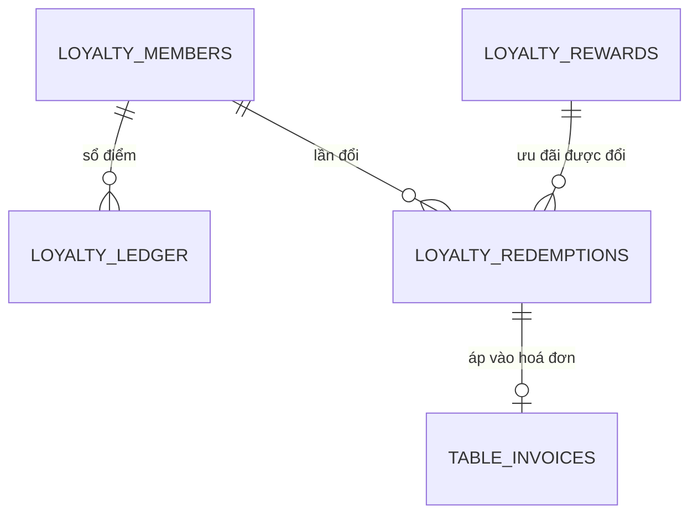

# Phần 5 — Nghiệp vụ quản lý: thực đơn, khuyến mãi, khách quen, báo cáo, nhân sự

> Đáp ứng: YC-QL-01 → YC-QL-13, YC-KH-11, YC-KH-12, YC-NS-01 → YC-NS-10

---

## 5.1. Thực đơn

### Cấu trúc một món

```java
class MenuItemEntity {
    String       categoryId;        // nhóm món
    String       name, description;
    BigDecimal   price;             // giá bán
    BigDecimal   costPrice;         // giá vốn (migration V34)
    Integer      remainingQuantity; // số suất còn lại hôm nay (V35)
    Integer      prepMinutes;       // thời gian nấu ước lượng
    int          delayMinutes;      // chậm thêm, do bếp đặt
    OffsetDateTime delayExpiresAt;  // mức chậm TỰ HẾT HẠN
    boolean      available;         // còn bán hay không
    String       imageUrl;
    List<String> tags;
}
```

Bốn chi tiết đáng giải thích:

**`costPrice` — YC-QL-12.** Giá vốn nhập ở đây, và được **chụp lại** vào `order_items.unit_cost`
mỗi lần khách gọi món. Không tra ngược lúc làm báo cáo, vì giá vốn đổi theo mùa và một báo cáo
tháng trước phải phản ánh giá vốn tháng trước. Đây là nguyên tắc chung cho mọi số liệu tài chính:
**chứng từ chụp lại giá trị đã dùng, không tham chiếu tới bảng gốc.**

**`remainingQuantity` — YC-QL-04.** Quản lý đặt số suất chuẩn bị trong ngày (`PUT
/api/admin/menu-items/chuan-bi-hom-nay`), hệ thống trừ dần theo đơn và tự tắt món khi về 0. Lưu ý
lịch sử migration: V39 thêm cơ chế nạp lại theo ca, **V40 gỡ bỏ việc tự nạp lại** — quyết định
cuối là *chỉ người mới được đặt lại số suất*, vì tự nạp lại lúc nửa đêm nghĩa là một món hết hàng
tự sống lại mà không ai đụng vào bếp.

**`delayExpiresAt` — mức chậm tự hết hạn.** Bếp đặt "chậm 15 phút" lúc cao điểm rồi quên tắt là
chuyện chắc chắn xảy ra. Cho mức chậm một hạn dùng thì trạng thái sai tự chữa; không cho thì nó ở
lại tới khi có người để ý, và lúc đó khách đã thấy thời gian chờ sai suốt buổi chiều.

**`available` có hai người bật tắt được, với hai ý nghĩa khác nhau.** Bếp tắt vì *hết nguyên liệu*.
Quản lý tắt vì *ngừng bán món này*. Hệ thống hiện dùng chung một cờ — xem khoảng trống KT-11.

### Khung giờ bán — YC-QL-03 `[ĐỦ]`

```java
class ServingPeriodEntity {
    String    name;        // "Sáng", "Trưa", "Tối"
    LocalTime startTime, endTime;
    int       displayOrder;
}
```

Nối nhiều-nhiều với món qua `MenuItemServingPeriodEntity` (migration V38). Một món thuộc nhiều khung
giờ; một khung giờ có nhiều món. Yêu cầu gốc: *"món sáng không được bán lúc 8 giờ tối."*

Dùng `LocalTime`, không `OffsetDateTime`: khung giờ bán là **quy tắc lặp hằng ngày**, không phải một
mốc thời gian cụ thể. Chọn sai kiểu dữ liệu ở đây sẽ buộc phải sinh bản ghi cho từng ngày.

### Quản lý bàn và mã QR — YC-QL-05 `[ĐỦ]`

| Thao tác | Endpoint |
|---|---|
| Tạo bàn | `POST /api/admin/tables` |
| Sửa bàn | `PATCH /api/admin/tables/{tableCode}` |
| **Xoay mã QR** | `POST /api/admin/tables/{tableCode}/qr/rotate` |

Giới hạn `MAX_TABLES = 99`, và khi hết mã trống thì báo lỗi rõ ràng
(`TABLE_CAPACITY_REACHED`) chứ không sinh mã trùng.

## 5.2. Khuyến mãi

```java
class PromotionEntity {
    String        code;               // mã khách gõ
    PromotionType type;               // theo % hay theo số tiền
    BigDecimal    discountValue;
    BigDecimal    minOrderAmount;     // hoá đơn tối thiểu
    BigDecimal    maxDiscountAmount;  // ← TẦNG 1 của ba tầng trần (§4.3)
    boolean       flashSale;
    Integer       usageLimit;         // tổng số lượt được dùng (V32)
    int           usedCount;          // đã dùng bao nhiêu
    OffsetDateTime startsAt, endsAt;
    boolean       active;
}
```

### Giới hạn lượt dùng — YC-QL-07 `[ĐỦ]`

`usageLimit` + `usedCount` (migration V32). Trước khi có hai cột này, **một mã lọt ra ngoài là dùng
vô hạn** — đăng lên một nhóm Facebook là quán trả tiền cho cả nhóm.

Điểm kỹ thuật bắt buộc: **tăng `usedCount` phải nằm cùng giao dịch với việc ghi hoá đơn.** Tách ra
hai giao dịch thì có một khe hở để hai hoá đơn cùng dùng lượt cuối cùng.

### Cờ `flashSale` — khoảng trống KT-12

Cờ này **không có nghĩa nghiệp vụ**: nó chỉ đổi cách hiển thị, không đổi cách tính tiền hay xét hiệu
lực. Hiệu lực theo thời gian đã do `startsAt`/`endsAt` lo trọn vẹn.

Khuyến nghị: **bỏ cờ**. Một trường tồn tại mà không ràng buộc gì là một lời mời hiểu nhầm — người
đọc mã sau này sẽ cho rằng nó có nghĩa và viết logic dựa vào nó.

### Mã hết hạn giữa bữa — khoảng trống KT-13

Khách mở phiên bàn lúc 17h50 với mã hết hạn 18h00. Ăn tới 18h30 rồi trả tiền. Mã còn hiệu lực không?

| Cách chọn | Hệ quả |
|---|---|
| Kiểm lúc **trả tiền** | Khách bị từ chối mã mà họ thấy còn hiệu lực lúc ngồi xuống |
| Chốt theo lúc **mở phiên bàn** | Khớp cách khách hiểu, và giải thích được ở quầy |

Khuyến nghị: **chốt theo lúc mở phiên**, và hoá đơn lưu thêm mốc thời gian đã dùng để kiểm — để
sau này đối chiếu được vì sao một mã hết hạn lại được chấp nhận.

## 5.3. Khách quen và tích điểm

### Mô hình



| Bảng | Vai trò |
|---|---|
| `loyalty_members` | Hồ sơ khách, khoá bằng **số điện thoại** |
| `loyalty_ledger` | **Sổ cái điểm** — mọi biến động là một dòng, không sửa |
| `loyalty_rewards` | Danh mục ưu đãi đổi được |
| `loyalty_redemptions` | Từng lần đổi, có mã 8 ký tự |

### Quy tắc tích điểm

```java
public static final BigDecimal VND_PER_POINT = BigDecimal.valueOf(10_000);
```

**10.000đ = 1 điểm**, nhân hệ số hạng, làm tròn **xuống**.

```java
public enum MemberTier {
    BAC      ("Bạc",       0L,          "1.0"),
    VANG     ("Vàng",      5_000_000L,  "1.25"),
    KIM_CUONG("Kim cương", 15_000_000L, "1.5");
}
```

Hạng xét theo **chi tiêu 12 tháng gần nhất** (`XetLaiHangJob` dùng `now.minusMonths(12)`), không
theo chi tiêu trọn đời. Khách ngừng đến thì hạng tự tụt — đó là ý đồ: chương trình khách quen
thưởng cho **thói quen hiện tại**, không thưởng cho quá khứ.

Điểm có hạn dùng **12 tháng** kể từ lúc tích (`now.plusMonths(12)` ghi thẳng vào dòng sổ).

### Sổ cái, không phải một cột số dư

Đây là quyết định thiết kế quan trọng nhất của phần này. Điểm **không** lưu thành một con số
`balance` trên hồ sơ khách. Điểm là **tổng các dòng sổ**:

```java
new LoyaltyLedgerEntity(id, memberId, diem, "ACCRUE", soTien, now.plusMonths(12), now);
```

Vì sao đắt hơn nhưng đúng hơn:

| Câu hỏi | Cột `balance` | Sổ cái |
|---|---|---|
| "Vì sao tôi có 240 điểm?" | Không trả lời được | Liệt kê từng dòng |
| "Điểm nào sắp hết hạn?" | Không biết | Mỗi dòng có hạn riêng |
| Hoàn tiền thì sửa thế nào? | Trừ tay, dễ sai | Ghi một dòng đảo |

### Hoàn tiền phải trừ lại điểm

Lỗ hổng đã đóng, và đáng kể lại vì nó minh hoạ cách sổ cái tự chữa.

**Cơ chế cũ:** hoàn tiền không ghi gì vào sổ điểm, nên dòng `ACCRUE` vẫn nằm nguyên. Tác vụ hằng
tháng tính lại chi tiêu **từ sổ**, nên nó không những không sửa mà còn **xác nhận lại con số sai** —
khách lên hạng bằng tiền chưa từng trả.

**Cách sửa — một dòng sổ đảo ngược:**

```java
id, memberId, -Math.abs(diemDaTich), "REFUND", soTienDaTich.abs().negate(), null, now
```

Điểm âm, tiền âm, đúng bằng dòng `ACCRUE` nó đảo. Truy vấn xét hạng cộng **cả** `REFUND`:

```sql
where l.memberId = :memberId and l.reason in ('ACCRUE', 'REFUND') and l.createdAt >= :tu
```

Ghi chú trong repository nói thẳng điểm mấu chốt: *"Dòng REFUND mang số tiền ÂM đúng bằng dòng
ACCRUE nó đảo, nên phép cộng thẳng tự khử. Bỏ REFUND ra ngoài thì một hoá đơn đã hoàn vẫn tính vào
hạng."*

Không phải trừ tay cột nào — **hạng tự chữa** ở kỳ tính lại sau.

### Đổi điểm — YC-KH-12 `[ĐỦ]`

Khách đổi điểm lấy ưu đãi, nhận **mã 8 ký tự** sinh từ `SecureRandom` với bảng chữ
`ABCDEFGHJKMNPQRSTWXYZ23456789` — **đã bỏ** `I`, `L`, `O`, `U`, `V`, `0`, `1`. Đây là chi tiết nhỏ
mà đúng: mã này được **đọc bằng miệng ở quầy**, và `0`/`O`, `1`/`I`/`L` là nguồn gõ nhầm.

Giá trị đổi bị chặn bởi `TranDoiDiem` — `min(30% hoá đơn, 200.000đ)`, xem §4.3.

### `[MỘT PHẦN]` YC-KH-11 — ba lỗ hổng còn lại của tích điểm

| # | Lỗ hổng | Hậu quả |
|---|---|---|
| **KT-04a** | Số điện thoại gõ ở quầy **không hiện lại** cho khách xác nhận | Gõ nhầm một chữ số → điểm vào hồ sơ người khác |
| **KT-04b** | **Không có** thao tác chuyển điểm giữa hai hồ sơ | Gõ nhầm rồi thì không có đường sửa |
| **KT-04c** | Khách **không được báo** vừa tích bao nhiêu điểm | `TableInvoicePaymentService` gọi `loyaltyService.accrue(...)` rồi **bỏ giá trị trả về** |

Ba lỗ hổng này liên quan chặt: **KT-04c làm cho KT-04a không bao giờ lộ.** Khách không được báo vừa
tích bao nhiêu điểm thì họ không có cách nào phát hiện điểm đã rơi vào hồ sơ khác. Sửa KT-04a mà
không sửa KT-04c là sửa nửa vời.

## 5.4. Nhân sự — phần mỏng nhất của hệ thống

Chủ quán đặt yêu cầu này riêng và nói trước: *"Nếu vượt phạm vi đợt này thì **nói thẳng là chưa
làm**, đừng làm nửa vời rồi tôi tưởng là có."* Phần này trả lời đúng như vậy.

### Cái đang có

```java
class UserEntity {
    String         email, fullName, phoneNumber;
    String         passwordHash;
    String         googleSub;        // đăng nhập Google (V21)
    String         role;
    int            failedLoginCount; // khoá sau nhiều lần sai
    OffsetDateTime lockoutEndAt;
    OffsetDateTime createdAt, updatedAt;
}
```

| Mã | Yêu cầu | Trạng thái | Cài ở đâu |
|---|---|---|---|
| YC-NS-01 | Tài khoản riêng từng người | `[ĐỦ]` | `GET/POST/PUT/DELETE /api/users` |
| YC-NS-02 | Phân quyền theo vai | `[ĐỦ]` | `@PreAuthorize` + `ADMIN_ASSIGNABLE` |
| YC-NS-03 | Đặt lại mật khẩu | `[ĐỦ]` | `POST /api/users/{userId}/reset-password` |
| YC-NS-04 | Khoá sau nhiều lần đăng nhập sai | `[ĐỦ]` | `failedLoginCount` + `lockoutEndAt` |

Đó là **toàn bộ** phần quản lý nhân sự hiện có: bốn việc, tất cả thuộc nhóm *quản trị tài khoản*.

### Cái đang thiếu, và vì sao nó quan trọng

Chủ quán có **15 người, hai ca, người nghỉ đột xuất tuần nào cũng có**. Bốn việc trên không chạm tới
một chữ nào của bài toán đó.

| Mã | Yêu cầu | Trạng thái | Hiện phải làm thế nào |
|---|---|---|---|
| YC-NS-05 | Ghi tên người thao tác cho mọi việc đụng tiền | `[MỘT PHẦN]` | Có ở ca quầy; **không** có ở huỷ món, áp mã giảm giá, sửa giá, tích điểm |
| YC-NS-06 | Xếp ca theo tuần | `[THIẾU]` | Giấy dán tường |
| YC-NS-07 | Chấm công vào/ra | `[THIẾU]` | Quản lý nhớ |
| YC-NS-08 | Bảng công cuối tháng | `[THIẾU]` | Tính tay từ giấy |
| YC-NS-09 | Đo năng suất theo người | `[THIẾU]` | Cảm giác |
| YC-NS-10 | Nhật ký thao tác tra cứu được | `[MỘT PHẦN]` | Dữ liệu rải rác nhiều bảng, không có màn hình tra cứu |

### Phân tích YC-NS-05 — ghi tên người thao tác

Đây là yêu cầu **bắt buộc** của chủ quán, và là chỗ đáng lo nhất vì nó đang ở trạng thái *"có một
nửa"* — dễ làm người đọc tưởng đã đủ.

| Thao tác đụng tiền | Có ghi tên người làm? |
|---|:---:|
| Thu tiền mặt | ✔ `CounterShiftTransaction.createdByUserId` |
| Mở ca / đóng ca | ✔ `openedByUserId`, `closedByUserId` |
| Điều chỉnh tiền trong ca | ✔ |
| **Huỷ món sau khi đã nấu** | ✖ |
| **Áp mã giảm giá** | ✖ |
| **Ép đóng bàn còn nợ** | lý do có ghi, **người thì không** |
| **Tích điểm cho khách** | ✖ |
| **Sửa giá món** | ✖ |
| **Hoàn tiền** | ✖ |

Năm dòng cuối là những thao tác **dễ bị lạm dụng nhất** trong một nhà hàng, và chúng đúng là những
dòng không ghi tên. Đây không phải chuyện nghi ngờ nhân viên; đây là chuyện chủ quán nói rõ ở §1.2:
*"Tôi không định soi nhân viên; tôi định có câu trả lời khi có chuyện."*

### Thiết kế đề xuất cho khoảng trống nhân sự

Ba hạng mục, xếp theo thứ tự làm. Chi tiết lộ trình ở Phần 9.

**Đề xuất NS-1 — Sổ nhật ký thao tác (`audit_log`)** · đóng YC-NS-05 và YC-NS-10

```
audit_log(
  id,
  actor_user_id,      -- AI làm
  actor_role,         -- vai lúc đó, CHỤP LẠI (vai có thể đổi sau)
  action,             -- 'ITEM_CANCEL', 'DISCOUNT_APPLY', 'PRICE_CHANGE', ...
  subject_type,       -- 'ORDER_ITEM' | 'TABLE_INVOICE' | 'MENU_ITEM' | ...
  subject_id,
  before_value,       -- JSON, giá trị trước
  after_value,        -- JSON, giá trị sau
  amount_impact,      -- ảnh hưởng tới tiền, nếu có
  reason,
  created_at
)
```

Bốn tính chất bắt buộc:

1. **Chỉ ghi thêm, không sửa, không xoá.** Một sổ sửa được thì không còn là sổ.
2. **Chụp lại vai lúc thao tác.** Vai đổi sau không được làm đổi ý nghĩa của bản ghi cũ.
3. **Ghi trong cùng giao dịch với việc nó mô tả.** Tách ra thì có thao tác không để lại dấu.
4. **Xoá nhân viên không xoá nhật ký.** Cùng nguyên tắc với ca quầy ở §4.6.

**Đề xuất NS-2 — Xếp ca và chấm công** · đóng YC-NS-06, 07, 08

```
work_shift(id, name, start_time, end_time)              -- ca mẫu: "Sáng 6h-14h"
shift_assignment(id, user_id, work_shift_id, work_date) -- ai làm ca nào ngày nào
attendance(id, user_id, shift_assignment_id,
           checked_in_at, checked_out_at, note)          -- vào/ra thật
```

Quyết định thiết kế quan trọng: **tách "xếp ca" khỏi "chấm công"**. Xếp ca là *dự định*, chấm công
là *thực tế*, và khoảng cách giữa hai cái mới là thứ quản lý cần đọc — ai hay đi muộn, ca nào hay
thiếu người. Gộp một bảng thì mất chính thông tin đó.

Bảng công cuối tháng là một truy vấn tổng hợp trên `attendance`, không phải một bảng riêng — bảng
riêng sẽ lệch với dữ liệu gốc ngay lần sửa đầu tiên.

**Đề xuất NS-3 — Đo năng suất** · đóng YC-NS-09

Phụ thuộc NS-1 và NS-2. Không cần bảng mới: mọi số liệu suy ra được từ dữ liệu đã có, **nếu**
`audit_log` đã ghi tên người.

| Số đo | Tính từ |
|---|---|
| Số bàn một người phục vụ trong ca | `counter_shift_transactions` + `shift_assignment` |
| Thời gian nấu trung bình một món | `order_items.createdAt` → `readyAt` |
| Tỷ lệ huỷ muộn theo ca | `cancelled_from_status` + `shift_assignment` |

> Chủ quán nói rõ mục đích: *"Tôi cần cái này để thưởng cho đúng người, không phải để phạt."* Thiết
> kế nên theo đúng tinh thần đó — báo cáo trình bày theo **ca** và theo **xu hướng**, không xếp hạng
> cá nhân theo từng ngày.

## 5.5. Báo cáo

### Cái đang có

Một endpoint: `GET /api/admin/reports/summary`.

```java
record SummaryResponse(
    OffsetDateTime from, to,
    int        totalOrders, paidOrders,
    BigDecimal grossRevenue, totalDiscount, netRevenue,
    List<TopItemResponse>     topItems,      // món bán chạy
    List<DailyRevenueResponse> dailyRevenue, // doanh thu theo ngày
    WasteResponse             waste)         // hao hụt vì huỷ món
```

Đáp ứng **YC-QL-09** ở mức cơ bản: doanh thu, số đơn, món bán chạy, doanh thu theo ngày.

### Báo cáo hao hụt — phần đáng học nhất

```java
record WasteResponse(
    int        huyKhiDangNau, huyTruocKhiNau, khongRoNguonGoc,
    BigDecimal giaTriHuyKhiDangNau, giaVonHuyKhiDangNau,
    int        monChuaCoGiaVon)
```

Sáu con số cho một câu hỏi tưởng là đơn giản. Javadoc giải thích từng cái, và cả ba lý do đều là
nguyên tắc thiết kế báo cáo đáng áp rộng:

**1. Không gộp cái khác loại.** *"Một quán huỷ nhiều nhưng toàn huỷ sớm là chuyện khác hẳn quán huỷ
ít mà toàn huỷ muộn."* Nên `huyKhiDangNau` và `huyTruocKhiNau` là hai con số, không phải một.

**2. Không bịa số cho dữ liệu cũ.** `khongRoNguonGoc` đếm riêng những món huỷ **trước** migration
V33, lúc chưa có cột `cancelled_from_status`. Javadoc: *"Đếm riêng chứ KHÔNG gộp vào nhóm 'không
hao hụt' cho gọn — làm thế là bịa ra một con số. Nhóm này sẽ tự teo đi theo thời gian."*

**3. Luôn hiện phần chưa đo được, cạnh phần đã đo.** `monChuaCoGiaVon` đếm những món huỷ mà chưa có
giá vốn để cộng vào. Lý do, nguyên văn:

> *"Phải hiện con số này cạnh `giaVonHuyKhiDangNau`, nếu không người đọc sẽ tưởng đã thấy toàn bộ
> thiệt hại. Cộng 0 cho những món đó là báo cáo hao hụt THẤP hơn sự thật — và **sai theo hướng làm
> người ta yên tâm là hướng sai nguy hiểm nhất**."*

Truy vấn cũng có một bẫy đã tránh được, ghi lại trong mã: điều kiện lọc của báo cáo hao hụt **không
được dùng lại** điều kiện lọc doanh thu, vì món huỷ không có thanh toán nào để neo vào — dùng lại sẽ
loại sạch mọi món huỷ và báo cáo **luôn ra 0**. Javadoc gọi đúng tên nó: *"đúng loại lỗi tự xác
nhận, vì con số 0 trông rất giống 'quán không huỷ món'."*

### `[THIẾU]` YC-QL-10 — mốc so sánh

Tiêu chí nghiệm thu số 4 của chủ quán: *"Mở báo cáo, trong 1 phút nói được hôm qua bán gì chạy
nhất."* Và yêu cầu: *"Tôi cần biết một con số là tốt hay tệ so với kỳ trước ngay khi nhìn thấy nó —
một con số đứng một mình không nói được gì."*

Hiện `SummaryResponse` trả về **một** khoảng thời gian, không kèm khoảng trước. Người đọc phải tự
mở hai lần rồi trừ trong đầu. Xem Phần 9, **KT-08**.

### `[MỘT PHẦN]` YC-QL-11 — thời gian phục vụ và giờ cao điểm

| Số đo | Dữ liệu có chưa? | Báo cáo có chưa? |
|---|:---:|:---:|
| Tỷ lệ huỷ món | ✔ | ✔ qua `WasteResponse` |
| Thời gian nấu trung bình | ✔ `order_items.readyAt` | ✖ |
| Giờ cao điểm | ✔ `orders.createdAt` | ✖ |
| Thời gian một bàn ngồi | ✔ `openedAt` → `closedAt` | ✖ |

**Dữ liệu đã có đủ.** Thiếu là phần tổng hợp và trình bày. Đây là tin tốt: hạng mục này không cần
migration, chỉ cần thêm truy vấn và màn hình.

### `[THIẾU]` YC-QL-13 — đổi chính sách tiền không cần lập trình viên

Sáu hằng số nghiệp vụ đang **chôn trong mã**:

| Hằng số | Giá trị | Ở đâu |
|---|---|---|
| Tỷ lệ tích điểm | 10.000đ/điểm | `LoyaltyMember.VND_PER_POINT` |
| Ngưỡng và hệ số hạng | 1,0 / 1,25 / 1,5 tại 0 / 5tr / 15tr | `MemberTier` |
| Trần đổi điểm | `min(30%, 200.000đ)` | `TranDoiDiem` |
| Trần tổng giảm giá | 50% | `TranGiamGiaHoaDon` |
| Hạn dùng điểm | 12 tháng | `LoyaltyLedgerEntity` |
| Hạn phiên bàn | 4 giờ | `TableSessionService` |

Chúng là **chính sách kinh doanh**, không phải hằng số kỹ thuật. Chủ quán muốn chạy "cuối tuần nhân
đôi điểm" phải sửa mã và triển khai lại. Thiết kế đề xuất ở Phần 9, **KT-14**.

## 5.6. Đối chiếu yêu cầu Phần 5

| Mã | Yêu cầu | Trạng thái |
|---|---|---|
| YC-QL-01 | Thêm/sửa/xoá món, nhóm, giá, ảnh | `[ĐỦ]` |
| YC-QL-02 | Bật/tắt món hết hàng | `[ĐỦ]` |
| YC-QL-03 | Khung giờ bán theo món | `[ĐỦ]` |
| YC-QL-04 | Số suất chuẩn bị trong ngày | `[ĐỦ]` |
| YC-QL-05 | Quản lý bàn, xoay QR | `[ĐỦ]` |
| YC-QL-06 | Khuyến mãi theo mã, %, số tiền, thời hạn | `[ĐỦ]` |
| YC-QL-07 | Giới hạn lượt dùng mã | `[ĐỦ]` |
| YC-QL-08 | Tích điểm, hạng, đổi điểm | `[ĐỦ]` |
| YC-QL-09 | Báo cáo doanh thu, món bán chạy | `[MỘT PHẦN]` — có số, thiếu chiều sâu |
| YC-QL-10 | Mốc so sánh kỳ trước | `[THIẾU]` — KT-08 |
| YC-QL-11 | Thời gian phục vụ, tỷ lệ huỷ, giờ cao điểm | `[MỘT PHẦN]` — dữ liệu đủ, báo cáo thiếu |
| YC-QL-12 | Giá vốn để tính lãi gộp | `[MỘT PHẦN]` — có `costPrice`+`unitCost`, thiếu báo cáo lãi gộp |
| YC-QL-13 | Đổi chính sách tiền không cần lập trình | `[THIẾU]` — KT-14 |
| YC-KH-11 | Khách xem điểm và hạng | `[MỘT PHẦN]` — KT-04a/b/c |
| YC-KH-12 | Đổi điểm lấy ưu đãi | `[ĐỦ]` |
| YC-NS-01..04 | Tài khoản, phân quyền, đặt lại mật khẩu, khoá | `[ĐỦ]` |
| YC-NS-05 | Ghi tên người thao tác đụng tiền | `[MỘT PHẦN]` — chỉ có ở quầy |
| YC-NS-06..09 | Xếp ca, chấm công, bảng công, năng suất | `[THIẾU]` — NS-2, NS-3 |
| YC-NS-10 | Nhật ký thao tác tra cứu được | `[MỘT PHẦN]` — NS-1 |

---

**Trước:** [Phần 4 — Vận hành](04-NGHIEP-VU-VAN-HANH.md) · **Tiếp:** [Phần 6 — Mô hình dữ liệu](06-MO-HINH-DU-LIEU.md)
