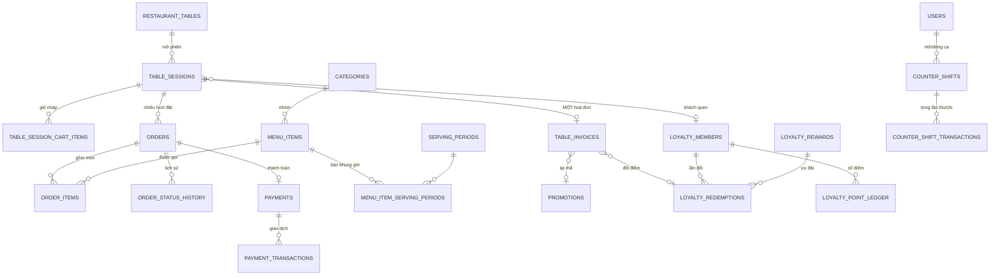

# Phần 6 — Mô hình dữ liệu

> Đáp ứng: YC-PCN-05, YC-PCN-06, RB-6 (dữ liệu là của chủ quán, xuất ra được)

---

## 6.1. Nền tảng

| Hạng mục | Lựa chọn | Lý do |
|---|---|---|
| Hệ quản trị | **PostgreSQL 16** | Giao dịch ACID thật, ràng buộc duy nhất từng phần, kiểu `numeric` chính xác |
| Truy cập | Spring Data JPA / Hibernate | Ánh xạ đối tượng, và `@Version` cho khoá lạc quan |
| Di trú lược đồ | **Flyway** | Migration đánh số, chạy một chiều, kiểm tra tổng |
| Kiểu tiền | `numeric` ↔ `BigDecimal` | Không bao giờ `float`/`double` — xem YC-PCN-05 |
| Kiểu thời gian | `timestamptz` ↔ `OffsetDateTime` | Luôn kèm múi giờ |

**Về kiểu thời gian:** `LocalTime` chỉ dùng cho `serving_periods` (khung giờ bán), vì đó là **quy
tắc lặp hằng ngày** chứ không phải một mốc. Mọi thứ khác là `OffsetDateTime`. Trộn hai kiểu này là
nguồn lỗi kinh điển khi đổi giờ hoặc chạy nhiều múi giờ.

## 6.2. Sơ đồ quan hệ

## 6.3. Từ điển dữ liệu — 22 bảng

### Nhóm A — Thực đơn (5 bảng)

| Bảng | Vai trò | Cột đáng chú ý |
|---|---|---|
| `categories` | Nhóm món | `display_order` |
| `menu_items` | Món ăn | `price`, `cost_price`, `remaining_quantity`, `prep_minutes`, `delay_minutes`, `delay_expires_at`, `available` |
| `serving_periods` | Khung giờ bán | `start_time`, `end_time` — kiểu `time`, không `timestamptz` |
| `menu_item_serving_periods` | Nối món ↔ khung giờ | Bảng nối nhiều-nhiều |
| `kitchen_delay` | Mức chậm chung của bếp | Một hàng duy nhất |

### Nhóm B — Bàn và phiên (3 bảng)

| Bảng | Vai trò | Cột đáng chú ý |
|---|---|---|
| `restaurant_tables` | Bàn vật lý | `table_code`, `qr_token` (xoay được) |
| `table_sessions` | **Phiên bàn** — gốc của một bữa | `status`, `expires_at`, `overdue_since`, `close_reason`, `member_id`, `version` |
| `table_session_cart_items` | Giỏ nháp chung của bàn | Xoá sạch mỗi lần chốt lượt |

**`version`** trên `table_sessions` là khoá lạc quan, phục vụ bất biến V4 — hai người cùng bàn quét
QR cùng lúc thì chỉ một phiên được tạo.

**`overdue_since`** tách khỏi `expires_at` vì `expires_at` bị đẩy tới liên tục khi bàn còn nợ (§3.2).
Hai cột trả lời hai câu hỏi khác nhau, và gộp chúng là mất một câu.

### Nhóm C — Đơn hàng (3 bảng)

| Bảng | Vai trò | Cột đáng chú ý |
|---|---|---|
| `orders` | Một **lượt đặt** | `order_code`, `status`, `table_session_id` |
| `order_items` | Từng món trong lượt | `status`, `unit_price`, `unit_cost`, `quantity`, `ready_at`, `cancelled_from_status` |
| `order_status_history` | Lịch sử chuyển trạng thái | Chỉ ghi thêm |

**Ba cột chụp lại giá trị** trên `order_items`, và đây là nguyên tắc quan trọng nhất của toàn bộ mô
hình dữ liệu:

| Cột | Chụp lại cái gì | Nếu không chụp thì sao |
|---|---|---|
| `menu_item_name` | Tên món lúc gọi | Đổi tên món → hoá đơn cũ đổi theo |
| `unit_price` | Giá bán lúc gọi | Tăng giá → doanh thu tháng trước tăng theo |
| `unit_cost` | Giá vốn lúc gọi | Đổi giá vốn → lãi gộp lịch sử sai |

> **Nguyên tắc: chứng từ chụp lại, không tham chiếu.** Một dòng hoá đơn là bằng chứng về một giao
> dịch đã xảy ra, không phải một khung nhìn động vào bảng danh mục. Vi phạm nguyên tắc này làm hỏng
> mọi báo cáo lịch sử, và hỏng theo cách không ai phát hiện ra cho tới khi đối chiếu sổ sách.

**`ready_at`** ghi thời điểm bếp báo xong — cùng với `created_at` cho ra thời gian nấu thật, nguyên
liệu cho YC-QL-11 và YC-NS-09.

### Nhóm D — Tiền (4 bảng)

| Bảng | Vai trò | Cột đáng chú ý |
|---|---|---|
| `table_invoices` | **Hoá đơn cả bàn** | `subtotal_amount`, `discount_amount`, `total_amount`, `promotion_code`, `loyalty_redemption_id`, `loyalty_discount_amount`, `customer_phone_number`, `method` |
| `payments` | Thanh toán | `status`, `version`, `cash_tendered` |
| `payment_transactions` | Từng giao dịch với cổng thanh toán | `reference_code` **DUY NHẤT** |
| `promotions` | Khuyến mãi | `usage_limit`, `used_count`, `max_discount_amount` |

**Ràng buộc duy nhất trên `reference_code`** (migration V23) là chốt chống trùng mạnh nhất trong hệ
thống. Webhook SePay gửi lại lần hai thì cơ sở dữ liệu từ chối, không phải mã ứng dụng từ chối.

### Nhóm E — Khách quen (4 bảng)

| Bảng | Vai trò | Cột đáng chú ý |
|---|---|---|
| `loyalty_members` | Hồ sơ khách | Khoá bằng **số điện thoại** |
| `loyalty_point_ledger` | **Sổ cái điểm** | `points`, `reason` (`ACCRUE`/`REDEEM`/`REFUND`), `amount`, `expires_at` |
| `loyalty_rewards` | Danh mục ưu đãi | |
| `loyalty_redemptions` | Từng lần đổi | Mã 8 ký tự, không có `I L O U V 0 1` |

Điểm **không** lưu thành cột số dư. Xem §5.3 — lý do và hệ quả.

### Nhóm F — Nhân sự và ca (3 bảng)

| Bảng | Vai trò | Cột đáng chú ý |
|---|---|---|
| `users` | Tài khoản | `role`, `password_hash`, `google_sub`, `failed_login_count`, `lockout_end_at` |
| `counter_shifts` | Ca quầy | `opening_cash_balance`, `expected_cash_total`, `actual_cash_total`, `cash_variance`, `close_note` |
| `counter_shift_transactions` | Từng lần thu/chi trong ca | `created_by_user_id`, `table_session_id`, `invoice_code`, `reason_code` |

> Ba bảng này là **toàn bộ** phần dữ liệu nhân sự. Không có bảng xếp ca, không có bảng chấm công,
> không có sổ nhật ký thao tác. Xem §5.4 và Phần 9 (NS-1, NS-2).

## 6.4. Bất biến dữ liệu

`SPEC.md` phát biểu 61 bất biến (V1–V61). Dưới đây là những bất biến **đụng trực tiếp tới cấu trúc
dữ liệu** — phần còn lại nói về giao diện và luồng.

| Mã | Phát biểu | Thi hành bằng |
|---|---|---|
| **V4** | Mỗi bàn tối đa **một** phiên sống | Ràng buộc duy nhất từng phần + `version` |
| **V14** | Phiên bàn → **nhiều** lượt đặt → **một** hoá đơn. Khuyến mãi/điểm/thanh toán **không** thuộc lượt đặt | Khoá ngoại: `table_invoices.table_session_id` |
| **V17** | Hoá đơn `Pending` thì **không** đổi được dòng tính tiền | Kiểm trạng thái trong `TableInvoicePaymentService` |
| **V19** | Một phiên đã trả tiền đếm **một** hoá đơn; doanh số món cộng **mọi** lượt chưa huỷ | Truy vấn báo cáo |
| **V20** | Tích điểm có chống xung đột | Giao dịch + khoá |

**Vì sao V14 là bất biến quan trọng nhất:** nó chặn đúng lỗi đã xảy ra — ưu đãi đổi điểm bị trừ ở
cấp lượt đặt trong khi hoá đơn tính ở cấp hoá đơn. Hai nơi cùng mô tả "khoản giảm" mà không có gì
bắt chúng khớp. Sau V14, khoản giảm chỉ có **một** chỗ để tồn tại, và câu hỏi "trừ ở đâu" không còn
đặt ra được.

## 6.5. Chiến lược di trú

### Nguyên tắc

| Nguyên tắc | Nghĩa |
|---|---|
| **Một chiều** | Không viết migration hoàn tác. Sai thì viết migration mới đè lên |
| **Đánh số tăng dần** | `V1` → `V40`. Flyway từ chối chạy nếu thiếu hoặc lệch tổng kiểm |
| **Không sửa migration đã chạy** | Đã chạy trên môi trường thật là đóng băng |
| **Dữ liệu cũ phải đi cùng** | Thêm cột `NOT NULL` phải kèm giá trị mặc định hoặc bước điền |

### Đọc lịch sử 40 migration

Lịch sử migration là **nhật ký các quyết định nghiệp vụ**, đọc được như một câu chuyện:

| Giai đoạn | Migration | Việc đã làm |
|---|---|---|
| Nền móng | V1, V2 | Lược đồ gốc (39KB) + thực đơn và bàn thật (65KB) |
| Phiên bàn | V3, V4, V29, V30 | Gắn khách quen, khoá lạc quan, lý do đóng, **mốc quá giờ** |
| Bếp | V5, V11, V12, V27, V36 | `ready_at`, thời gian nấu, mức chậm |
| Thanh toán | V6, V7, V23, V24 | Khoá lạc quan, **`reference_code` duy nhất**, tiền khách đưa |
| Khách quen | V10, V13–V20, V25, V26, V31 | Sổ điểm, hạng, ưu đãi, mã đổi, **đảo điểm khi hoàn tiền** |
| Đăng nhập | V9, V21, V22 | Số điện thoại, Google, đăng ký bằng điện thoại |
| Dọn dẹp | V26, V28, V40 | Bỏ mã liên kết điểm, **bỏ bảng chat**, bỏ tự nạp suất |
| Báo cáo | V33, V34, V37 | **`cancelled_from_status`**, giá vốn, nạp dữ liệu giá vốn |
| Kiểm soát | V32, V35 | Giới hạn lượt dùng mã, số suất còn lại |
| Khung giờ | V38, V39, V40 | Khung giờ bán, nạp lại theo ca, rồi **gỡ tự nạp lại** |

Ba chỗ đáng học trong lịch sử này:

**V26 gỡ chính V20.** Mã liên kết điểm thêm vào ở V20, gỡ ở V26 — cơ chế đó thua cách đơn giản hơn
là nhận diện bằng số điện thoại. Gỡ một thứ mình vừa thêm là dấu hiệu tốt, không phải dấu hiệu xấu.

**V40 gỡ chính V39.** Tự nạp lại suất theo ca thêm ở V39, gỡ ở V40. Lý do: một món hết hàng **tự
sống lại** lúc đổi ca mà không ai đụng vào bếp. Tự động hoá một quyết định cần con người là tạo ra
một trạng thái sai không ai chịu trách nhiệm.

**V28 xoá ba bảng.** `chat_sessions`, `chat_messages`, `knowledge_entries` — vết tích của một tính
năng trợ lý ảo không còn trong phạm vi. Xoá hẳn thay vì để lại cho gọn: bảng chết còn nằm đó là lời
mời cho người đọc sau này tưởng tính năng đó còn sống.

## 6.6. Khả năng xuất dữ liệu — RB-6

Chủ quán đặt điều kiện không thương lượng: *"Dữ liệu là của tôi, xuất ra được."*

| Cách | Trạng thái | Ghi chú |
|---|---|---|
| Sao lưu toàn bộ (`pg_dump`) | `[ĐỦ]` | Chuẩn PostgreSQL, không khoá nhà cung cấp |
| API báo cáo | `[MỘT PHẦN]` | `GET /api/admin/reports/summary` trả JSON |
| Xuất tệp bảng tính (CSV/Excel) | `[THIẾU]` | Kế toán ngoài cần định dạng này — xem KT-15 |

Lược đồ không dùng tính năng riêng của một nhà cung cấp nào, nên dữ liệu chuyển sang hệ quản trị
khác được. Đây là cách thực chất để giữ RB-6, chứ không phải bằng một nút "Xuất".

## 6.7. Độ bền dữ liệu — YC-PCN-06 `[MỘT PHẦN]`

Yêu cầu: *"Hỏng máy quầy thì dữ liệu không mất."*

**Đã đáp ứng:** máy quầy chỉ là trình duyệt. Toàn bộ dữ liệu nằm ở máy chủ, nên máy quầy cháy cũng
không mất gì — mở máy khác, đăng nhập, làm tiếp.

**Còn thiếu:** máy chủ hỏng giữa ngày thì sao. Sao lưu **có** và chạy tự động — nhưng chỉ vào hai
thời điểm: trước mỗi lần chạy migration (`deploy-vps.sh:207`) và trước mỗi lần quay lui
(`rollback-vps.sh:45`). **Không có sao lưu định kỳ.** Máy chủ chết lúc 3 giờ chiều làm mất toàn bộ
dữ liệu kể từ lần triển khai gần nhất.

Khả năng khôi phục thì **đã được chứng minh**: workflow `thu-khoi-phuc.yml` cố ý làm hỏng dữ liệu
trên `staging` rồi khôi phục lại. Chi tiết ở Phần 7 §7.4; hạng mục còn mở ở Phần 9 **KT-16**.

> Phân biệt này quan trọng khi trình bày: yêu cầu nói "máy quầy", và phần đó đã xong. Nhưng câu hỏi
> thật sau lưng nó là "dữ liệu của tôi có an toàn không", và câu đó chưa trả lời xong.

---

**Trước:** [Phần 5 — Quản lý](05-NGHIEP-VU-QUAN-LY.md) · **Tiếp:** [Phần 7 — Kiến trúc hệ thống](07-KIEN-TRUC-HE-THONG.md)
