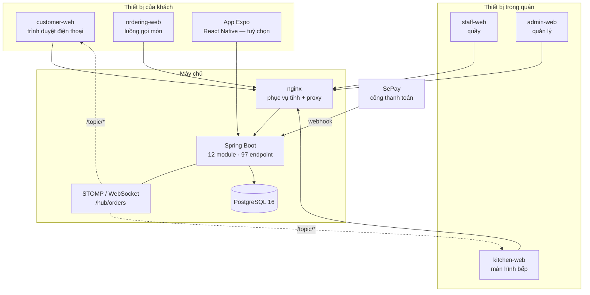
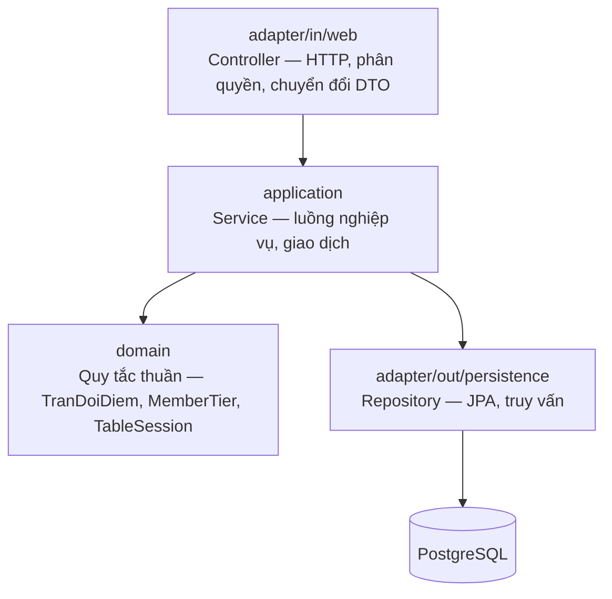

# Phần 7 — Kiến trúc hệ thống

> Đáp ứng: RB-2, RB-3, RB-5, YC-PCN-04, YC-PCN-07, YC-PCN-08

---

## 7.1. Hình dạng tổng thể



### Vì sao sáu ứng dụng mặt trước, không phải một

Quyết định này đáng giải thích vì nhìn qua thì nó có vẻ phức tạp không cần thiết.

| Ứng dụng | Người dùng | Môi trường | Ràng buộc quyết định |
|---|---|---|---|
| `customer-web` | Khách | Điện thoại cá nhân, mạng wifi quán | Phải **nhẹ** — tải nhanh trên máy yếu |
| `ordering-web` | Khách | Cùng trên | Luồng gọi món, tách để tải riêng |
| `kitchen-web` | Bếp | Màn hình treo tường, xem từ 2m | Chữ to, vùng chạm to, không bao giờ cuộn ngang |
| `staff-web` | Quầy | Máy tính bàn tại quầy | Nhiều thông tin cùng lúc, thao tác nhanh |
| `admin-web` | Quản lý | Máy tính, đôi khi điện thoại | Biểu đồ, bảng, form dài |
| App Expo | Khách | Điện thoại | **Tuỳ chọn** — không bắt buộc, theo RB-1 |

Gộp làm một thì gói tải về của khách phải chứa cả màn hình báo cáo doanh thu mà họ không bao giờ
mở — vi phạm RB-3 (*"tầng hai sóng yếu"*). Tách riêng thì mỗi bên chỉ tải phần của mình.

Phần dùng chung **không** bị lặp lại: 7 gói chia sẻ trong `frontend/packages/`.

| Gói | Chứa gì |
|---|---|
| `api-client` | Lớp gọi API, sinh theo hợp đồng |
| `realtime-client` | Kết nối STOMP — **một** bản cài đặt cho mọi ứng dụng |
| `shared-types` | Kiểu dữ liệu dùng chung |
| `auth` | Đăng nhập, giữ token, làm mới |
| `brand-ui`, `shared-ui` | Thành phần giao diện, hệ thống thiết kế |
| `i18n` | Chuỗi tiếng Việt — YC-PCN-07 |

> `realtime-client` là **một** gói dùng chung, và đó là bài học trực tiếp từ lỗi SignalR/STOMP ở
> §4.1: khi mỗi ứng dụng tự viết lớp kết nối riêng, chúng lệch nhau mà không ai biết.

### Ứng dụng di động — vị trí trong kiến trúc

Ứng dụng Expo / React Native (`mobile-rn/`) là **kênh bổ sung**, không phải kênh chính. Khách vẫn
ăn được trọn vẹn mà không cài nó (RB-1). Nó tồn tại cho nhóm khách quen muốn xem điểm và gọi lại
món cũ nhanh.

Một khác biệt kỹ thuật đáng nêu: ứng dụng di động lưu token vào **kho an toàn của hệ điều hành**
(Android Keystore / iOS Keychain) qua `expo-secure-store`, thay vì bộ nhớ trình duyệt. Kho này có
thể **từ chối ghi** — khi người dùng đổi khoá màn hình, đổi vân tay, hoặc khôi phục máy từ bản sao
lưu, khoá mã hoá bị vô hiệu và mọi thao tác đọc/ghi ném lỗi.

Hệ quả thiết kế: mọi nút **ghi** xuống kho an toàn phải xử lý được trường hợp ghi hỏng, và phải
**nói ra** thay vì im lặng. Đặc biệt với nút Đăng xuất: nếu ghi hỏng mà giao diện vẫn dọn sạch như
đã đăng xuất thì token còn nguyên trong Keystore, và người cầm máy tiếp theo mở app vào thẳng tài
khoản đó. Quy tắc áp dụng: **thất bại ở bước ghi thì không được dọn màn hình.**

## 7.2. Phân tầng backend



### Tầng `domain` — nơi quy tắc nghiệp vụ sống

Tầng này **không** biết gì về HTTP, JPA, hay Spring. Nó là các lớp Java thuần:

| Lớp | Quy tắc nó giữ |
|---|---|
| `TranDoiDiem` | `min(30% hoá đơn, 200.000đ)` |
| `TranGiamGiaHoaDon` | Tổng giảm ≤ 50%, cắt phần vượt |
| `MemberTier` | Ngưỡng và hệ số hạng thành viên |
| `TableSession` | Quy tắc hết hạn và gia hạn khi còn nợ |
| `MaUuDai` | Sinh mã 8 ký tự, bảng chữ không gây nhầm |
| `PhoneNumber` | Chuẩn hoá số điện thoại Việt Nam |
| `RevenueLedger` | Quy tắc cộng doanh thu |

Lợi ích cụ thể, không phải lý thuyết: những lớp này **kiểm được bằng phép kiểm đơn vị thuần**,
không cần cơ sở dữ liệu, không cần máy chủ. Quy tắc tiền là chỗ đáng kiểm kỹ nhất, và cũng là chỗ
đắt nhất nếu phải dựng cả hệ thống lên mới kiểm được.

### 12 module, 97 endpoint

| Module | Endpoint | Tệp | Phụ trách |
|---|---:|---:|---|
| `menu` | 22 | 20 | Thực đơn, nhóm món, khung giờ bán, tình trạng món |
| `tables` | 18 | 29 | Bàn, phiên bàn, hoá đơn bàn, thanh toán hoá đơn |
| `loyalty` | 15 | 24 | Khách quen, điểm, hạng, ưu đãi |
| `auth` | 10 | 28 | Đăng nhập, tài khoản, phân quyền |
| `orders` | 10 | 20 | Lượt đặt, món, trạng thái, bảng bếp |
| `promotions` | 7 | 12 | Khuyến mãi |
| `payments` | 6 | 21 | Thanh toán, webhook, hoàn tiền |
| `counter` | 4 | 12 | Ca quầy, đối soát tiền |
| `cart` | 3 | 9 | Giỏ nháp của bàn |
| `reports` | 1 | 6 | Báo cáo tổng hợp |
| `shared` | 1 | 8 | Kiểm tra sức khoẻ, tiện ích chung |
| `realtime` | 0 | 6 | STOMP — **không có endpoint HTTP** |

Bảng này **sinh từ mã** bởi `docs/build_system_facts.py`, có cổng CI đối chiếu. Nó không thể nói sai
về việc cái gì tồn tại.

> **Vì sao cần sinh tự động:** đã từng có lúc tài liệu khai *13 module / 97 endpoint* trong khi mã
> có *12 / 88*. Hình dạng lỗi: **văn xuôi kể lại trạng thái mã**, và văn xuôi không tự cập nhật.
> Cách chống đã áp cho cả ba chỗ hay lạc hậu nhất — kiểm kê endpoint, bảng module, chỉ mục tài liệu:
> **sinh ra thay vì viết lại**, kèm cổng CI.

## 7.3. Truyền tin thời gian thực

| Hạng mục | Lựa chọn |
|---|---|
| Giao thức | **STOMP trên WebSocket** |
| Điểm nối | `/hub/orders` |
| Chủ đề | `/topic/kitchen`, `/topic/orders/{orderCode}`, `/topic/tables/...` |
| Gác quyền | `StompSubscriptionGuard` — kiểm **trước khi** cho đăng ký |

### Gác quyền ở tầng đăng ký, không ở tầng phát

Một kênh realtime dễ bị bỏ quên phần phân quyền, vì nó không đi qua chuỗi `@PreAuthorize` quen
thuộc. Ở đây `StompSubscriptionGuard` chặn ngay lúc **đăng ký kênh**:

```java
canWatchOrder(orderCode, first(accessor, "X-Order-Token"), isOperator)
  → orderLookup.matchesCustomerToken(orderCode, orderToken)
```

Dùng lại **đúng** `CustomerTokenGuard` mà đường HTTP dùng. Một định nghĩa "vé này có hợp lệ không"
cho cả hai đường, nên chúng không thể lệch nhau — cùng nguyên tắc đã áp ở §4.5 cho `conNoTien`.

### Ranh giới được kiểm bằng phép kiểm đầu-cuối

Bộ kiểm `realtime-e2e` chạy **mã client thật** đấu với **backend thật**. Lý do có nó, nhắc lại từ
§4.1: frontend từng dùng SignalR khi backend đã sang STOMP, và lỗi sống được vì *mỗi bên tự kiểm
bằng client của chính mình*.

> Nguyên tắc rút ra, áp cho mọi ranh giới: **hai bên tự kiểm bằng giả lập của mình thì cả hai đều
> xanh trong khi hệ thống đỏ.** Ranh giới phải có một phép kiểm chạy qua nó bằng đồ thật.

## 7.4. Triển khai

### Hạ tầng

| Hạng mục | Lựa chọn |
|---|---|
| Đóng gói | Docker, `deploy/docker-compose.java.yml` |
| Máy chủ | VPS, triển khai qua SSH (`deploy-vps.sh`) |
| Phục vụ web | nginx — tệp tĩnh + proxy ngược tới API |
| Môi trường | **staging** và **production**, tách hoàn toàn |
| CI/CD | GitHub Actions |

### Các luồng tự động

| Workflow | Kích hoạt | Việc |
|---|---|---|
| `ci.yml` | Mỗi push | Kiểm frontend, kiểu, lint, phép kiểm |
| `ci-java.yml` | Mỗi push | Kiểm backend |
| `ci-mobile.yml` | Mỗi push | Kiểm ứng dụng di động |
| `security.yml` | Mỗi push | Quét bảo mật |
| `dependency-review.yml` | Mỗi PR | Soát thư viện mới |
| `cd.yml` | Merge | Triển khai |
| `thu-khoi-phuc.yml` | **Bấm tay** | Diễn tập khôi phục cơ sở dữ liệu |
| `du-lieu-mau.yml` | Bấm tay | Nạp dữ liệu mẫu |

### Sao lưu — trạng thái thật

Đây là chỗ cần nói chính xác, vì dễ đọc nhầm theo cả hai hướng.

| Thời điểm | Có sao lưu? | Ở đâu trong mã |
|---|:---:|---|
| **Trước mỗi lần chạy migration** | ✔ | `deploy-vps.sh:207` — `backup-postgres.sh truoc-migration` |
| **Trước mỗi lần quay lui** | ✔ | `rollback-vps.sh:45` |
| **Định kỳ hằng đêm** | ✖ | **Không có lịch chạy** |

Nghĩa là: rủi ro **do triển khai** đã được che kín — mọi lần đụng vào lược đồ đều có bản sao lưu
ngay trước đó. Rủi ro **do máy chủ hỏng giữa ngày** thì chưa: máy chủ chết lúc 3 giờ chiều làm mất
toàn bộ dữ liệu kể từ lần triển khai gần nhất. Xem Phần 9, **KT-16**.

### Diễn tập khôi phục — một chi tiết đáng nêu khi trình bày

Workflow `thu-khoi-phuc.yml` **cố ý làm hỏng dữ liệu rồi khôi phục lại**, để chứng minh bản sao lưu
dùng được thật. Lý do ghi trong chính tệp đó:

> *"`restore-postgres.sh` nằm trong repo từ lâu và chưa từng chạy. **Có script sao lưu không bằng có
> khả năng khôi phục** — và ngày người ta cần tới nó là ngày tệ nhất để phát hiện nó hỏng."*

Ba quyết định thiết kế trong workflow đó, mỗi cái ứng một cách hỏng:

1. **Chỉ chạy khi bấm tay**, không gắn vào `push`: *"đây là thao tác cố ý làm hỏng dữ liệu rồi khôi
   phục lại, nó phải là một quyết định chứ không phải một tác dụng phụ của việc merge."*
2. **`production` bị script từ chối** — chỉ diễn tập trên `staging`.
3. **Dùng chung khoá đồng thời với `cd.yml`**: diễn tập chen vào giữa một lượt triển khai là hai
   tiến trình cùng xoá và tạo lại một cơ sở dữ liệu.

Diễn tập này đã tìm ra một lỗi thật trước khi cần tới: `restore-postgres.sh` khai 4 biến bắt buộc
nhưng bước cuối thiếu một biến. Lỗi đó sẽ chỉ lộ ra vào đúng ngày cần khôi phục.

## 7.5. Hiệu năng — YC-PCN-04 `[MỘT PHẦN]`

Yêu cầu: *"Giờ cao điểm 30 bàn cùng gọi không làm chậm màn bếp."*

### Cái đã làm

| Biện pháp | Tác dụng |
|---|---|
| Đẩy tin qua STOMP thay vì hỏi vòng | Màn bếp không gọi API mỗi 2 giây |
| Bảng bếp nhận **thay đổi**, không tải lại toàn bộ | Tải mạng không tăng theo số bàn |
| Tách 6 ứng dụng mặt trước | Màn bếp không tải mã của màn báo cáo |
| Chỉ mục cơ sở dữ liệu trên các cột lọc nóng | Truy vấn bảng bếp không quét toàn bảng |

### Cái chưa làm — vì sao vẫn là `[MỘT PHẦN]`

**Chưa có phép đo tải thật.** Không có số liệu cho câu hỏi *"30 bàn cùng gọi thì màn bếp chậm bao
nhiêu"*. Thiết kế có cơ sở để tin là đủ, nhưng tin không phải là đo.

Cách đóng: một kịch bản tải mô phỏng 30 phiên bàn đồng thời, đo độ trễ từ lúc gửi đơn tới lúc màn
bếp hiện. Xem Phần 9, **KT-17**.

> Đây là kiểu khoảng trống đáng nêu trong buổi bảo vệ: hệ thống **có thể** đủ nhanh, nhưng hiện
> không ai chứng minh được điều đó, và "có vẻ chạy ổn khi thử tay" không phải bằng chứng.

## 7.6. Khả năng học — YC-PCN-08 `[ĐỦ]`

Yêu cầu: *"Nhân viên mới dùng được sau 15 phút hướng dẫn."*

Biện pháp thiết kế trực tiếp phục vụ yêu cầu này:

| Biện pháp | Cách nó giúp |
|---|---|
| **Mỗi vai một ứng dụng riêng** | Nhân viên bếp không bao giờ thấy màn hình không phải việc mình |
| Toàn bộ tiếng Việt, kể cả thông báo lỗi | Không phải dịch trong đầu |
| Thông báo lỗi nói **việc phải làm**, không nói mã lỗi | *"Bàn còn món chưa thanh toán. Thu tiền trước, hoặc ép đóng kèm lý do."* |
| Hệ thống **chặn thao tác sai** thay vì để nhân viên nhớ quy tắc | Không đóng được bàn còn nợ — không cần ai nhớ |

Điểm cuối đáng nhấn: mỗi quy tắc mà **hệ thống nhớ hộ** là một quy tắc **nhân viên mới không phải
học**. Đây là cách rẻ nhất để rút ngắn thời gian đào tạo, và nó là hệ quả tự nhiên của việc đặt quy
tắc nghiệp vụ vào tầng `domain` thay vào đầu người.

---

**Trước:** [Phần 6 — Mô hình dữ liệu](06-MO-HINH-DU-LIEU.md) · **Tiếp:** [Phần 8 — Yêu cầu phi chức năng](08-YEU-CAU-PHI-CHUC-NANG.md)
